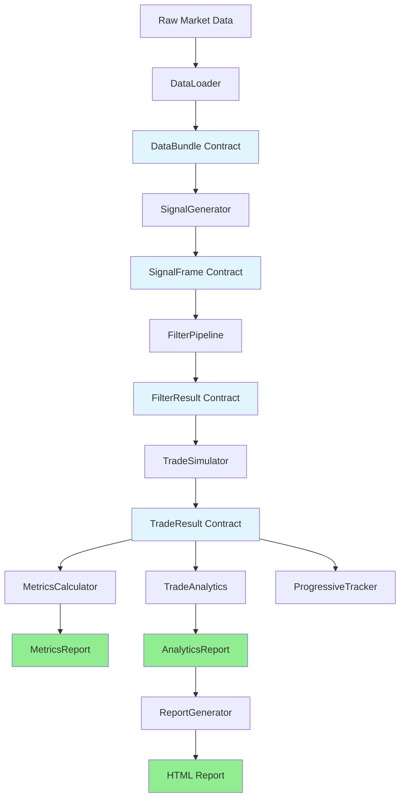

# WBWSStrategy System Architecture
**Version**: 2.1.0  
**Date**: 2026-02-17  
**Status**: All new architecture migrated. Architecture is locked. To perform a change, case analysis is required and approval. All modifications to log in docs\architecture\CHANGE_LOG.md
---
## Table of Contents
1. [Executive Summary](#executive-summary)
2. [System Overview](#system-overview)
3. [Architecture Principles](#architecture-principles)
4. [Module Responsibilities](#module-responsibilities)
5. [Data Flow](#data-flow)
6. [Contract Hierarchy](#contract-hierarchy)
7. [Performance Optimizations](#performance-optimizations)
8. [Design Decisions](#design-decisions)
9. [Integration Guide](#integration-guide)
10. [Extension Points](#extension-points)
11. [Phase 5: Analytics Infrastructure](#phase-5-analytics-infrastructure)
---
## Executive Summary
### What Is This System?
WBWSStrategy is a **high-performance, contract-based backtesting engine** with **intelligent analytics** and **HTML reporting** for systematic trading strategies. It processes market data through a pipeline of typed contracts, generating trade signals, simulating realistic trade execution with sub-millisecond precision, providing actionable insights through AI-like recommendations, and exporting self-contained HTML reports.
### Key Characteristics
- **Contract-Based**: End-to-end typed dataclasses (immutable, validated)
- **High Performance**: 92.6% faster than legacy on realistic datasets
- **Intelligent Analytics**: AI-like insights with confidence levels (Sessions 14-16)
- **HTML Reporting**: Self-contained report, dark/light theme, 4 Chart.js charts (Sessions 17-18)
- **Type Safe**: 100% type hints with strict mypy validation
- **Modular**: Clean separation of concerns (data → signals → filters → trades → analytics → reports)
- **Production-Ready**: Tested at scale (88k bars, 9.6k signals, 2M LTF ticks)
### Design Philosophy
> **"Explicit is better than implicit. Performance matters. Contracts prevent bugs. Intelligence adds value."**
Every module accepts and returns strongly-typed contracts. No hidden state, no dict-based communication, no global variables. Pure functional pipeline with optimized hot paths, intelligent insight generation, and portable HTML output.
---
## System Overview
### High-Level Architecture (Updated v2.1)

### Processing Pipeline (Enhanced v2.1)
```
┌─────────────┐
│ Market Data │ (CSV/Parquet/DataFrame)
└─────┬───────┘
      │
      ▼
┌─────────────┐
│ DataLoader  │ → DataBundle (OHLCV + LTF + ARTF)
└─────┬───────┘
      │
      ▼
┌─────────────────┐
│ SignalGenerator │ → SignalFrame (BUY/SELL signals)
└─────┬───────────┘
      │
      ▼
┌──────────────┐
│ FilterPipeline│ → FilterResult (filtered signals)
│   ├─Time     │    - Time filters (session, day)
│   └─Technical│    - Technical filters (trend, vol)
└─────┬────────┘
      │
      ▼
┌──────────────┐
│TradeSimulator│ → TradeResult (executed trades)
│   ├─RiskMgr  │    - Position sizing
│   ├─TradeMgr │    - Position management
│   └─LTF Exec │    - Realistic execution
└─────┬────────┘
      │
      ▼
┌────────────────────────────────┐
│  Analytics + Reporting Layer   │ (Phase 5 — Sessions 13-18)
│  ├─MetricsCalculator           │ → MetricsReport (17 core metrics, 1.72ms)
│  ├─TradeAnalytics              │ → AnalyticsReport (AI insights, <200ms)
│  └─ReportGenerator             │ → HTML Report (self-contained, ~32KB, ~5ms)
└────────────────────────────────┘
```
---
## Architecture Principles
### 1. Single Responsibility Principle
**Rule**: One module = one concern
**Application**:
- **DataLoader**: Only loads/validates data
- **SignalGenerator**: Only generates signals
- **FilterPipeline**: Only filters signals
- **TradeSimulator**: Only simulates trades
- **MetricsCalculator**: Only calculates core metrics (Session 13)
- **TradeAnalytics**: Only generates insights (Sessions 14-16)
- **ReportGenerator**: Only creates visualisations (Sessions 17-18)
---
### 2. Performance-Driven Design
**Rule**: Vectorization first, loops only when necessary, cache, other technics to consider in Phase 8
### 3. Explicit Contracts
**Rule**: No hidden assumptions, all inputs/outputs typed
## Integration Guide
### Complete Pipeline (imports)

```python
from src.strategies.specific.modules.data_loader import DataLoader 
from src.strategies.specific.modules.signal_generator import SignalGenerator
from src.strategies.specific.modules.filter_pipeline import FilterPipeline
from src.strategies.specific.modules.spread_manager import SpreadManager #sub module of TradeSimulator
from src.strategies.specific.modules.risk_manager import RiskManager #sub module of TradeSimulator
from src.strategies.specific.modules.trade_manager import TradeManager #sub module of TradeSimulator
from src.strategies.specific.modules import TradeSimulator
from src.strategies.specific.modules.metrics_calculator import MetricsCalculator
from src.strategies.specific.modules.trade_analytics import TradeAnalytics
from src.strategies.specific.modules.report_generator import ReportGenerator
from src.strategies.contracts.report_contracts import ReportConfig
from pathlib import Path
```
## File Organisation (v2.1)
--- (global stratcture)
project_root/ #
├── configs/                        # All YAML configuration files
│   ├── spreads/
|   |   └── broker_spreads.yaml         # Centralized broker spread config (all assets)
│   ├── data/
|   |   └── data_aggregator.yaml        # Settings for generate_ohlcv.py to create parquet/csv with all TF data files
│   └── strategies/
│       └── wbws/
│           └── wbws_strategy.yaml # Model configuration file for Legacy run_wbws_strategy.py
├── data/                           # All input datasets
│   ├── raw/                        # Tick data (.bi5)
|   |   └──  dukascopy_bi5/         # Datafeed from Dukascopy
|   |       └── ... subfolders with real tick data for at least 2 years (organized in hourly .bi5)
│   ├── processed/                  # OHLCV datasets
|   |    └──  ohlcv/ csv/parquet files => different instruments, time frames, full date ranges (2+ years)
|   |       └── ... (csv/parquet files)
── outputs/                        # All generated outputs
│   ├── backtests/ # future backtester
│   ├── strategies/ # New architecture outputs
│   │   ├── logs/
|   |   |   └── wbws/
│   │   └── reports/
|   |       └── wbws/
|   ├── logs/ # legacy
|   |   └── wbws_strategy.log # Legacy
│   ├── reports/ #legacy
│   │   └── WBWS/  # WBWS strategy execution reports
│   └── signals/ #legacy
|       └── progressive/ 
|           └── signals_progressive_YYYYMMDD_HHMMSS.csv # Singal and trades details generated by strategy only in "debug" mode
│
├── scripts/                        # Entry-point scripts
│   ├── validation/
│   │   └── validate_strategy_data.py
│   └── runners/ (ad hoc one time runners)
│       └── run_wbws_strategy.py # Legacy strategy script 
│        

src/strategies/ # it contains also temporary structure for architecture migration project
├── contracts/ #New architecture contracts
|   ├── data_contracts.py           # DataBundle, DataInfo ✅
|   ├── signal_contracts.py         # SignalFrame, SignalType ✅
|   ├── filter_contracts.py         # FilterResult, FilterPipelineResult ✅
|   ├── trade_contracts.py          # Trade, RejectedSignal, TradeResult ✅
|   ├── market_contracts.py         # MarketFrame ✅
|   ├── position_contracts.py       # Position ✅
|   ├── metrics_contracts.py        # MetricsReport ✅
|   ├── analytics_contracts.py      # AnalyticsReport ✅
|   ├── report_contracts.py         # ReportConfig, GeneratedReport ✅
|   └── cache.py                    # FilterPipelineCache ✅      
├── config/ #New architecture
│   └── config_schema.py # New architecture config loader
├── market/ #new achitecture eventual placeholder to move there: spread_manager.py, risk_manager.py and trade_manager.py  
├── specific/ #New architecture
│   ├── modules/
│   │   ├── data_loader.py
│   │   ├── signal_generator.py
│   │   ├── filter_pipeline.py
│   │   ├── trade_simulator.py
│   │   ├── spread_manager.py
│   │   ├── risk_manager.py
│   │   ├── trade_manager.py
│   │   ├── metrics_calculator.py
│   │   ├── trade_analytics.py      
│   │   └── report_generator.py     
│   └── filters/
│       └──  adx_filter.py|bollinger_filter.py|cci_filter.py|choppiness_filter.py|dpo_filter.py|ma_filter.py|macd_filter.py
|            pivot_filter.py|rsi_filter.py|supertrend_filter.py|time_filter.py 
└── utils/
    ├── paths.py # path resolver (legacy and new architecture)
    └── structured_logger.py # New architecture logger

tests/migration/ New architecture test script: unit (26 scripts, hundreds TC), integration (3 scripts, dozens TC)

## Path resolution => src\utils\paths.py
```python
from pathlib import Path

# ---------------------------------------------------------
# ROOT RESOLUTION
# ---------------------------------------------------------
# This resolves the project root no matter where the code is executed from:
# - scripts/
# - notebooks/
# - tests/
# - src/
PROJECT_ROOT = Path(__file__).resolve().parents[2]
# ---------------------------------------------------------
# TOP-LEVEL DIRECTORIES
# ---------------------------------------------------------
CONFIGS_DIR = PROJECT_ROOT / "configs"
DATA_DIR = PROJECT_ROOT / "data"
OUTPUTS_DIR = PROJECT_ROOT / "outputs"
SCRIPTS_DIR = PROJECT_ROOT / "scripts"
SRC_DIR = PROJECT_ROOT / "src"
# ---------------------------------------------------------
# DATA SUBDIRECTORIES
# ---------------------------------------------------------
RAW_DATA_DIR = DATA_DIR / "raw"
PROCESSED_DATA_DIR = DATA_DIR / "processed"
EXPORTS_DATA_DIR = DATA_DIR / "exports"
# ---------------------------------------------------------
# OUTPUT SUBDIRECTORIES
# ---------------------------------------------------------
BACKTEST_OUTPUT_DIR = OUTPUTS_DIR / "backtests"
LOGS_DIR = OUTPUTS_DIR / "logs"
REPORTS_DIR = OUTPUTS_DIR / "reports"
SIGNALS_DIR = OUTPUTS_DIR / "signals"
# ---------------------------------------------------------
# SCRIPT RUNNERS
# ---------------------------------------------------------
RUNNERS_DIR = SCRIPTS_DIR / "runners"
VALIDATION_SCRIPTS_DIR = SCRIPTS_DIR / "validation"
# ---------------------------------------------------------
# STRATEGY SUBDIRECTORIES (NEW MIGRATION PROJECT STRUCTURE)
# ---------------------------------------------------------
STRATEGIES_DIR = SRC_DIR / "strategies"
CONTRACTS_DIR = STRATEGIES_DIR / "contracts"
SPECIFIC_STRATEGIES_DIR = STRATEGIES_DIR / "specific"
MODULES_DIR = SPECIFIC_STRATEGIES_DIR / "modules"
FILTERS_DIR = SPECIFIC_STRATEGIES_DIR / "filters"
# ---------------------------------------------------------
# TEST SUBDIRECTORIES (NEW MIGRATION STRUCTURE)
# ---------------------------------------------------------
TESTS_DIR = PROJECT_ROOT / "tests"
MIGRATION_TESTS_DIR = TESTS_DIR / "migration"
```
# CONTRACTS QUICK REFERENCE
**Version 6.0 | 2026-02-17**
## 📋 TABLE OF CONTENTS
- [Phase 1: Data Layer](#data-layer-phase-1-)
- [Phase 2: Signal Layer](#signal-layer-phase-2-)
- [Phase 3: Filter Layer](#filter-layer-phase-3-)
- [Phase 4: Trade Layer](#trade-layer-phase-4-)
- [Phase 5: Metrics & Analytics](#metrics--analytics-phase-5-)
- [Phase 5: Reporting](#reporting-phase-5-)
- [Contract Organization](#contract-organization)
- [Migration Status](#migration-status)
---
## DATA LAYER (Phase 1 ✅)
### DataBundle
```python
@dataclass
class DataBundle:
    full: pd.DataFrame           # Complete dataset
    strategy: pd.DataFrame       # Date-sliced data
    htf: Optional[pd.DataFrame]  # Higher timeframe (e.g., 1H)
    ltf: Optional[pd.DataFrame]  # Lower timeframe (e.g., 1s)
    artf: Optional[pd.DataFrame] # Monthly bars
    info: DataInfo               # Metadata (bar counts, date range)
    validation: DataValidationResult
    config: Optional[DataConfig]
```
**Key Methods**: `has_htf`, `has_ltf`, `has_artf`  
**Validation**: All DataFrames must have DatetimeIndex + OHLC columns
---
## SIGNAL LAYER (Phase 2 ✅)
### SignalFrame - OPTIMIZED v2.2
```python
@dataclass
class SignalFrame:
    signals: pd.Series           # int8: 1=BUY, 2=SELL, 0=none
    indicator_data: Optional[pd.DataFrame]  # Lazy (debug mode only)
    signal_metadata: Dict[str, Any]
```
**Key Methods**:
- `count_by_type()` → `{"buy": int, "sell": int, "total": int}`
- `iter_raw()` → Fast iterator: `(timestamp, code)`
- `buy_signals`, `sell_signals` properties
**Performance**: int8 storage (not Enum objects) for 5-10% speedup
### SignalType Enum
```python
class SignalType(Enum):
    BUY = auto()   # Code: 1
    SELL = auto()  # Code: 2
```
**Conversion**: `SignalType.from_code(1)` → `SignalType.BUY`
---
## FILTER LAYER (Phase 3 ✅)
### FilterStatus Enum
```python
class FilterStatus(Enum):
    PASSED = auto()
    REJECTED = auto()
    SKIPPED = auto()
    ERROR = auto()
```
### FilterResult
```python
@dataclass(frozen=True)
class FilterResult:
    passed: bool
    signal_frame: SignalFrame
    metadata: FilterMetadata
```
### FilterPipelineResult
```python
@dataclass(frozen=True)
class FilterPipelineResult:
    final_signals: SignalFrame
    raw_count: int
    time_filtered_count: int
    technical_filtered_count: int
    final_count: int
    filter_results: list[FilterMetadata]
    rejection_reasons: Dict[str, int]
    execution_time_ms: Optional[float]
```
**Key Properties**: `pass_rate`, `total_rejection_count`, `get_stats_summary()`
---
## TRADE LAYER (Phase 4 ✅)
### TradeDirection Enum
```python
class TradeDirection(Enum):
    LONG = 1
    SHORT = -1
```
### ExitReason Enum
```python
class ExitReason(Enum):
    STOP_LOSS = auto()
    TAKE_PROFIT = auto()
    OPPOSITE_SIGNAL = auto()
    END_OF_DATA = auto()
    MANUAL = auto()
    TIME_EXIT = auto()
```
### TradeParameters
```python
@dataclass(frozen=True)
class TradeParameters:
    entry_price_mid: float
    entry_price_executed: float
    stop_loss_raw: float
    stop_loss_trigger: float
    take_profit: float
    position_size: float = 1.0
    atr_value: Optional[float]
    atr_length: Optional[int]
    sl_distance: Optional[float]
    tp_distance: Optional[float]
    risk_reward_ratio: Optional[float]
    annual_range_value: Optional[float]
    risk_percentile_calculated: Optional[float]
    max_risk_percentile: Optional[float]
    risk_percentile_passed: bool = True
    spread_enabled: bool = False
    spread_applied: bool = False
    spread_points: Optional[float]
    sl_adjusted: bool = False
```
### TradeEntry
```python
@dataclass(frozen=True)
class TradeEntry:
    entry_id: str
    trade_manager_id: Optional[int]
    signal_id: Optional[int]
    entry_time: pd.Timestamp
    direction: TradeDirection
    entry_price: float
    stop_loss: float
    take_profit: float
    position_size: float = 1.0
    sl_distance: float
    tp_distance: float
    risk_reward_ratio: float
    atr_value: Optional[float]
    spread_enabled: bool = False
    spread_points: Optional[float]
    sl_adjusted: bool = False
    comment: Optional[str]
```
### TradeExit
```python
@dataclass(frozen=True)
class TradeExit:
    exit_id: str
    entry_id: str
    exit_time: pd.Timestamp
    duration_bars: int
    duration_minutes: float
    exit_price: float
    exit_reason: ExitReason
    pnl_points: float
    pnl_percent: float
    is_win: bool
    is_loss: bool
    exit_bar_high: Optional[float]
    exit_bar_low: Optional[float]
    ltf_execution: bool = False
```
### Trade (Entry + Exit)
```python
@dataclass(frozen=True)
class Trade:
    entry: TradeEntry
    exit: Optional[TradeExit] = None
```
**Key Properties**: `is_open`, `is_closed`, `pnl_points`, `is_win`, `is_loss`
### RejectedSignal
```python
@dataclass(frozen=True)
class RejectedSignal:
    rejection_id: str
    signal_id: Optional[int]
    rejection_time: pd.Timestamp
    direction: str
    rejection_stage: str
    rejection_reason: str
    current_price: Optional[float]
    meta: Dict[str, Any]
```
### TradeResult (Pipeline Output)
```python
@dataclass(frozen=True)
class TradeResult:
    trades: List[Trade]
    rejected_signals: List[RejectedSignal]
    total_entries: int
    total_opened: int
    total_closed: int
    total_rejected: int
    currently_open: int
    exits_by_reason: Dict[str, int]
    risk_approved: int
    risk_rejected: int
    risk_adjusted: int
    position_rejected: Dict[str, int]
    win_count: int
    loss_count: int
    win_rate: float
    total_pnl_points: float
    execution_mode: str
    execution_time_ms: Optional[float]
```
---
## METRICS & ANALYTICS (Phase 5 ✅)
### MetricsReport (Session 13)
```python
@dataclass(frozen=True)
class MetricsReport:
    # Performance metrics (13 fields)
    total_trades: int
    winning_trades: int
    losing_trades: int
    win_rate: float                 # Percentage (0-100)
    total_pnl_points: float
    expectancy_points: float
    profit_factor: float
    avg_pnl_points: float
    largest_win: float
    largest_loss: float
    max_drawdown: float             # Negative value
    losing_streak: int
    winning_streak: int
    # Trade summary (2 fields)
    trades_per_week: float
    trades_per_day: float
    # Metadata (2 fields)
    execution_duration_ms: float
    execution_date: str
```
**Key Methods**: `to_dict()`, `to_json()`, `to_flat_dict()`  
**Performance**: 1.72ms for 1000 trades (5.8x faster than target!)
```python
from src.strategies.specific.modules.metrics_calculator import calculate_metrics
metrics = calculate_metrics(trade_result)
```
---
### AnalyticsReport (Sessions 14-16) ✅
#### Insight (Core Building Block)
```python
@dataclass(frozen=True)
class Insight:
    message: str                  # Observation
    recommendation: str           # Action
    confidence: str               # "High" | "Medium" | "Low"
    impact_estimate: Optional[str]
    category: str                 # "time" | "quality" | "risk" | "general"
    severity: str                 # "critical" | "warning" | "info" | "success"
```
#### SessionMetrics
```python
@dataclass(frozen=True)
class SessionMetrics:
    session_name: str             # "London", "Monday", "14"
    trades: int
    winning_trades: int
    win_rate: float
    total_pnl: float
    avg_pnl: float
    largest_win: float
    largest_loss: float
```
#### TimePerformanceBreakdown
```python
@dataclass(frozen=True)
class TimePerformanceBreakdown:
    by_session: Dict[str, SessionMetrics]   # Asia/London/NY
    by_hour: Dict[int, SessionMetrics]      # 0-23
    by_day: Dict[str, SessionMetrics]       # Mon-Sun
    best_session: str
    worst_session: str
    insights: List[Insight]
```
#### TradeDistribution
```python
@dataclass(frozen=True)
class TradeDistribution:
    small_count: int    # < 3 points
    medium_count: int   # 3-7 points
    large_count: int    # > 7 points
    small_pct: float
    medium_pct: float
    large_pct: float
```
#### DurationAnalysis
```python
@dataclass(frozen=True)
class DurationAnalysis:
    avg_bars: float
    median_bars: int
    fast_exits_count: int       # < 3 bars
    normal_exits_count: int     # 3-10 bars
    prolonged_exits_count: int  # > 10 bars
    fast_exits_pct: float
    insights: List[str]
```
#### TradeQualityAnalysis
```python
@dataclass(frozen=True)
class TradeQualityAnalysis:
    win_distribution: TradeDistribution
    loss_distribution: TradeDistribution
    duration_analysis: DurationAnalysis
    avg_bars_to_profit: Optional[float]
    avg_bars_to_loss: Optional[float]
    premature_exit_estimate: str
    insights: List[Insight]
```
#### RiskAdjustedMetrics
```python
@dataclass(frozen=True)
class RiskAdjustedMetrics:
    return_over_max_dd: float       # Total PnL / Max DD
    avg_win_over_avg_loss: float    # Risk/reward ratio
    expectancy_per_trade: float
    consistency_score: float        # 0-100 (CV-based)
    recovery_factor: float          # Total PnL / gross losses
    insights: List[Insight]
```
#### ExecutiveSummary
```python
@dataclass(frozen=True)
class ExecutiveSummary:
    performance_grade: str          # "A+" to "F"
    grade_reasoning: str
    critical_insights: List[Insight]  # Top 3-5 (max 7)
    key_strengths: List[str]
    improvement_areas: List[str]
    overall_assessment: str
```
**Grading algorithm** (4 × 25 pts):
1. Win rate: ≥20% = 25, ≥15% = 20, ≥10% = 10
2. Profit factor: ≥2.0 = 25, ≥1.5 = 20, ≥1.2 = 10
3. Drawdown: DD < 20% of profit = 25, <50% = 15, <100% = 5
4. Consistency: ≥70 = 25, ≥50 = 15, ≥30 = 5
Score → Grade: 90+=A+, 85=A, 80=A-, 75=B+, 70=B, 65=B-, 60=C+, 55=C, 50=C-, 40=D+, 30=D, <30=F
#### AnalyticsReport (main)
```python
@dataclass(frozen=True)
class AnalyticsReport:
    executive_summary: ExecutiveSummary
    time_performance: TimePerformanceBreakdown
    trade_quality: TradeQualityAnalysis
    risk_adjusted: RiskAdjustedMetrics
    comparative: Optional[ComparativeContext]
    input_metrics: MetricsReport
    analysis_timestamp: str
    analysis_duration_ms: float
```
**Key Methods**: `to_dict()`, `to_json()`, `get_all_insights()`,
`get_critical_insights_only()`, `get_insights_by_category(category)`
**Usage**:
```python
from src.strategies.specific.modules.trade_analytics import TradeAnalytics
report = TradeAnalytics.analyze(result, config)               # auto-metrics
report = TradeAnalytics.analyze(result, config, metrics=m)    # explicit
```
---
## REPORTING (Phase 5 ✅)
### ReportConfig (Session 17)
```python
@dataclass(frozen=True)
class ReportConfig:
    title: str = "Strategy Performance Report"
    output_dir: Path = Path("outputs/reports")
    include_raw_data: bool = True    # Layer 3 toggle
    theme: str = "dark"              # "dark" | "light"
    chart_height_px: int = 300       # 100-800
    subtitle: Optional[str] = None
```
**Validation**:
- `theme` must be `"dark"` or `"light"` (raises `ValueError` otherwise)
- `chart_height_px` must be 100–800
---
### GeneratedReport (Session 17)
```python
@dataclass(frozen=True)
class GeneratedReport:
    html_path: Path                  # Absolute path to saved file
    html_content: str                # Full HTML string (for tests / inspection)
    generation_duration_ms: float    # Wall-clock time to generate
    analytics_report: AnalyticsReport  # Source data reference
    layers_included: List[str]       # ["executive", "analytical"] or + "raw"
```
**Key Methods**: `to_dict()`, `to_json()`
---
### ReportGenerator (Sessions 17-18) ✅
**Entry point**:
```python
@staticmethod
def generate(
    analytics_report: AnalyticsReport,
    trade_result: Optional[TradeResult] = None,  # enables equity curve
    config: Optional[ReportConfig] = None,
) -> GeneratedReport
```
**Internal methods**:
```python
_build_html(analytics_report, trade_result, config) -> str
_build_layer1_executive(report, colours) -> str
_build_layer2_analytical(report, colours, config, chart_data) -> str
_build_layer3_raw(report, colours) -> str
_build_chart_data(trade_result, report) -> Dict     # Chart.js datasets
_build_insights_accordion(insights, colours) -> str
_build_css(colours, config) -> str
_build_js(chart_data, colours, config) -> str
_save_html(html, config) -> Path
```
**HTML report features**:
- Single self-contained `.html` file (~32KB)
- Three tabs: Executive | Analytical | Raw Data
- 4 Chart.js charts: equity curve, session bar, win/loss dist, duration doughnut
- Dark/light theme via `ReportConfig.theme`
- Mobile-responsive: 6→3 cols @900px, 3→2 cols @480px
- Lazy chart initialisation (Executive tab loads instantly)
- CDN failure handler + `<noscript>` fallback (v1.1)
- First critical insight auto-opens in accordion (v1.1)
- Zero-trade hours filtered from hour table (v1.1)
**Full pipeline usage**:
```python
from src.strategies.specific.modules.report_generator import ReportGenerator
from src.strategies.contracts.report_contracts import ReportConfig
from pathlib import Path
analytics = TradeAnalytics.analyze(trade_result, strategy_config)
generated = ReportGenerator.generate(
    analytics,
    trade_result=trade_result,
    config=ReportConfig(
        title="WBWSStrategy Performance Report",
        subtitle="Q1 2026 Backtest",
        output_dir=Path("outputs/strategies/reports"),
        theme="dark",
        chart_height_px=300,
    )
)
# generated.html_path   → Path to file (open in browser)
# generated.html_content → Full HTML string (for tests)
# generated.layers_included → ["executive", "analytical", "raw"]
```

**Status**: ✅ v1.1 COMPLETE (Sessions 17-18, 131 tests)  
**Future formats**: Excel, PDF — see `POST_MIGRATION_ROADMAP.md`
## KEY DESIGN PATTERNS
### 1. Immutability
All Phase 4+ contracts use `frozen=True`.
### 2. Optional Parameters for Flexibility
```python
def analyze(
    trade_result: TradeResult,
    config: StrategyConfig,
    metrics: Optional[MetricsReport] = None,  # auto-calculate if None
    trade_result: Optional[TradeResult] = None,  # equity curve if provided
) -> AnalyticsReport
```
### 3. Validation in `__post_init__`
```python
def __post_init__(self):
    if self.theme not in {"dark", "light"}:
        raise ValueError(f"Theme must be 'dark' or 'light', got '{self.theme}'")
```
### 4. Structured Serialization
All contracts expose `to_dict()` and `to_json()` for downstream consumers.
### 5. html_content in GeneratedReport (Session 17)
```python
# Test without touching the filesystem
result = ReportGenerator.generate(analytics, config=cfg)
assert "B+" in result.html_content    # Grade in HTML
assert "chart-equity" in result.html_content
```
**Last Updated**: 2026-02-17  
**File Location**: `docs\architecture\ARCHITECTURE.md`