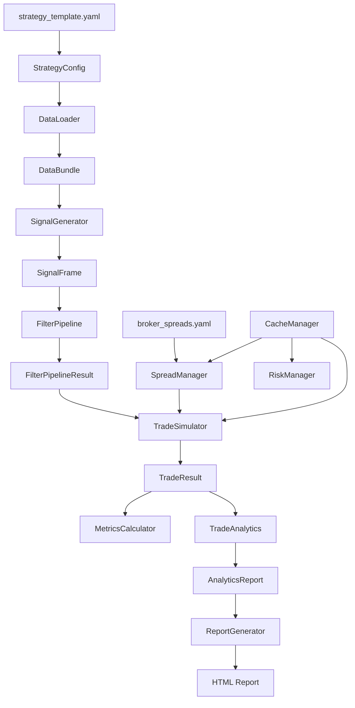

---
## UPDATED ARCHITECTURE.md
```markdown
# WBWSStrategy System Architecture
**Version**: 3.0.0 (Production Ready)
**Date**: 2026-02-21
---
## Table of Contents
1. [Who Should Read This](#who-should-read-this)
2. [System Overview](#system-overview)
3. [Architecture Principles](#architecture-principles)
4. [Execution Modes](#execution-modes)
5. [Module Responsibilities](#module-responsibilities)
6. [Contract Reference](#contract-reference)
7. [Data Flow](#data-flow)
8. [Configuration Management](#configuration-management)
9. [Cache Management](#cache-management)
10. [File Organisation](#file-organisation)
11. [Path Resolution](#path-resolution)
12. [Integration Guide](#integration-guide)
13. [Design Patterns](#design-patterns)
14. [Extension Points](#extension-points)
---
## Who Should Read This
This document serves three developer profiles. Find yours and use it as a reading guide.
**Modifying an existing component** — Read [Architecture Principles](#architecture-principles), the relevant section in [Contract Reference](#contract-reference), and [Design Patterns](#design-patterns). Every module has a single responsibility and communicates only through typed contracts. Understand the contract before touching any module.
**Building a new strategy on this architecture** — Read [Execution Modes](#execution-modes), [Integration Guide](#integration-guide), and [Extension Points](#extension-points). The pipeline is strategy-agnostic from `FilterPipeline` onward; only `DataLoader`, `SignalGenerator`, and strategy-specific filters need to be implemented or swapped.
**Building a backtesting environment** — Read [Execution Modes](#execution-modes) carefully — the `core` mode exists specifically for multi-run backtesting. Then read [Module Responsibilities](#module-responsibilities) and [Contract Reference](#contract-reference) to understand what each stage produces and consumes. The pipeline is designed to be called in a loop with `CacheManager.clear_all_caches()` between runs.
---
## System Overview
WBWSStrategy is a **contract-based backtesting engine** with **analytics** and **HTML reporting** for systematic trading strategies. It processes market data through a typed pipeline, generating trade signals, simulating realistic execution with configurable spread and risk management, and producing actionable insights and self-contained HTML reports.
### Key Characteristics
- **Contract-based**: End-to-end typed, frozen dataclasses. No dict-based communication between modules.
- **Single Source of Truth**: All configuration comes from `StrategyConfig`. Spread values come exclusively from `broker_spreads.yaml`.
- **Dual execution modes**: `core` for maximum throughput in multi-run backtesting; `analytics` for full insight and reporting pipeline.
- **Performance**: Vectorised hot paths throughout. LTF tick processing is gated to `analytics` mode only. O(1) data structures for trade management.
- **Type safe**: 100% type hints, strict mypy.
- **Modular**: Each module has exactly one responsibility. The pipeline is: data → signals → filters → trades → analytics → reports.
- **Fail-fast**: All validation happens at module construction. Invalid inputs raise immediately with clear error messages.
- **Cache-managed**: Central `CacheManager` handles all module-level caches for clean multi-run state.
### Pipeline at a Glance

---
## Architecture Principles
### 1. Single Responsibility
One module, one concern. DataLoader only loads data. SignalGenerator only generates signals. MetricsCalculator only computes metrics. No module reaches into another module's domain. Each module trusts its inputs implicitly — validation happens at configuration boundaries only.
### 2. Contracts Are the Interface
Every module accepts and returns typed, frozen dataclasses. There are no raw dicts, no shared state, no global variables passed between modules. If you need to add information that crosses a module boundary, add a field to the relevant contract — do not bypass the contract.
### 3. Immutability
All contracts use frozen=True. Any module that needs to derive a field at construction time uses object.__setattr__ in __post_init__ — that is the only acceptable use. After construction, contracts are read-only.
### 4. Explicit Over Implicit
No hidden defaults buried in logic. Mode-gated behaviour (core vs analytics) is explicit at every call site. Expensive operations (LTF precomputation, progressive tracking, signal ID lookups) run only when the mode requires them.
### 5. Vectorisation First
Hot paths use numpy/pandas vectorised operations. Python loops appear only where the logic cannot be vectorised (e.g. stateful trade management). ATR computation and spread config loading are cached via the central CacheManager.
### 6. Fail Fast
Invalid configuration raises immediately at construction via __post_init__ validation. There are no silent fallbacks, no auto-corrections of bad input. If a value is wrong, the system tells you before any computation begins.
### 7. Single Source of Truth
Configuration flows from strategy_template.yaml → StrategyConfig → all modules. No module loads its own config. Spread values are read exclusively from broker_spreads.yaml — the strategy template contains only the path to this file.
### 8. Cache Lifecycle Management
All module-level caches (ATR, annual range, spread configs) are managed by a central CacheManager. Call clear_all_caches() between backtester runs to ensure clean state.
---
## Execution Modes
The pipeline has two execution modes, selected via execution.mode in the strategy config YAML.
| Mode       | Purpose              | What Runs                        | Typical Use        |
|------------|----------------------|----------------------------------|--------------------|
| core       | Maximum throughput   | Data → Signals → Filter → Trade  | Multi-run sweep    |
| analytics  | Full pipeline        | Everything + Analytics + Report  | Single-run analysis|
---
## Mode in Config YAML
```yaml
execution:
  mode: "analytics"   # or "core"
```
---
### Multi-run Backtesting Pattern
```python
from src.strategies.core.cache_manager import CacheManager

cache_manager = CacheManager()
results = []

for params in parameter_grid:
    config = build_config(params)
    orchestrator = StrategyOrchestrator(config, cache_manager=cache_manager)
    result = orchestrator.run(mode="core")
    results.append(result)
    cache_manager.clear_all_caches()  # Clean state between runs
```
---
### Module Responsibilities
## DataLoader
File: src/strategies/specific/modules/data_loader.py
Input: StrategyConfig
Output: DataBundle
Loads OHLCV data for the strategy timeframe, and optionally HTF, LTF, and ARTF (monthly bars). Validates all DataFrames (DatetimeIndex, OHLC columns present). Applies Parquet optimisation sequence: timestamp floor → sort index → lazy duplicate check. Caches loaded data by file mtime + size + version string.
## SignalGenerator
File: src/strategies/specific/modules/signal_generator.py
Input: StrategyConfig, DataBundle
Output: SignalFrame
Generates BUY/SELL signals by delegating to a strategy-specific indicator (e.g. WBWSTrigger). Signals are stored as int8 (1=BUY, 2=SELL, 0=none) for memory efficiency. HTF alignment uses shift(1) — no lookahead. Validates htf_period format against known pandas offset aliases.
## FilterPipeline
File: src/strategies/specific/modules/filter_pipeline.py
Input: StrategyConfig, SignalFrame, DataFrame
Output: FilterPipelineResult
Runs signals through a two-stage filter: time filters first (session, day-of-week), then technical filters. Uses typed TimeFilterConfig for time filter parameters. Filter results are cached by a key that includes the data fingerprint and a hash of the filter configuration.
## TradeSimulator
File: src/strategies/specific/modules/trade_simulator.py
Sub-modules: SpreadManager, RiskManager, TradeManager
Input: StrategyConfig, SignalFrame, DataBundle
Output: TradeResult
Simulates trade execution bar by bar. Features:
O(1) data structures for trade lookups (v4.7+)
Numba-accelerated exit detection
Accepts SignalFrame directly (CF-6)
LTF tick data precomputation gated to analytics mode
Central cache management via CacheManager
## RiskManager
File: src/strategies/specific/modules/risk_manager.py
Input: StrategyConfig, OHLCV data
Output: TradeParameters
Computes ATR-based stop-loss and take-profit with R:R ratio or direct ATR multiple modes. Features:
ATR arrays cached via CacheManager
Annual range validation
Spread-aware SL/TP triggers
Reads spread settings from SpreadManager
## SpreadManager
File: src/strategies/specific/modules/spread_manager.py
Input: Asset symbol, path to broker_spreads.yaml
Output: Spread calculations in points
Manages broker spread application. Features:
Single source of truth: reads exclusively from broker_spreads.yaml
Class-level config cache via CacheManager
Fail-fast path resolution (no hardcoded defaults)
Exposes global broker settings (apply_to_long, apply_to_short)
## TradeManager
File: src/strategies/specific/modules/trade_manager.py
Input: StrategyConfig
Output: TradeDecision
Manages open positions, handles entry/exit logic, enforces max concurrent trades and pyramiding rules.
Key change (Phase 5): Now accepts StrategyConfig directly — no dict-based config.
## MetricsCalculator
File: src/strategies/specific/modules/metrics_calculator.py
Input: TradeResult
Output: MetricsReport
Computes 17 core performance metrics (win rate, profit factor, expectancy, drawdown, streaks, trades per week/day, etc.). Runs in both modes.
## TradeAnalytics
File: src/strategies/specific/modules/trade_analytics.py
Input: TradeResult, StrategyConfig (+ optional MetricsReport)
Output: AnalyticsReport
Mode: analytics only
Generates AI-like insights across four dimensions: time performance, trade quality, risk-adjusted metrics, and executive summary with performance grade.
## ReportGenerator
File: src/strategies/specific/modules/report_generator.py
Input: AnalyticsReport, optional TradeResult, ReportConfig
Output: GeneratedReport (HTML file + content string)
Mode: analytics only
Produces a single self-contained HTML file (~32KB). Features: three tabs, four Chart.js charts, dark/light theme, mobile-responsive layout.
## CacheManager
File: src/strategies/core/cache_manager.py
Purpose: Centralised cache management for multi-run backtesting
Manages all module-level caches:
ATR series (RiskManager) 
Annual range series (RiskManager)
Spread configs (SpreadManager)
Provides clear_all_caches() for clean state between backtester runs.
---
### Contract Reference
## Data Layer
## DataBundle
```python
@dataclass(frozen=True)
class DataBundle:
    full: pd.DataFrame           # Complete dataset
    strategy: pd.DataFrame       # Date-sliced to config.date_range
    htf: Optional[pd.DataFrame]  # Higher timeframe
    ltf: Optional[pd.DataFrame]  # Lower timeframe (1s ticks)
    artf: Optional[pd.DataFrame] # Monthly bars
    info: DataInfo
    validation: DataValidationResult
    config: Optional[DataConfig]
```
---
## DataConfig
```python
@dataclass(frozen=True)
class DataConfig:
    strategy_data: DataFileConfig
    htf_data: Optional[DataFileConfig]
    ltf_data: Optional[DataFileConfig]
    artf_data: Optional[DataFileConfig]
    date_range: Optional[DateRange]
    validation_rules: Dict[str, Any]
```
---
## Signal Layer
## SignalFrame
```python
@dataclass(frozen=True)
class SignalFrame:
    signals: pd.Series           # int8: 1=BUY, 2=SELL, 0=none
    indicator_data: Optional[pd.DataFrame]
    signal_metadata: Dict[str, Any]
Key methods:
count_by_type() → vectorised counts
iter_raw() → fast iterator for core mode
__iter__ → raises in core mode (requires indicator_data)
```
---
## Filter Layer
## FilterPipelineResult
```python
@dataclass(frozen=True)
class FilterPipelineResult:
    final_signals: SignalFrame
    raw_count: int
    time_filtered_count: int
    technical_filtered_count: int
    final_count: int
    filter_results: List[FilterMetadata]
    rejection_reasons: Dict[str, int]
    execution_time_ms: Optional[float]
```
---
## Trade Layer
## TradeResult
```python
@dataclass(frozen=True)
class TradeResult:
    trades: List[Trade]
    rejected_signals: List[RejectedSignal]
    total_entries: int
    total_opened: int
    total_closed: int
    total_rejected: int
    currently_open: int
    exits_by_reason: Dict[str, int]
    risk_approved: int
    risk_rejected: int
    risk_adjusted: int
    position_rejected: Dict[str, int]
    win_count: int
    loss_count: int
    win_rate: float
    total_pnl_points: float
    execution_mode: str
    execution_time_ms: Optional[float]
```
---
## TradeParameters
```python
@dataclass(frozen=True)
class TradeParameters:
    entry_price_mid: float
    entry_price_executed: float
    stop_loss_raw: float
    stop_loss_trigger: float
    take_profit: float
    take_profit_trigger: float  # DEC-038
    tp_mode: str                 # DEC-037
    # ... additional fields
```
---
## Analytics Layer
## AnalyticsReport
```python
@dataclass(frozen=True)
class AnalyticsReport:
    executive_summary: ExecutiveSummary
    time_performance: TimePerformanceBreakdown
    trade_quality: TradeQualityAnalysis
    risk_adjusted: RiskAdjustedMetrics
    comparative: Optional[ComparativeContext]
    input_metrics: MetricsReport
    analysis_timestamp: str
    analysis_duration_ms: float
```
---
## Configuration Management
## StrategyConfig (Single Source of Truth)
All configuration flows through StrategyConfig, built from strategy_template.yaml:
```python
config = StrategyConfig.from_yaml(Path("configs/strategies/my_strategy.yaml"))
```
---
## Spread Configuration (Broker File Only)
Spread values are never stored in the strategy template. Only the path to the broker file is configured:
```yaml
trade_management:
  spread:
    enabled: true
    config_path: "configs/spreads/broker_spreads.yaml"  # Single source
The broker file contains all spread definitions:
```
```yaml
spreads:
  DEUIDXEUR:
    spread_value: 0.015
    spread_type: "percentage"
    # ...
```
---
## Validation Flow
YAML → StrategyConfig.from_yaml() → validation in __post_init__
Modules receive validated StrategyConfig
Modules trust the config — no additional validation
Spread values loaded by SpreadManager from broker file
---
## Cache Management
## CacheManager
The CacheManager provides centralized cache management:
```python
class CacheManager:
    def __init__(self):
        self._atr_cache: Dict[str, pd.Series] = {}
        self._annual_range_cache: Dict[str, pd.Series] = {}
        self._spread_config_cache: Dict[str, Dict] = {}
    
    def clear_all_caches(self) -> None:
        """Call between backtester runs"""
        self._atr_cache.clear()
        self._annual_range_cache.clear()
        self._spread_config_cache.clear()
    
    def get_atr(self, key: str) -> Optional[pd.Series]
    def set_atr(self, key: str, series: pd.Series) -> None
    # ... similar methods for other caches
```
---
## Cache Usage Pattern
```python
# In RiskManager
atr = self._cache_manager.get_atr(key)
if atr is None:
    atr = self._compute_atr()
    self._cache_manager.set_atr(key, atr)
```
---
## Data Flow
## Complete Analytics Run
```python
# 1. Load config
config = StrategyConfig.from_yaml(config_path)
# 2. Load data
loader = DataLoader(config)
bundle = loader.load_data()
# 3. Generate signals
generator = SignalGenerator(config)
signals = generator.generate_signals(bundle)
# 4. Filter signals
pipeline = FilterPipeline(config)
filtered = pipeline.apply_filters(signals, bundle.strategy)
# 5. Simulate trades
simulator = TradeSimulator(config, bundle.full)
result = simulator.simulate_trades(
    df_strategy=bundle.strategy,
    signal_frame=filtered.final_signals,
    df_ltf=bundle.ltf,
)
# 6. Compute metrics
metrics = calculate_metrics(result)
# 7. Generate insights
analytics = TradeAnalytics.analyze(result, config, metrics=metrics)
# 8. Generate HTML report
report = ReportGenerator.generate(
    analytics,
    trade_result=result,
    config=ReportConfig(
        title="Strategy Report",
        brand_name=config.output.reports.brand_name,
        output_dir=config.output.reports.output_dir,
    ),
)
```
---
## Multi-Run Backtester Loop
```python
cache_manager = CacheManager()
results = []
for params in parameter_grid:
    config = build_config(params)
    
    loader = DataLoader(config)
    bundle = loader.load_data()
    
    generator = SignalGenerator(config)
    signals = generator.generate_signals(bundle)
    
    pipeline = FilterPipeline(config)
    filtered = pipeline.apply_filters(signals, bundle.strategy)
    
    simulator = TradeSimulator(config, bundle.full, cache_manager=cache_manager)
    result = simulator.simulate_trades(
        df_strategy=bundle.strategy,
        signal_frame=filtered.final_signals,
        df_ltf=bundle.ltf,
    )
    
    metrics = calculate_metrics(result)
    results.append((params, metrics))
    
    cache_manager.clear_all_caches()  # Reset between runs
```
---
## Folder structure
project_root/
├── configs/
│   ├── spreads/
│   │   └── broker_spreads.yaml          # Centralised broker spread config
│   └── strategies/
│       └── strategy_template.yaml       # Generic strategy config template
├── data/
│   ├── raw/                              # Tick data (.bi5)
│   └── processed/                        # OHLCV parquet files
├── outputs/
│   └── strategies/                       
│       ├── logs/
│       └── reports/
├── scripts/
│   └── runners/
│       └── run_strategy.py               # CLI entry point
└── src/
    └── strategies/
        ├── contracts/                     # All typed contracts
        ├── core/                           # Core infrastructure
        │   ├── cache_manager.py            # Central cache management
        │   └── null_progressive_tracker.py
        ├── specific/
        │   ├── modules/                     # Pipeline modules
        │   └── filters/                      # Technical filters
        └── utils/                            # Utilities
            ├── paths.py
            └── structured_logger.py    
---
## Integration Guide
## Complete Imports
```python
from src.strategies.specific.modules.data_loader import DataLoader
from src.strategies.specific.modules.signal_generator import SignalGenerator
from src.strategies.specific.modules.filter_pipeline import FilterPipeline
from src.strategies.specific.modules.trade_simulator import TradeSimulator
from src.strategies.specific.modules.metrics_calculator import calculate_metrics
from src.strategies.specific.modules.trade_analytics import TradeAnalytics
from src.strategies.specific.modules.report_generator import ReportGenerator
from src.strategies.core.cache_manager import CacheManager
from src.config.config_schema import StrategyConfig
```
---
## Loading Config
```python
config = StrategyConfig.from_yaml(Path("configs/strategies/my_strategy.yaml"))
```
The config template at configs/strategies/strategy_template.yaml documents every available key. Note that spread values must be defined in broker_spreads.yaml — the template only contains the path.
---
## Cache Management in Backtester
```python
cache_manager = CacheManager()

for params in parameter_grid:
    # ... pipeline execution ...
    cache_manager.clear_all_caches()  # Essential between runs
```
---
### Design Patterns
## Immutable Contracts
All contracts are frozen=True dataclasses. Derived fields computed at construction use object.__setattr__ in __post_init__.
Optional Parameters
```python
analytics = TradeAnalytics.analyze(trade_result, config)  # auto-metrics
analytics = TradeAnalytics.analyze(trade_result, config, metrics=pre_computed)
```
---
## Validation in __post_init__
All validation happens at construction. If a contract is in memory, it is valid.
## Mode-Gated Behaviour
``` python
if mode == "analytics":
    ltf_data = self._preprocess_ltf(data_bundle.ltf)
    logger.info("LTF precomputed: %d ticks", len(ltf_data))
```
---
## Centralised Cache Management
```python
class RiskManager:
    def __init__(self, config, ..., cache_manager=None):
        self._cache_manager = cache_manager or CacheManager()
    
    def _get_atr(self, prices, length):
        key = self._make_key(prices, length)
        cached = self._cache_manager.get_atr(key)
        if cached is not None:
            return cached
        computed = self._compute_atr(prices, length)
        self._cache_manager.set_atr(key, computed)
        return computed
```
---
## Extension Points
### Adding a New Technical Filter
1. Create filter in src/strategies/specific/filters/
2. Implement FilterProtocol interface
3. Register in FILTER_CLASSES in filter_pipeline.py
4. Add configuration to FilterPipelineConfig in config_schema.py
### Building a New Strategy
1. Implement signal generator (replace or extend WBWSTrigger)
2. Create SignalGenerator subclass or replace indicator reference
3. Copy strategy_template.yaml and fill in strategy-specific parameters
4. Select which technical filters to enable
5. Extending the Analytics Layer
6. Add new dataclass contract to analytics_contracts.py
7. Add field to AnalyticsReport
8. Implement analysis method in trade_analytics.py
9. Add insights to get_all_insights()
### Extending the Report
ReportGenerator builds HTML through four internal methods. Add a new section by adding a method that returns an HTML string and inserting its output in _build_html.
---
The codebase is now **production-ready** and fully compliant with all architectural principles. No further hardening is required before deployment.
*Last updated: 2026-02-21 | Version 3.0.0 (Production Ready)*