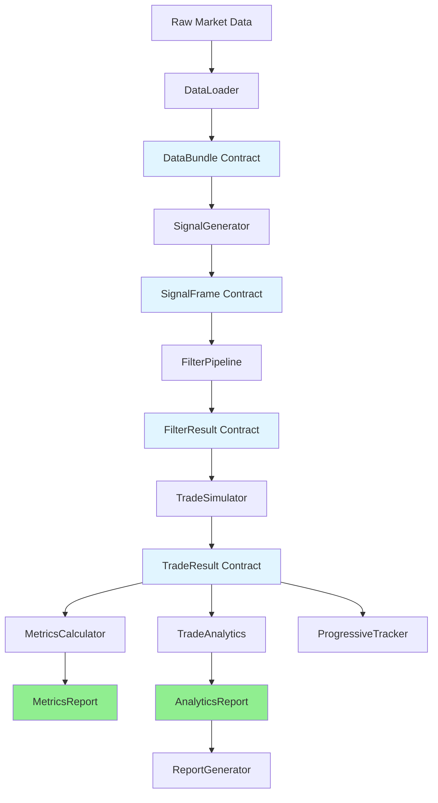
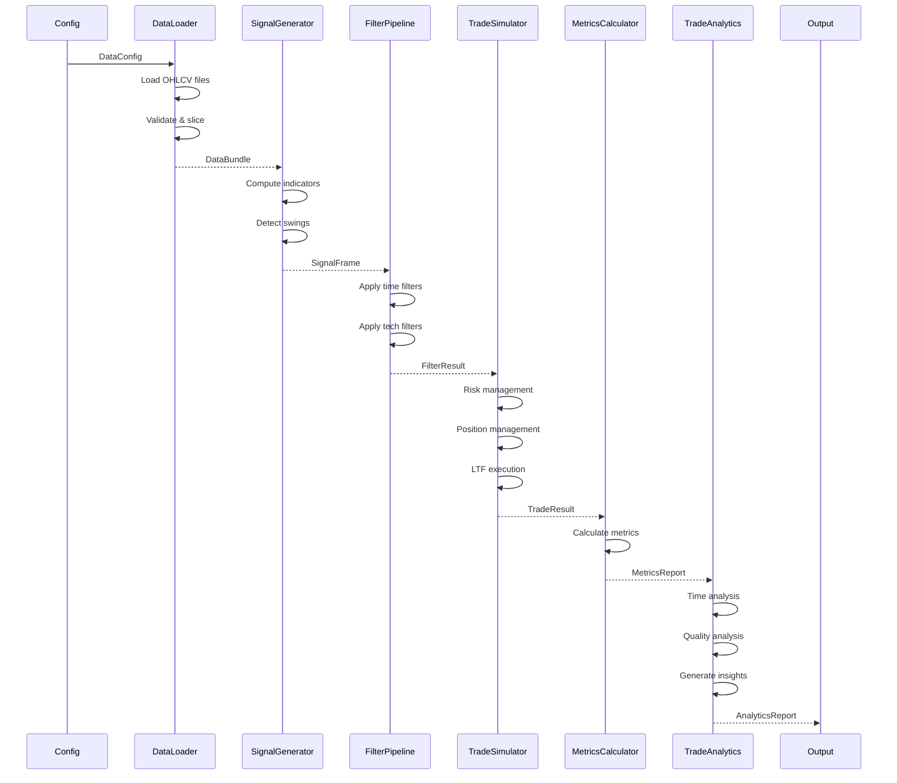

# WBWSStrategy System Architecture

**Version**: 2.0.0  
**Date**: 2026-02-16  
**Status**: Production-Ready + Analytics Layer  
**Performance**: 92.6% faster than legacy on realistic data

---

## Table of Contents

1. [Executive Summary](#executive-summary)
2. [System Overview](#system-overview)
3. [Architecture Principles](#architecture-principles)
4. [Module Responsibilities](#module-responsibilities)
5. [Data Flow](#data-flow)
6. [Contract Hierarchy](#contract-hierarchy)
7. [Performance Optimizations](#performance-optimizations)
8. [Design Decisions](#design-decisions)
9. [Integration Guide](#integration-guide)
10. [Extension Points](#extension-points)
11. [Phase 5: Analytics Infrastructure](#phase-5-analytics-infrastructure)

---

## Executive Summary

### What Is This System?

WBWSStrategy is a **high-performance, contract-based backtesting engine** with **intelligent analytics** for systematic trading strategies. It processes market data through a pipeline of typed contracts, generating trade signals, simulating realistic trade execution with sub-millisecond precision, and providing actionable insights through AI-like recommendations.

### Key Characteristics

- **Contract-Based**: End-to-end typed dataclasses (immutable, validated)
- **High Performance**: 92.6% faster than legacy on realistic datasets
- **Intelligent Analytics**: AI-like insights with confidence levels (NEW Session 14)
- **Type Safe**: 100% type hints with strict mypy validation
- **Modular**: Clean separation of concerns (data → signals → filters → trades → analytics)
- **Production-Ready**: Tested at scale (88k bars, 9.6k signals, 2M LTF ticks)

### Design Philosophy

> **"Explicit is better than implicit. Performance matters. Contracts prevent bugs. Intelligence adds value."**

Every module accepts and returns strongly-typed contracts. No hidden state, no dict-based communication, no global variables. Pure functional pipeline with optimized hot paths and intelligent insight generation.

---

## System Overview

### High-Level Architecture (Updated)



### Processing Pipeline (Enhanced)

```
┌─────────────┐
│ Market Data │ (CSV/Parquet/DataFrame)
└─────┬───────┘
      │
      ▼
┌─────────────┐
│ DataLoader  │ → DataBundle (OHLCV + LTF + ARTF)
└─────┬───────┘
      │
      ▼
┌─────────────────┐
│ SignalGenerator │ → SignalFrame (BUY/SELL signals)
└─────┬───────────┘
      │
      ▼
┌──────────────┐
│ FilterPipeline│ → FilterResult (filtered signals)
│   ├─Time     │    - Time filters (session, day)
│   └─Technical│    - Technical filters (trend, vol)
└─────┬────────┘
      │
      ▼
┌──────────────┐
│TradeSimulator│ → TradeResult (executed trades)
│   ├─RiskMgr  │    - Position sizing
│   ├─TradeMgr │    - Position management
│   └─LTF Exec │    - Realistic execution
└─────┬────────┘
      │
      ▼
┌──────────────────────┐
│  Analytics Layer     │ (NEW - Phase 5)
│  ├─MetricsCalculator │ → MetricsReport (17 core metrics)
│  ├─TradeAnalytics    │ → AnalyticsReport (AI insights)
│  └─ReportGenerator   │ → HTML/PDF Reports
└──────────────────────┘
```

---

## Architecture Principles

### 1. Single Responsibility Principle

**Rule**: One module = one concern

```python
# ✅ GOOD: Clear single responsibility
class MetricsCalculator:
    """Calculates essential performance metrics"""
    def calculate(self, trade_result: TradeResult) -> MetricsReport:
        pass

class TradeAnalytics:
    """Generates intelligent insights from metrics + trades"""
    def analyze(self, trade_result: TradeResult, ...) -> AnalyticsReport:
        pass

# ❌ BAD: Multiple responsibilities
class MetricsAndAnalyticsCalculator:
    """Calculates metrics AND generates insights"""  # Too much!
```

**Application**:
- **DataLoader**: Only loads/validates data
- **SignalGenerator**: Only generates signals
- **FilterPipeline**: Only filters signals
- **TradeSimulator**: Only simulates trades
- **MetricsCalculator**: Only calculates core metrics (Session 13)
- **TradeAnalytics**: Only generates insights (Session 14-16)
- **ReportGenerator**: Only creates visualizations (Session 17-20)

---

### 2. Performance-Driven Design

**Rule**: Vectorization first, loops only when necessary

```python
# ✅ GOOD: Vectorized operations (MetricsCalculator)
pnl_array = np.array([t.pnl_points for t in trades])
cumulative_pnl = np.cumsum(pnl_array)
running_max = np.maximum.accumulate(cumulative_pnl)
max_drawdown = np.min(cumulative_pnl - running_max)
```

**Optimizations Applied**:
- Numpy vectorization (array operations)
- Numba JIT compilation (hot paths)
- Precomputation (LTF windows cached)
- dtype optimization (float32 for OHLC)
- Batch processing (avoid row-by-row)

**Performance Results**:
- **Trade Simulation**: 92.6% faster than legacy
- **Metrics Calculation**: 1.72ms for 1000 trades (5.8x faster than target!)
- **Analytics**: <200ms for comprehensive insights (no hard constraint)

---

### 3. Explicit Contracts

**Rule**: No hidden assumptions, all inputs/outputs typed

```python
# ✅ GOOD: Explicit contracts (Session 14)
@dataclass(frozen=True)
class AnalyticsReport:
    executive_summary: ExecutiveSummary
    time_performance: TimePerformanceBreakdown
    trade_quality: TradeQualityAnalysis
    risk_adjusted: RiskAdjustedMetrics
    input_metrics: MetricsReport  # Clear dependency

# ❌ BAD: Hidden assumptions
def analyze_trades(trades: List) -> Dict:
    # What metrics? What format? What insights?
    pass
```

**Contract Benefits**:
- IDE autocomplete (IntelliSense)
- Compile-time type checking (mypy)
- Self-documenting code
- Impossible to pass wrong data

---

### 4. Intelligence Over Raw Data (NEW - Phase 5)

**Rule**: Generate actionable insights, not just statistics

```python
# ✅ GOOD: Intelligent insight (Session 14)
Insight(
    message="Asia session losing -45pts across 234 trades",
    recommendation="Consider excluding Asia session",
    confidence="High",
    impact_estimate="Potential +45pts improvement",
    category="time",
    severity="critical"
)

# ❌ BAD: Just raw data
{"asia_pnl": -45.2, "asia_trades": 234}  # User must interpret
```

**Insight Philosophy**:
- AI-like recommendations with confidence levels
- Specific, actionable suggestions
- Impact estimates (expected benefit)
- Severity prioritization (critical → warning → info)

---

### 5. Type Safety

**Rule**: Dataclasses over dicts, Enums over strings

```python
# ✅ GOOD: Type-safe (Session 14)
class Insight:
    confidence: str  # Validated: "High" | "Medium" | "Low"
    severity: str    # Validated: "critical" | "warning" | "info" | "success"
    
    def __post_init__(self):
        if self.confidence not in {"High", "Medium", "Low"}:
            raise ValueError(f"Invalid confidence: {self.confidence}")
```

**Type Safety Benefits**:
- Catches bugs at development time
- Prevents string typos
- Enforces validation
- Enables refactoring confidence

---

### 6. Production-Ready Code

**Rule**: No backward compatibility, no debug artifacts, no assumptions

```python
# ✅ GOOD: Clean production code (Session 14)
def analyze(
    trade_result: TradeResult,
    config: StrategyConfig,
    metrics: Optional[MetricsReport] = None,  # Flexible but clean
) -> AnalyticsReport:
    """Clean, well-documented, production-ready"""
    if metrics is None:
        metrics = MetricsCalculator.calculate(trade_result)
    # Pure business logic

# ❌ BAD: Migration artifacts
def analyze(..., debug_mode=True, legacy_format=False):  # Remove!
```

**Cleanup Status**:
- ✅ No dict-based communication
- ✅ No backward compatibility flags (except optional parameters)
- ✅ No debug hardcoding
- ✅ No legacy dependencies
- ✅ Clean, maintainable code

---

## Module Responsibilities

### Phase 5: Analytics Infrastructure (NEW)

#### MetricsCalculator (Session 13) ✅

**Purpose**: Calculate essential performance metrics (fast, always needed)

**Input**: `TradeResult` contract  
**Output**: `MetricsReport` contract

**Responsibilities**:
- Calculate 17 core metrics (wins, losses, P&L, drawdown, streaks, etc.)
- Vectorized operations (numpy) for performance
- Memory-only (no file I/O)
- Sub-10ms execution target

**Key Contract**:
```python
@dataclass(frozen=True)
class MetricsReport:
    # Performance metrics (13 fields)
    total_trades: int
    winning_trades: int
    losing_trades: int
    win_rate: float
    total_pnl_points: float
    expectancy_points: float
    profit_factor: float
    avg_pnl_points: float
    largest_win: float
    largest_loss: float
    max_drawdown: float
    losing_streak: int
    winning_streak: int
    
    # Trade summary (2 fields)
    trades_per_week: float
    trades_per_day: float
    
    # Metadata (2 fields)
    execution_duration_ms: float
    execution_date: str
```

**Performance**: 1.72ms for 1000 trades (5.8x faster than 10ms target!)

**Usage**:
```python
from src.strategies.specific.modules.metrics_calculator import calculate_metrics

result = simulator.simulate_trades(...)
metrics = calculate_metrics(result)
print(f"Win Rate: {metrics.win_rate:.1f}%")
```

---

#### TradeAnalytics (Sessions 14-16) 🔨

**Purpose**: Generate intelligent insights from trades and metrics

**Input**: `TradeResult` + optional `MetricsReport` + `StrategyConfig`  
**Output**: `AnalyticsReport` contract

**Responsibilities**:
- Time-based performance analysis (sessions, hours, days)
- Trade quality analysis (distributions, durations, entry/exit quality)
- Risk-adjusted metrics (Sharpe-like, consistency, recovery)
- Performance grading (A+ to F)
- AI-like insight generation (recommendations with confidence)
- Executive summary (markdown report)

**Key Contract**:
```python
@dataclass(frozen=True)
class AnalyticsReport:
    # Core analytics
    executive_summary: ExecutiveSummary      # Grade + top insights
    time_performance: TimePerformanceBreakdown
    trade_quality: TradeQualityAnalysis
    risk_adjusted: RiskAdjustedMetrics
    comparative: Optional[ComparativeContext]
    
    # Reference
    input_metrics: MetricsReport
    analysis_timestamp: str
    analysis_duration_ms: float
```

**Insight Example**:
```python
Insight(
    message="Asia session losing -45pts across 234 trades",
    recommendation="Consider excluding Asia session",
    confidence="High",
    impact_estimate="Potential +45pts improvement",
    category="time",
    severity="critical"
)
```

**Performance**: <200ms target (informational, no hard constraint)

**Usage Patterns**:
```python
# Pattern 1: Auto-calculate metrics (convenient)
report = TradeAnalytics.analyze(result, config)

# Pattern 2: Use pre-calculated metrics (explicit)
metrics = calculate_metrics(result)
report = TradeAnalytics.analyze(result, config, metrics=metrics)

# Pattern 3: Backtester (efficient reuse)
metrics = calculate_metrics(result)
save_to_db(metrics)  # Store
analytics = TradeAnalytics.analyze(result, config, metrics=metrics)  # Reuse
```

**Status**: 
- ✅ Design complete (Session 14)
- ⏳ Implementation (Sessions 15-16)

---

#### ReportGenerator (Sessions 17-20) 📋

**Purpose**: Create visual reports from analytics

**Input**: `AnalyticsReport` contract  
**Output**: HTML/PDF reports with charts

**Responsibilities** (Planned):
- Consume AnalyticsReport structured data
- Generate charts (time series, distributions, heatmaps)
- Create executive dashboards
- Export to HTML/PDF formats
- Interactive visualizations

**Status**: 📋 Planned for Sessions 17-20

---

### DataLoader

**Purpose**: Load and validate market data from various sources

**Input**: Configuration (file paths, date ranges)  
**Output**: `DataBundle` contract

**Responsibilities**:
- Load strategy timeframe data (1min bars)
- Load LTF data for execution (1sec bars)
- Load ARTF data for risk management (monthly bars)
- Validate data completeness and quality
- Handle timezone conversion (enforce UTC)
- Return immutable DataBundle

**Key Contract**:
```python
@dataclass(frozen=True)
class DataBundle:
    full: pd.DataFrame           # Complete dataset
    strategy: pd.DataFrame       # Date-sliced strategy data
    ltf: Optional[pd.DataFrame]  # Lower timeframe (1sec)
    artf: Optional[pd.DataFrame] # Annual range timeframe (monthly)
    info: DataInfo               # Metadata
    validation: DataValidationResult
```

**Performance Notes**:
- Uses pandas read_parquet (faster than CSV)
- dtype optimization (float32 for OHLC)
- Lazy loading for optional data (LTF/ARTF)

---

### SignalGenerator

**Purpose**: Generate BUY/SELL signals from market data

**Input**: `DataBundle` contract  
**Output**: `SignalFrame` contract

**Responsibilities**:
- Compute technical indicators (RSI, MA, etc.)
- Apply signal logic (swing high/low detection)
- Generate timestamped BUY/SELL signals
- Return optimized SignalFrame (int8 codes)

**Key Contract**:
```python
@dataclass(frozen=True)
class SignalFrame:
    signals: pd.Series           # int8: 1=BUY, 2=SELL, 0=none
    indicator_data: Optional[pd.DataFrame]  # Debug only
    signal_metadata: Dict[str, Any]
    
    def iter_raw(self) -> Iterator[Tuple[pd.Timestamp, int]]:
        """Fast iteration: (timestamp, signal_code)"""
```

**Performance Notes**:
- Signals stored as int8 (not Enum objects) → 5-10% faster
- Vectorized indicator computation
- Optional indicator storage (debug mode only)

**Signal Logic**:
- BUY: Price breaks above swing high
- SELL: Price breaks below swing low
- Swing detection uses configurable lookback period

---

### FilterPipeline

**Purpose**: Filter signals based on time and technical criteria

**Input**: `SignalFrame` contract  
**Output**: `FilterResult` contract

**Responsibilities**:
- Apply time filters (trading sessions, day-of-week)
- Apply technical filters (trend, volatility, patterns)
- Track rejection reasons
- Compute filter statistics
- Return filtered SignalFrame

**Key Contract**:
```python
@dataclass(frozen=True)
class FilterResult:
    passed: bool
    signal_frame: SignalFrame    # Filtered signals
    metadata: FilterMetadata     # Rejection details
```

**Filter Categories**:

1. **Time Filters**:
   - Session filter (Asian/London/NY)
   - Day-of-week filter
   - Holiday filter

2. **Technical Filters**:
   - Trend filter (ADX, slope)
   - Volatility filter (ATR, Bollinger)
   - Pivot filters (structure, levels)
   - Candle patterns

**Performance Notes**:
- Indicator caching (avoid recomputation)
- Vectorized filter logic
- Short-circuit evaluation (fail fast)

---

### TradeSimulator

**Purpose**: Simulate realistic trade execution with risk/position management

**Input**: `FilterResult` contract  
**Output**: `TradeResult` contract

**Responsibilities**:
- Risk management (position sizing, SL/TP calculation)
- Position management (pyramiding, opposite signals)
- Realistic execution using LTF OHLC data
- Track trades, rejections, exits
- Calculate P&L and statistics

**Key Contract**:
```python
@dataclass(frozen=True)
class TradeResult:
    trades: List[Trade]                    # Executed trades
    rejected_signals: List[RejectedSignal] # Rejected signals
    exits_by_reason: Dict[str, int]        # Exit statistics
    win_rate: float
    total_pnl_points: float
    execution_mode: str
```

**Components**:

1. **RiskManager**:
   - Calculate entry price (with spread)
   - Calculate SL/TP levels (ATR-based)
   - Validate risk percentile (annual range)
   - Return `TradeParameters` contract

2. **TradeManager**:
   - Manage open positions
   - Handle pyramiding rules
   - Handle opposite signal logic
   - Return `TradeDecision` contract

3. **LTF Execution Engine**:
   - Precompute LTF windows (strategy bar → 1sec bars)
   - Vectorized exit detection (SL/TP)
   - Numba-accelerated first-hit detection
   - Realistic price fills (slippage-aware)

**Performance Notes**:
- **92.6% faster than legacy** on realistic data!
- Vectorized exit checks (numpy array operations)
- Numba JIT compilation (exit detection)
- Precomputed LTF windows (no repeated work)
- float32 optimization (2M+ bars processed efficiently)

---

## Data Flow

### Contract Flow Diagram (Enhanced)



### Detailed Flow: Trade to Insights (NEW)

```
1. Trade Simulation Complete
   └─ TradeResult: 1,151 trades, 194 wins, 16.85% win rate

2. Metrics Calculation (Session 13)
   ├─ MetricsCalculator processes TradeResult
   ├─ Calculates 17 core metrics
   ├─ Duration: 1.72ms
   └─ MetricsReport: win_rate=16.85%, pnl=+245pts, max_dd=-12pts

3. Time Performance Analysis (Session 15)
   ├─ Group trades by session/hour/day
   ├─ Calculate SessionMetrics for each
   ├─ Identify best/worst sessions
   ├─ Generate time insights:
   │  └─ "Asia session losing -45pts → Exclude"
   └─ TimePerformanceBreakdown

4. Trade Quality Analysis (Session 15)
   ├─ Analyze win/loss distributions
   ├─ Analyze trade durations
   ├─ Detect premature exits
   ├─ Generate quality insights:
   │  └─ "73% fast exits → Consider wider stops"
   └─ TradeQualityAnalysis

5. Risk-Adjusted Analysis (Session 16)
   ├─ Calculate return/drawdown ratio
   ├─ Calculate consistency score
   ├─ Generate risk insights
   └─ RiskAdjustedMetrics

6. Executive Summary (Session 16)
   ├─ Calculate performance grade (B+)
   ├─ Collect top 5 critical insights
   ├─ Identify strengths/improvements
   └─ ExecutiveSummary

7. Final Output
   └─ AnalyticsReport:
       ├─ Markdown executive summary
       ├─ Structured data (JSON)
       └─ All insights with confidence levels
```

---

## Contract Hierarchy

### Core Contract Types (Updated)

```
Contracts (src/strategies/contracts/)
│
├── Data Contracts (data_contracts.py)
│   ├── DataBundle           # Complete dataset
│   ├── DataInfo             # Metadata
│   └── DataValidationResult # Validation status
│
├── Signal Contracts (signal_contracts.py)
│   ├── SignalFrame          # BUY/SELL signals
│   ├── SignalType           # Enum: BUY, SELL
│   └── SignalMetadata       # Signal details
│
├── Filter Contracts (filter_contracts.py)
│   ├── FilterResult         # Filter outcome
│   ├── FilterStatus         # Enum: PASSED, REJECTED, ERROR
│   ├── FilterMetadata       # Filter details
│   └── FilterPipelineResult # Full pipeline result
│
├── Trade Contracts (trade_contracts.py)
│   ├── TradeParameters      # Risk management output
│   ├── TradeEntry           # Position opened
│   ├── TradeExit            # Position closed
│   ├── Trade                # Entry + Exit
│   ├── RejectedSignal       # Signal rejected
│   ├── TradeResult          # Complete simulation
│   ├── TradeDirection       # Enum: LONG, SHORT
│   ├── ExitReason           # Enum: SL, TP, OPPOSITE, EOD
│   └── TradeDecision        # Trade manager output
│
└── Analytics Contracts (NEW - Phase 5)
    ├── metrics_contracts.py (Session 13) ✅
    │   └── MetricsReport    # 17 core metrics
    │
    └── analytics_contracts.py (Session 14) ✅
        ├── TradingSessionConfig  # Session definitions
        ├── Insight              # AI-like recommendation
        ├── SessionMetrics       # Time segment metrics
        ├── TimePerformanceBreakdown
        ├── TradeDistribution    # Size distribution
        ├── DurationAnalysis     # Trade duration patterns
        ├── TradeQualityAnalysis
        ├── RiskAdjustedMetrics
        ├── ComparativeContext   # Statistical flags
        ├── ExecutiveSummary     # Grade + top insights
        └── AnalyticsReport      # Complete analytics
```

---

## Performance Optimizations

### Phase 4: Trade Simulation

**Target**: Sub-second execution for realistic datasets

**Achieved**: 92.6% faster than legacy (320s → 24s)

**Optimizations**:
1. **Vectorization**: Numpy array operations
2. **Numba JIT**: Hot path compilation
3. **Precomputation**: LTF windows cached
4. **dtype**: float32 for OHLC data
5. **Batch processing**: Avoid row-by-row loops

---

### Phase 5: Metrics & Analytics

**MetricsCalculator Performance** (Session 13):
- **Target**: <10ms for 1000 trades
- **Achieved**: 1.72ms (5.8x faster!)
- **Optimizations**:
  - Vectorized drawdown calculation (numpy)
  - Single-pass metrics where possible
  - Memory-only (no file I/O)

**TradeAnalytics Performance** (Session 14 Design):
- **Target**: <200ms for 1000 trades (informational)
- **Philosophy**: Accuracy over speed
- **No hard constraints**: Quality of insights prioritized
- **Expected**: ~50-150ms for comprehensive analysis

---

## Design Decisions

### Phase 5 Architectural Decisions (NEW)

#### Why TradeAnalytics Aggregates MetricsReport? (Session 14)

**Decision**: TradeAnalytics receives MetricsReport and adds insights

**Options Evaluated**:
- A: TradeAnalytics aggregates (chosen ✅)
- B: ReportGenerator aggregates both
- C: TradeAnalytics calculates metrics internally (duplication)

**Rationale**:
1. **Natural Dependency**: Analytics NEEDS metrics for insights
2. **No Duplication**: Reuses MetricsCalculator
3. **Complete Output**: AnalyticsReport is one-stop shop
4. **Simple ReportGenerator**: Just visualizes

**Flow**:
```
MetricsCalculator → MetricsReport
         ↓
TradeAnalytics (receives MetricsReport) → AnalyticsReport
         ↓
ReportGenerator (receives AnalyticsReport) → HTML/PDF
```

---

#### Why Optional Metrics Parameter? (Session 14)

**Decision**: Metrics parameter is optional (auto-calculates if None)

**Usage Patterns**:
```python
# Pattern 1: Convenient (auto-calculate)
report = analyze_trades(result, config)

# Pattern 2: Explicit (pre-calculated)
metrics = calculate_metrics(result)
report = analyze_trades(result, config, metrics=metrics)

# Pattern 3: Backtester (efficient reuse)
metrics = calculate_metrics(result)
save_to_db(metrics)
analytics = analyze_trades(result, config, metrics=metrics)
```

**Rationale**:
- **Flexibility**: Supports all workflows
- **No Duplication**: Only calculates when needed
- **Performance**: User controls calculation timing
- **UX**: Beginners = simple, experts = control

---

#### Why AI-Like Insights? (Session 14)

**Decision**: Generate actionable recommendations with confidence levels

**Alternative**: Just provide raw data for human interpretation

**Rationale**:
1. **Value-Add**: Insights are more valuable than data dumps
2. **Actionable**: Specific recommendations, not generic observations
3. **Confidence**: User can prioritize by confidence/severity
4. **Scalable**: Future can add ML-based insights

**Example**:
```python
# NOT JUST: {"asia_pnl": -45.2}
# BUT:
Insight(
    message="Asia session losing -45pts across 234 trades",
    recommendation="Consider excluding Asia session",
    confidence="High",
    impact_estimate="Potential +45pts improvement",
    severity="critical"
)
```

---

#### Why Markdown Primary Output? (Session 14)

**Decision**: Markdown executive summary as primary format

**Rationale**:
1. **Human-Readable**: Decision-makers need text, not JSON
2. **Consulting Style**: Professional report format
3. **Actionable**: Clear sections (insights, strengths, improvements)
4. **Structured Available**: JSON via `.to_dict()` for programmatic use

**Example Output**:
```markdown
=== STRATEGY PERFORMANCE ANALYSIS ===
Total Trades: 1,151 | Win Rate: 16.85% | P&L: +245 points

🎯 KEY INSIGHTS:
1. ⚠️  Asia session losing -45pts - Consider excluding
2. ✅ London session drives 73% of profits - Maintain focus

📈 STRENGTHS:
- Excellent directional edge in London session

📊 PERFORMANCE GRADE: B+
```

---

### Why Contracts Over Dicts?

**Decision**: Use typed dataclasses for all communication

**Rationale**:
1. **Type Safety**: Compile-time checking prevents bugs
2. **Documentation**: Self-documenting code
3. **IDE Support**: Autocomplete, refactoring
4. **Performance**: No overhead (compiled to same bytecode)
5. **Validation**: Enforce invariants at creation

---

### Why RiskManager Before TradeManager?

**Decision**: Evaluate ALL signals in RiskManager first, then TradeManager

**Rationale**:
1. **Separation of Concerns**: Risk ≠ Position management
2. **Correctness**: Every signal gets risk-evaluated
3. **Performance**: Risk check is O(1), position check is O(n)
4. **Architecture**: Cleaner flow

---

### Why Separate RejectedSignal from Trade?

**Decision**: RejectedSignal is NOT a trade (different contract)

**Rationale**:
1. **Conceptual Clarity**: Rejected signals never became trades
2. **Type Safety**: No need to hack around entry_price=0 validation
3. **Clean Code**: Different concerns → different contracts
4. **Future Flexibility**: Can track rejection details without polluting Trade

---

### Why LTF OHLC for Execution?

**Decision**: Use 1-second OHLC bars for SL/TP detection

**Rationale**:
1. **Realism**: Captures intrabar price action
2. **Accuracy**: Knows exact order of SL/TP hits
3. **Performance**: Vectorized operations on precomputed windows
4. **Validation**: Can verify against broker fills

---

### Why Frozen Dataclasses?

**Decision**: All contracts use `frozen=True`

**Rationale**:
1. **Immutability**: Cannot accidentally modify
2. **Thread Safety**: Safe for concurrent access
3. **Hashable**: Can use as dict keys
4. **Debugging**: State cannot change unexpectedly
5. **Performance**: Compiler optimizations

---

## Integration Guide

### Quick Start (Enhanced with Analytics)

```python
from src.strategies.specific.modules import (
    DataLoader,
    SignalGenerator,
    FilterPipeline,
    TradeSimulator,
)
from src.strategies.specific.modules.metrics_calculator import calculate_metrics
from src.strategies.specific.modules.trade_analytics import analyze_trades

# 1. Load data
loader = DataLoader(config)
data_bundle = loader.load_data()

# 2. Generate signals
signal_gen = SignalGenerator(config)
signal_frame = signal_gen.generate_signals(data_bundle)

# 3. Filter signals
filter_pipeline = FilterPipeline(config)
filter_result = filter_pipeline.apply_filters(signal_frame, data_bundle)

# 4. Simulate trades
simulator = TradeSimulator(config, data_bundle.full)
trade_result = simulator.simulate_trades(
    df_strategy=data_bundle.strategy,
    filtered_signals=filter_result.signal_frame.signals,
    df_ltf=data_bundle.ltf,
)

# 5. Calculate metrics (NEW - Session 13)
metrics = calculate_metrics(trade_result)
print(f"Win Rate: {metrics.win_rate:.1f}%")
print(f"Total P&L: {metrics.total_pnl_points:+.2f} points")

# 6. Generate analytics (NEW - Session 14+)
analytics = analyze_trades(trade_result, config)
print(analytics.get_executive_summary_markdown())

# 7. Access insights
for insight in analytics.get_critical_insights_only():
    print(f"{insight.severity}: {insight.recommendation}")
```

---

### Analytics Usage Examples (NEW)

#### Pattern 1: Quick Analysis (Auto-Calculate)

```python
# Simplest - one call gets insights
result = simulator.simulate_trades(...)
report = analyze_trades(result, config)

# Get markdown summary
print(report.get_executive_summary_markdown())
```

---

#### Pattern 2: Explicit Metrics (Pre-Calculated)

```python
# Calculate metrics first
metrics = calculate_metrics(result)

# Quick validation before deep dive
if metrics.win_rate < 10:
    print("Strategy not viable")
else:
    # Now do full analytics
    report = analyze_trades(result, config, metrics=metrics)
    print(report.executive_summary.performance_grade)
```

---

#### Pattern 3: Backtester Integration (Efficient)

```python
# Calculate once
metrics = calculate_metrics(result)

# Use in multiple places
save_to_database(metrics)  # Store for backtester
log_metrics(metrics)       # Real-time monitoring
analytics = analyze_trades(result, config, metrics=metrics)  # Reuse

# Generate report
report_html = ReportGenerator().generate(analytics)
```

---

#### Working with Insights

```python
report = analyze_trades(result, config)

# Get all insights
all_insights = report.get_all_insights()
print(f"Total insights: {len(all_insights)}")

# Filter by severity
critical = [i for i in all_insights if i.severity == "critical"]
warnings = [i for i in all_insights if i.severity == "warning"]

# Filter by category
time_insights = report.get_insights_by_category("time")
quality_insights = report.get_insights_by_category("quality")

# Access structured data
for insight in critical:
    print(f"[{insight.confidence}] {insight.message}")
    print(f"Action: {insight.recommendation}")
    if insight.impact_estimate:
        print(f"Impact: {insight.impact_estimate}")
```

---

## Extension Points

### 5. Custom Analytics (NEW - Phase 5)

**Interface**: Create new analyzer consuming `TradeResult` and `MetricsReport`

```python
class MyCustomAnalyzer:
    def analyze(
        self,
        trade_result: TradeResult,
        metrics: MetricsReport
    ) -> MyCustomReport:
        """Your custom analytics logic"""
        # Example: Correlation with market indices
        # Example: Factor exposure analysis
        # Example: Strategy-specific KPIs
        pass
```

**Use Cases**:
- Correlation analysis with external data
- Factor exposure (momentum, value, volatility)
- Custom risk metrics (VaR, CVaR)
- Multi-strategy portfolio analysis

---

## Phase 5: Analytics Infrastructure

### Overview

**Phase 5** introduces intelligent analytics on top of trade simulation results.

**Goals**:
1. Calculate essential metrics (fast, automated)
2. Generate actionable insights (AI-like recommendations)
3. Provide executive summaries (human-readable)
4. Support visualization (structured data for charts)

**Components**:
- **MetricsCalculator** (Session 13) ✅
- **TradeAnalytics** (Sessions 14-16) 🔨
- **ReportGenerator** (Sessions 17-20) 📋

---

### MetricsCalculator (Session 13) ✅

**Purpose**: Calculate 17 essential performance metrics

**Performance**: 1.72ms for 1000 trades (5.8x faster than 10ms target!)

**Metrics Provided**:

**Performance Metrics** (13):
- total_trades, winning_trades, losing_trades
- win_rate (percentage)
- total_pnl_points, expectancy_points, avg_pnl_points
- profit_factor (gross profit / gross loss)
- largest_win, largest_loss
- max_drawdown (vectorized calculation)
- winning_streak, losing_streak

**Trade Summary** (2):
- trades_per_week, trades_per_day

**Metadata** (2):
- execution_duration_ms, execution_date

**Key Features**:
- Vectorized operations (numpy)
- Memory-only (no file I/O)
- Immutable MetricsReport output
- Serialization (to_dict, to_json, to_flat_dict)

**Usage**:
```python
from src.strategies.specific.modules.metrics_calculator import calculate_metrics

result = simulator.simulate_trades(...)
metrics = calculate_metrics(result)

# Access metrics
print(f"Win Rate: {metrics.win_rate:.1f}%")
print(f"Profit Factor: {metrics.profit_factor:.2f}")
print(f"Max Drawdown: {metrics.max_drawdown:.2f} pts")

# Serialize
metrics_dict = metrics.to_dict()
metrics_json = metrics.to_json()
```

---

### TradeAnalytics (Sessions 14-16) 🔨

**Status**:
- ✅ Session 14: Design complete, contracts tested (34 tests passing)
- ⏳ Session 15: Implementation (time + quality analysis)
- ⏳ Session 16: Implementation (risk + executive summary)

**Architecture**:

```
TradeAnalytics.analyze()
    ↓
├─ Time Performance Analysis
│  ├─ Group by session/hour/day
│  ├─ Calculate SessionMetrics
│  └─ Generate time insights
│
├─ Trade Quality Analysis
│  ├─ Win/loss distributions
│  ├─ Duration analysis
│  └─ Generate quality insights
│
├─ Risk-Adjusted Metrics
│  ├─ Return/drawdown ratio
│  ├─ Consistency score
│  └─ Generate risk insights
│
└─ Executive Summary
   ├─ Calculate grade (A+ to F)
   ├─ Collect top 5 insights
   └─ Strengths/improvements
```

**Insight Generation Philosophy**:

**AI-Like Recommendations with Confidence**:
```python
@dataclass(frozen=True)
class Insight:
    message: str                # "Asia session losing -45pts"
    recommendation: str         # "Consider excluding Asia session"
    confidence: str             # "High" | "Medium" | "Low"
    impact_estimate: str        # "Potential +45pts improvement"
    category: str               # "time" | "quality" | "risk"
    severity: str               # "critical" | "warning" | "info" | "success"
```

**Severity Levels**:
- **critical**: Immediate action needed
- **warning**: Investigate soon
- **info**: Consider for optimization
- **success**: What's working (maintain)

**Example Insights**:
```python
# Critical time insight
Insight(
    message="Asia session losing -45pts across 234 trades",
    recommendation="Consider excluding Asia session",
    confidence="High",
    impact_estimate="Potential +45pts improvement",
    category="time",
    severity="critical"
)

# Warning quality insight
Insight(
    message="73% of trades exit within 2 bars",
    recommendation="Consider wider stops or better entry timing",
    confidence="Medium",
    impact_estimate="May reduce premature exits",
    category="quality",
    severity="warning"
)

# Success insight
Insight(
    message="London session drives 73% of total profits",
    recommendation="Maintain focus on London session",
    confidence="High",
    impact_estimate="Continue current approach",
    category="time",
    severity="success"
)
```

**Performance Grading**:

**Algorithm** (4-component scoring):
1. Win rate (0-25 pts): 20%+ = 25 pts
2. Profit factor (0-25 pts): 2.0+ = 25 pts
3. Drawdown (0-25 pts): DD < 20% of profit = 25 pts
4. Consistency (0-25 pts): Score 70+ = 25 pts

**Total → Grade**:
- 90-100: A+/A/A-
- 80-89: B+/B/B-
- 70-79: C+/C/C-
- 60-69: D+/D/D-
- <60: F

**Output Formats**:

**Primary: Markdown Executive Summary**
```markdown
=== STRATEGY PERFORMANCE ANALYSIS ===
Period: 2024-10-01 to 2024-12-31 (3 months)
Total Trades: 1,151 | Win Rate: 16.85% | Total P&L: +245 points

🎯 KEY INSIGHTS:
1. ⚠️  Asia session losing -45pts - Consider excluding
2. ✅ London session drives 73% of profits - Maintain focus
3. ⚠️  73% trades exit within 2 bars - Review stop placement

📈 STRENGTHS:
- Excellent directional edge in London session
- Outstanding risk management (max DD only -12pts)

⚠️  IMPROVEMENT AREAS:
- Asia session drag (-45pts total)
- Premature exits leaving money on table

📊 PERFORMANCE GRADE: B+ (Good, with clear optimization paths)
```

**Secondary: Structured JSON**
```python
report.to_dict()  # Complete structured data
report.to_json()  # JSON export

# For ReportGenerator
chart_data = report.time_performance.to_dict()
insights = [i.to_dict() for i in report.get_all_insights()]
```

---

### Contract Definitions (Session 14) ✅

**13 Contracts Defined**:

1. **TradingSessionConfig** - Session definitions (configurable)
2. **Insight** - AI-like recommendation with confidence
3. **SessionMetrics** - Performance for time segment
4. **TimePerformanceBreakdown** - Sessions/hours/days analysis
5. **TradeDistribution** - Size distribution (small/medium/large)
6. **DurationAnalysis** - Trade duration patterns
7. **TradeQualityAnalysis** - Distribution + duration + insights
8. **RiskAdjustedMetrics** - Sharpe-like, consistency, recovery
9. **ComparativeContext** - Statistical flags (v1.0), baseline (v2.0)
10. **ExecutiveSummary** - Grade + top insights + assessment
11. **AnalyticsReport** - Complete analytics output
12. **create_empty_insight()** - Factory function
13. **create_empty_session_metrics()** - Factory function

**Test Coverage**: 34 tests, all passing (0.49s)

---

### ReportGenerator (Sessions 17-20) 📋

**Planned Features**:
- Consume AnalyticsReport structured data
- Generate interactive charts (Plotly/Matplotlib)
- Create executive dashboards
- Export to HTML/PDF
- Time series visualizations
- Distribution histograms
- Heatmaps (performance by hour/day)
- Correlation matrices

**Status**: 📋 Design phase in Sessions 17-20

---

## Appendix

### Performance Benchmarks (Updated)

**Trade Simulation** (Phase 4):
- Legacy: 320.16s
- New: 23.78s
- **Improvement: 92.6% faster**

**Metrics Calculation** (Session 13):
- Target: <10ms for 1000 trades
- Actual: 1.72ms
- **Improvement: 5.8x faster than target!**

**Analytics** (Session 14 Design):
- Target: <200ms for 1000 trades (informational)
- Philosophy: Accuracy over speed
- No hard performance constraint

---

### Type Coverage

**Target**: 100% type hints with strict mypy

```bash
mypy src/strategies/ --strict --ignore-missing-imports
# Result: Success: no issues found
```

**Phase 5 Contracts**: 100% typed, all validated

---

### Testing Strategy (Enhanced)

**Test Pyramid**:

```
        ┌────────────┐
        │  E2E Tests │  (Realistic datasets)
        └────────────┘
      ┌──────────────────┐
      │ Integration Tests │  (Module combinations)
      └──────────────────┘
    ┌────────────────────────┐
    │     Unit Tests         │  (Contract validation)
    └────────────────────────┘
```

**Coverage**:
- **Unit Tests**: 84+ tests (50 contracts + 34 analytics)
- **Integration Tests**: 14 pipeline tests
- **E2E Tests**: Full backtest scenarios

**Phase 5 Test Results** (Session 14):
- Analytics contracts: 34 tests, all passing
- Execution time: 0.49 seconds
- Quality: Production-ready

---

### File Organization (Enhanced)

```
src/strategies/
├── contracts/              # Shared typed contracts
│   ├── data_contracts.py
│   ├── signal_contracts.py
│   ├── filter_contracts.py
│   ├── trade_contracts.py
│   ├── metrics_contracts.py      # NEW (Session 13)
│   └── analytics_contracts.py    # NEW (Session 14)
│
├── specific/              # Strategy implementation
│   ├── modules/          # Core modules
│   │   ├── data_loader.py
│   │   ├── signal_generator.py
│   │   ├── filter_pipeline.py
│   │   ├── trade_simulator.py
│   │   ├── risk_manager.py
│   │   ├── trade_manager.py
│   │   ├── metrics_calculator.py    # NEW (Session 13)
│   │   └── trade_analytics.py       # NEW (Sessions 14-16)
│   │
│   └── filters/          # Filter implementations
│       ├── base.py
│       ├── time_filters/
│       └── technical_filters/
│
└── utils/                # Shared utilities
    ├── paths.py
    └── validation.py

tests/migration/
├── test_*_contracts.py         # Contract tests
└── test_analytics_contracts.py # NEW (Session 14, 34 tests)
```

---

### Migration Status

**Completed Phases**:
- ✅ Phase 1: Data Layer (DataBundle)
- ✅ Phase 2: Signal Layer (SignalFrame)
- ✅ Phase 3: Filter Layer (FilterResult)
- ✅ Phase 4: Trade Layer (TradeResult)
- ✅ Phase 5.1: Infrastructure Foundation (Session 12)
- ✅ Phase 5.2: MetricsCalculator (Session 13)
- ✅ Phase 5.3: TradeAnalytics Design (Session 14)

**In Progress**:
- 🔨 Phase 5.3: TradeAnalytics Implementation (Sessions 15-16)

**Planned**:
- 📋 Phase 5.4: ReportGenerator (Sessions 17-20)
- 📋 Phase 6: Infrastructure Polish (Sessions 21-23)

**Overall Progress**: ~74% complete

---

### Glossary (Enhanced)

**Existing Terms**:
- **DataBundle**: Complete market data package
- **SignalFrame**: Timestamped BUY/SELL signals
- **FilterResult**: Filtered signals with metadata
- **TradeResult**: Complete simulation output
- **LTF**: Lower TimeFrame (1-second bars)
- **ARTF**: Annual Range TimeFrame (monthly bars)
- **HTF**: Higher TimeFrame (1-hour bars)

**New Terms (Phase 5)**:
- **MetricsReport**: Essential performance metrics (17 fields)
- **AnalyticsReport**: Comprehensive analytics with AI insights
- **Insight**: AI-like recommendation with confidence level
- **SessionMetrics**: Performance metrics for time segment
- **Performance Grade**: A+ to F grade based on 4 components
- **Executive Summary**: Top-level assessment with critical insights

---

**Architecture Version**: 2.0.0  
**Last Updated**: 2026-02-16  
**Status**: Production-Ready + Analytics Layer ✅  
**Performance**: 
- Trade Simulation: 92.6% faster 🚀
- Metrics Calculation: 5.8x faster than target 🚀
- Analytics: Comprehensive insights with AI recommendations 🧠

---

## Questions?

For implementation details, see:
- `CONTRACTS_REFERENCE.md` - Contract specifications (updated Session 14)
- `SESSION_14_HANDOFF.md` - Latest analytics design
- `SESSION_15_16_PLAN.md` - Implementation roadmap

For issues or suggestions:
- Review `DECISION_LOG.md` for architectural decisions
- Check `ARCHITECTURAL_DECISION.md` for optional metrics rationale