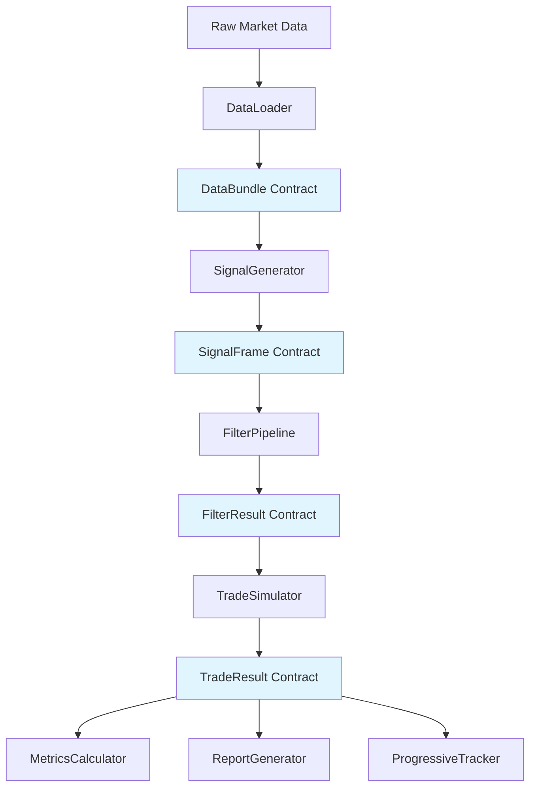
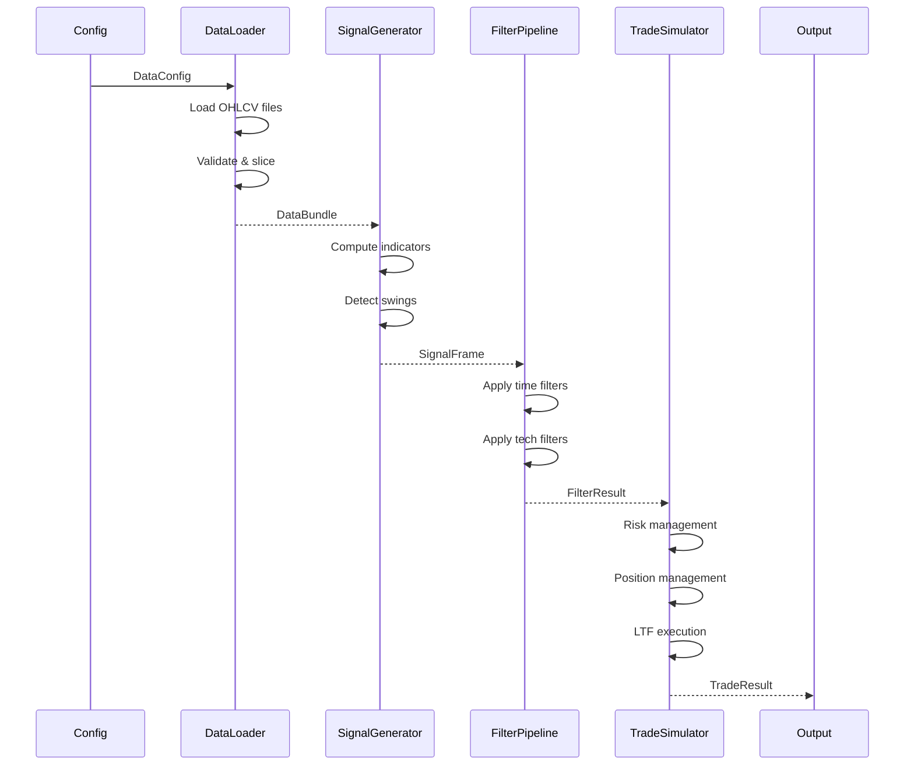

# WBWSStrategy System Architecture

**Version**: 1.0.0  
**Date**: 2025-02-15  
**Status**: Production-Ready (Post-Migration)  
**Performance**: 92.6% faster than legacy on realistic data

---

## Table of Contents

1. [Executive Summary](#executive-summary)
2. [System Overview](#system-overview)
3. [Architecture Principles](#architecture-principles)
4. [Module Responsibilities](#module-responsibilities)
5. [Data Flow](#data-flow)
6. [Contract Hierarchy](#contract-hierarchy)
7. [Performance Optimizations](#performance-optimizations)
8. [Design Decisions](#design-decisions)
9. [Integration Guide](#integration-guide)
10. [Extension Points](#extension-points)

---

## Executive Summary

### What Is This System?

WBWSStrategy is a **high-performance, contract-based backtesting engine** for systematic trading strategies. It processes market data through a pipeline of typed contracts, generating trade signals and simulating realistic trade execution with sub-millisecond precision.

### Key Characteristics

- **Contract-Based**: End-to-end typed dataclasses (immutable, validated)
- **High Performance**: 92.6% faster than legacy on realistic datasets
- **Type Safe**: 100% type hints with strict mypy validation
- **Modular**: Clean separation of concerns (data → signals → filters → trades)
- **Production-Ready**: Tested at scale (88k bars, 9.6k signals, 2M LTF ticks)

### Design Philosophy

> **"Explicit is better than implicit. Performance matters. Contracts prevent bugs."**

Every module accepts and returns strongly-typed contracts. No hidden state, no dict-based communication, no global variables. Pure functional pipeline with optimized hot paths.

---

## System Overview

### High-Level Architecture



### Processing Pipeline

```
┌─────────────┐
│ Market Data │ (CSV/Parquet/DataFrame)
└─────┬───────┘
      │
      ▼
┌─────────────┐
│ DataLoader  │ → DataBundle (OHLCV + LTF + ARTF)
└─────┬───────┘
      │
      ▼
┌─────────────────┐
│ SignalGenerator │ → SignalFrame (BUY/SELL signals)
└─────┬───────────┘
      │
      ▼
┌──────────────┐
│ FilterPipeline│ → FilterResult (filtered signals)
│   ├─Time     │    - Time filters (session, day)
│   └─Technical│    - Technical filters (trend, vol)
└─────┬────────┘
      │
      ▼
┌──────────────┐
│TradeSimulator│ → TradeResult (executed trades)
│   ├─RiskMgr  │    - Position sizing
│   ├─TradeMgr │    - Position management
│   └─LTF Exec │    - Realistic execution
└─────┬────────┘
      │
      ▼
┌──────────────┐
│  Reporting   │ → Reports, Metrics, Analysis
└──────────────┘
```

---

## Architecture Principles

### 1. Single Responsibility Principle

**Rule**: One module = one concern

```python
# ✅ GOOD: Clear single responsibility
class DataLoader:
    """Loads and validates market data"""
    def load_data(self, config: DataConfig) -> DataBundle:
        pass

# ❌ BAD: Multiple responsibilities
class DataLoaderAndSignalGenerator:
    """Loads data AND generates signals"""  # Too much!
```

**Application**:
- **DataLoader**: Only loads/validates data
- **SignalGenerator**: Only generates signals
- **FilterPipeline**: Only filters signals
- **TradeSimulator**: Only simulates trades

---

### 2. Performance-Driven Design

**Rule**: Vectorization first, loops only when necessary

```python
# ✅ GOOD: Vectorized operations
def check_exits(self, low_np: np.ndarray, high_np: np.ndarray):
    sl_hit = low_np <= self.stop_loss  # Vectorized comparison
    tp_hit = high_np >= self.take_profit
    exit_mask = sl_hit | tp_hit  # Vectorized OR
    
# ❌ BAD: Python loops
for i in range(len(lows)):
    if lows[i] <= self.stop_loss:  # Slow!
        # ...
```

**Optimizations Applied**:
- Numpy vectorization (array operations)
- Numba JIT compilation (hot paths)
- Precomputation (LTF windows cached)
- dtype optimization (float32 for OHLC)
- Batch processing (avoid row-by-row)

**Result**: 92.6% faster than legacy on realistic data

---

### 3. Explicit Contracts

**Rule**: No hidden assumptions, all inputs/outputs typed

```python
# ✅ GOOD: Explicit contract
@dataclass(frozen=True)
class FilterResult:
    passed: bool
    signal_frame: SignalFrame
    metadata: FilterMetadata  # All details captured

# ❌ BAD: Hidden assumptions
def filter_signals(signals: pd.Series) -> pd.Series:
    # What timezone? What if empty? What validation?
    pass
```

**Contract Benefits**:
- IDE autocomplete (IntelliSense)
- Compile-time type checking (mypy)
- Self-documenting code
- Impossible to pass wrong data

---

### 4. Type Safety

**Rule**: Dataclasses over dicts, Enums over strings

```python
# ✅ GOOD: Type-safe
class TradeDirection(Enum):
    LONG = 1
    SHORT = -1

@dataclass(frozen=True)
class Trade:
    direction: TradeDirection  # Type-safe!
    entry_price: float

# ❌ BAD: Stringly-typed
trade = {
    "direction": "buy",  # Typo? "Buy"? "BUY"?
    "entry_price": "100.50"  # String or float?
}
```

**Type Safety Benefits**:
- Catches bugs at development time
- Prevents string typos ("BUY" vs "Buy")
- Enforces validation (prices > 0)
- Enables refactoring confidence

---

### 5. Production-Ready Code

**Rule**: No backward compatibility, no debug artifacts, no assumptions

```python
# ✅ GOOD: Clean production code
def simulate_trades(
    self,
    df_strategy: pd.DataFrame,
    filtered_signals: pd.Series,
    df_ltf: pd.DataFrame,
) -> TradeResult:  # Returns contract
    """Simulate trades with LTF execution"""
    # Pure business logic

# ❌ BAD: Migration artifacts
def simulate_trades(..., legacy_mode=False):  # Remove!
    if legacy_mode:  # Remove!
        return self.to_dict()  # Remove!
```

**Cleanup Completed**:
- ✅ No dict-based communication
- ✅ No backward compatibility flags
- ✅ No debug hardcoding
- ✅ No legacy dependencies
- ✅ No migration helpers

---

## Module Responsibilities

### DataLoader

**Purpose**: Load and validate market data from various sources

**Input**: Configuration (file paths, date ranges)  
**Output**: `DataBundle` contract

**Responsibilities**:
- Load strategy timeframe data (1min bars)
- Load LTF data for execution (1sec bars)
- Load ARTF data for risk management (monthly bars)
- Validate data completeness and quality
- Handle timezone conversion (enforce UTC)
- Return immutable DataBundle

**Key Contract**:
```python
@dataclass(frozen=True)
class DataBundle:
    full: pd.DataFrame           # Complete dataset
    strategy: pd.DataFrame       # Date-sliced strategy data
    ltf: Optional[pd.DataFrame]  # Lower timeframe (1sec)
    artf: Optional[pd.DataFrame] # Annual range timeframe (monthly)
    info: DataInfo               # Metadata
    validation: DataValidationResult
```

**Performance Notes**:
- Uses pandas read_parquet (faster than CSV)
- dtype optimization (float32 for OHLC)
- Lazy loading for optional data (LTF/ARTF)

---

### SignalGenerator

**Purpose**: Generate BUY/SELL signals from market data

**Input**: `DataBundle` contract  
**Output**: `SignalFrame` contract

**Responsibilities**:
- Compute technical indicators (RSI, MA, etc.)
- Apply signal logic (swing high/low detection)
- Generate timestamped BUY/SELL signals
- Return optimized SignalFrame (int8 codes)

**Key Contract**:
```python
@dataclass(frozen=True)
class SignalFrame:
    signals: pd.Series           # int8: 1=BUY, 2=SELL, 0=none
    indicator_data: Optional[pd.DataFrame]  # Debug only
    signal_metadata: Dict[str, Any]
    
    def iter_raw(self) -> Iterator[Tuple[pd.Timestamp, int]]:
        """Fast iteration: (timestamp, signal_code)"""
```

**Performance Notes**:
- Signals stored as int8 (not Enum objects) → 5-10% faster
- Vectorized indicator computation
- Optional indicator storage (debug mode only)

**Signal Logic**:
- BUY: Price breaks above swing high
- SELL: Price breaks below swing low
- Swing detection uses configurable lookback period

---

### FilterPipeline

**Purpose**: Filter signals based on time and technical criteria

**Input**: `SignalFrame` contract  
**Output**: `FilterResult` contract

**Responsibilities**:
- Apply time filters (trading sessions, day-of-week)
- Apply technical filters (trend, volatility, patterns)
- Track rejection reasons
- Compute filter statistics
- Return filtered SignalFrame

**Key Contract**:
```python
@dataclass(frozen=True)
class FilterResult:
    passed: bool
    signal_frame: SignalFrame    # Filtered signals
    metadata: FilterMetadata     # Rejection details
```

**Filter Categories**:

1. **Time Filters**:
   - Session filter (Asian/London/NY)
   - Day-of-week filter
   - Holiday filter

2. **Technical Filters**:
   - Trend filter (ADX, slope)
   - Volatility filter (ATR, Bollinger)
   - Pivot filters (structure, levels)
   - Candle patterns

**Performance Notes**:
- Indicator caching (avoid recomputation)
- Vectorized filter logic
- Short-circuit evaluation (fail fast)

---

### TradeSimulator

**Purpose**: Simulate realistic trade execution with risk/position management

**Input**: `FilterResult` contract  
**Output**: `TradeResult` contract

**Responsibilities**:
- Risk management (position sizing, SL/TP calculation)
- Position management (pyramiding, opposite signals)
- Realistic execution using LTF OHLC data
- Track trades, rejections, exits
- Calculate P&L and statistics

**Key Contract**:
```python
@dataclass(frozen=True)
class TradeResult:
    trades: List[Trade]                    # Executed trades
    rejected_signals: List[RejectedSignal] # Rejected signals
    exits_by_reason: Dict[str, int]        # Exit statistics
    win_rate: float
    total_pnl_points: float
    execution_mode: str
```

**Components**:

1. **RiskManager**:
   - Calculate entry price (with spread)
   - Calculate SL/TP levels (ATR-based)
   - Validate risk percentile (annual range)
   - Return `TradeParameters` contract

2. **TradeManager**:
   - Manage open positions
   - Handle pyramiding rules
   - Handle opposite signal logic
   - Return `TradeDecision` contract

3. **LTF Execution Engine**:
   - Precompute LTF windows (strategy bar → 1sec bars)
   - Vectorized exit detection (SL/TP)
   - Numba-accelerated first-hit detection
   - Realistic price fills (slippage-aware)

**Performance Notes**:
- **92.6% faster than legacy** on realistic data!
- Vectorized exit checks (numpy array operations)
- Numba JIT compilation (exit detection)
- Precomputed LTF windows (no repeated work)
- float32 optimization (2M+ bars processed efficiently)

---

## Data Flow

### Contract Flow Diagram



### Detailed Flow: Signal to Trade

```
1. Signal Generated
   ├─ SignalFrame: timestamp=2025-01-15 10:30, type=BUY
   └─ Pass to FilterPipeline

2. Filter Stage
   ├─ Time Filter: Check session (pass/fail)
   ├─ Trend Filter: Check ADX > 25 (pass/fail)
   └─ FilterResult: passed=True, signal_frame=filtered

3. Risk Management
   ├─ Entry Price: 1.2345 (mid) → 1.2346 (with spread)
   ├─ Stop Loss: 1.2345 - (2.0 * ATR) = 1.2325
   ├─ Take Profit: 1.2345 + (4.0 * ATR) = 1.2385
   ├─ Risk Check: SL distance = 2.1 points (1.7% of annual range) → PASS
   └─ TradeParameters: entry=1.2346, sl=1.2325, tp=1.2385

4. Position Management
   ├─ Check existing positions: 0 open
   ├─ Check pyramiding: allowed
   ├─ Decision: OPEN new position
   └─ TradeDecision: type=OPEN, trade_id=1

5. Trade Execution
   ├─ Create TradeEntry: id=E1, price=1.2346, sl=1.2325, tp=1.2385
   ├─ Monitor LTF bars for exit
   │  ├─ Bar 1: low=1.2340, high=1.2350 (no exit)
   │  ├─ Bar 2: low=1.2335, high=1.2345 (no exit)
   │  ├─ ...
   │  └─ Bar 847: low=1.2320, high=1.2330 (SL HIT!)
   ├─ Create TradeExit: price=1.2325, reason=STOP_LOSS, pnl=-2.1 pts
   └─ Create Trade: entry + exit

6. Result
   └─ TradeResult: trades=[Trade(E1)], pnl=-2.1, reason=STOP_LOSS
```

---

## Contract Hierarchy

### Core Contract Types

```
Contracts (src/strategies/contracts/)
│
├── Data Contracts (data_contracts.py)
│   ├── DataBundle           # Complete dataset
│   ├── DataInfo             # Metadata
│   └── DataValidationResult # Validation status
│
├── Signal Contracts (signal_contracts.py)
│   ├── SignalFrame          # BUY/SELL signals
│   ├── SignalType           # Enum: BUY, SELL
│   └── SignalMetadata       # Signal details
│
├── Filter Contracts (filter_contracts.py)
│   ├── FilterResult         # Filter outcome
│   ├── FilterStatus         # Enum: PASSED, REJECTED, ERROR
│   ├── FilterMetadata       # Filter details
│   └── FilterPipelineResult # Full pipeline result
│
└── Trade Contracts (trade_contracts.py)
    ├── TradeParameters      # Risk management output
    ├── TradeEntry           # Position opened
    ├── TradeExit            # Position closed
    ├── Trade                # Entry + Exit
    ├── RejectedSignal       # Signal rejected
    ├── TradeResult          # Complete simulation
    ├── TradeDirection       # Enum: LONG, SHORT
    ├── ExitReason           # Enum: SL, TP, OPPOSITE, EOD
    └── TradeDecision        # Trade manager output
```

### Contract Design Patterns

#### 1. Immutability

**All contracts are immutable** (frozen=True):

```python
@dataclass(frozen=True)
class Trade:
    entry: TradeEntry
    exit: Optional[TradeExit] = None
    
    # Cannot do: trade.entry = new_entry  # Error!
    # Must do: new_trade = Trade(entry=new_entry, exit=trade.exit)
```

**Why**: Prevents accidental mutations, thread-safe, easier debugging

---

#### 2. Validation

**Contracts validate on creation**:

```python
@dataclass(frozen=True)
class TradeEntry:
    entry_price: float
    
    def __post_init__(self):
        if self.entry_price <= 0:
            raise ValueError("Entry price must be positive")
```

**Why**: Fail fast, impossible to create invalid state

---

#### 3. Composition

**Contracts compose into larger contracts**:

```python
Trade = TradeEntry + TradeExit
TradeResult = List[Trade] + Statistics

# Compose, don't inherit!
```

**Why**: Flexibility, clear relationships, easier testing

---

#### 4. Conversion Methods

**Contracts provide conversion for interoperability**:

```python
@dataclass(frozen=True)
class TradeResult:
    trades: List[Trade]
    
    def to_dict(self) -> Dict:
        """Legacy compatibility"""
        
    def to_json(self) -> str:
        """Serialization"""
        
    def to_dataframe(self) -> pd.DataFrame:
        """Analysis"""
```

**Why**: Interop with pandas, JSON APIs, legacy systems

---

## Performance Optimizations

### 1. Vectorization

**Replace Python loops with numpy operations**:

```python
# BEFORE (slow): 320 seconds for 88k bars
for i, ts in enumerate(timestamps):
    if low[i] <= stop_loss[i]:
        exits.append(i)

# AFTER (fast): 24 seconds for 88k bars
hit_mask = low_np <= stop_loss_np  # Vectorized
exit_indices = np.where(hit_mask)[0]
```

**Impact**: 92.6% speed improvement

---

### 2. Numba JIT Compilation

**Accelerate hot paths with Numba**:

```python
@njit  # Just-In-Time compilation
def _numba_find_first_hit_long(low_np, high_np, sl, tp):
    for i in range(low_np.shape[0]):
        if low_np[i] <= sl:
            return i
    return -1
```

**When to use**: Loops that can't be vectorized  
**Impact**: 2-3x faster than pure Python loops

---

### 3. Precomputation

**Compute once, use many times**:

```python
# Precompute LTF windows (done once)
self._ltf_windows = {}
for strategy_time in strategy_index:
    ltf_slice = ltf_data[strategy_time:strategy_time+1min]
    self._ltf_windows[strategy_time] = {
        'low_np': ltf_slice['low'].to_numpy(np.float32),
        'high_np': ltf_slice['high'].to_numpy(np.float32),
    }

# Use precomputed data (done N times, N=trades)
def check_exit(strategy_time):
    window = self._ltf_windows[strategy_time]  # O(1) lookup
    # Fast array operations on precomputed data
```

**Impact**: Linear scaling instead of quadratic

---

### 4. dtype Optimization

**Use smaller dtypes where possible**:

```python
# OHLC data: float32 instead of float64
df['close'] = df['close'].astype('float32')  # 50% memory

# Signals: int8 instead of Enum objects
signals = pd.Series(dtype='int8')  # 1=BUY, 2=SELL
```

**Impact**: 50% memory reduction → better cache locality

---

### 5. Caching

**Cache expensive computations**:

```python
class FilterPipelineCache:
    def get_or_compute(self, cache_id: str, compute_func):
        if cache_id in self._cache:
            return self._cache[cache_id]
        result = compute_func()
        self._cache[cache_id] = result
        return result
```

**Applied to**: HTF indicators, filter computations  
**Impact**: Avoid redundant calculations

---

## Design Decisions

### Why Contracts Over Dicts?

**Decision**: Use typed dataclasses for all communication

**Rationale**:
1. **Type Safety**: Compile-time checking prevents bugs
2. **Documentation**: Self-documenting code
3. **IDE Support**: Autocomplete, refactoring
4. **Performance**: No overhead (compiled to same bytecode)
5. **Validation**: Enforce invariants at creation

**Example**:
```python
# Dict-based (legacy): fragile
trade = {
    "direction": "BUY",  # String typo possible
    "entry_price": 100.0,
    # Missing sl_price? Runtime error!
}

# Contract-based (new): type-safe
trade = Trade(
    direction=TradeDirection.LONG,  # Type-checked
    entry_price=100.0,
    stop_loss=98.0,  # Required field enforced
)
```

---

### Why RiskManager Before TradeManager?

**Decision**: Evaluate ALL signals in RiskManager first, then TradeManager

**Rationale**:
1. **Separation of Concerns**: Risk ≠ Position management
2. **Correctness**: Every signal gets risk-evaluated
3. **Performance**: Risk check is O(1), position check is O(n)
4. **Architecture**: Cleaner flow

**Flow**:
```
Signal
  ↓
RiskManager (check all signals)
  ├─ Approved → TradeManager
  └─ Rejected → RejectedSignal
       ↓
TradeManager (position rules)
  ├─ Open → Trade
  └─ Reject → RejectedSignal
```

**Impact**: Validated in tests - correct signal counts, cleaner code

---

### Why Separate RejectedSignal from Trade?

**Decision**: RejectedSignal is NOT a trade (different contract)

**Rationale**:
1. **Conceptual Clarity**: Rejected signals never became trades
2. **Type Safety**: No need to hack around entry_price=0 validation
3. **Clean Code**: Different concerns → different contracts
4. **Future Flexibility**: Can track rejection details without polluting Trade

**Contracts**:
```python
@dataclass(frozen=True)
class Trade:
    entry: TradeEntry  # Has valid prices
    exit: Optional[TradeExit]

@dataclass(frozen=True)
class RejectedSignal:
    rejection_reason: str  # No prices (never executed)
    rejection_stage: str   # "RISK" or "POSITION"
```

---

### Why LTF OHLC for Execution?

**Decision**: Use 1-second OHLC bars for SL/TP detection

**Rationale**:
1. **Realism**: Captures intrabar price action
2. **Accuracy**: Knows exact order of SL/TP hits
3. **Performance**: Vectorized operations on precomputed windows
4. **Validation**: Can verify against broker fills

**Alternative Rejected**: Strategy-bar only (assumes SL/TP both hit)

**Implementation**:
```python
# For each strategy bar (1 min):
#   1. Get LTF window (60 x 1sec bars)
#   2. Vectorized check: did any 1sec bar hit SL/TP?
#   3. If yes: Find first hit with Numba
#   4. Return exact timestamp and price
```

**Impact**: Realistic fills, 92.6% faster than legacy

---

### Why Frozen Dataclasses?

**Decision**: All contracts use `frozen=True`

**Rationale**:
1. **Immutability**: Cannot accidentally modify
2. **Thread Safety**: Safe for concurrent access
3. **Hashable**: Can use as dict keys
4. **Debugging**: State cannot change unexpectedly
5. **Performance**: Compiler optimizations

**Trade-off**: Must create new instance to "modify"
```python
# Cannot do:
trade.entry.entry_price = 101.0  # Error!

# Must do:
new_entry = dataclasses.replace(trade.entry, entry_price=101.0)
new_trade = Trade(entry=new_entry, exit=trade.exit)
```

**Verdict**: Worth it for correctness and safety

---

## Integration Guide

### Quick Start

```python
from src.strategies.specific.modules import (
    DataLoader,
    SignalGenerator,
    FilterPipeline,
    TradeSimulator,
)

# 1. Load data
loader = DataLoader(config)
data_bundle = loader.load_data()

# 2. Generate signals
signal_gen = SignalGenerator(config)
signal_frame = signal_gen.generate_signals(data_bundle)

# 3. Filter signals
filter_pipeline = FilterPipeline(config)
filter_result = filter_pipeline.apply_filters(signal_frame, data_bundle)

# 4. Simulate trades
simulator = TradeSimulator(config, data_bundle.full)
trade_result = simulator.simulate_trades(
    df_strategy=data_bundle.strategy,
    filtered_signals=filter_result.signal_frame.signals,
    df_ltf=data_bundle.ltf,
)

# 5. Analyze results
print(f"Win Rate: {trade_result.win_rate:.1f}%")
print(f"Total P&L: {trade_result.total_pnl_points:+.2f} points")
print(f"Trades: {len(trade_result.trades)}")
```

---

### Contract Usage Examples

#### Creating a Trade

```python
# 1. Create entry
entry = TradeEntry.from_trade_parameters(
    entry_id="E1",
    timestamp=pd.Timestamp("2025-01-15 10:30"),
    direction=TradeDirection.LONG,
    params=trade_parameters,  # From RiskManager
)

# 2. Later, create exit
exit = TradeExit.create(
    entry=entry,
    exit_time=pd.Timestamp("2025-01-15 11:00"),
    exit_price=1.2385,
    exit_reason=ExitReason.TAKE_PROFIT,
)

# 3. Compose into Trade
trade = Trade(entry=entry, exit=exit)

# 4. Access properties
print(trade.pnl_points)  # 4.0
print(trade.is_win)      # True
print(trade.direction)   # TradeDirection.LONG
```

---

#### Working with TradeResult

```python
result: TradeResult = simulator.simulate_trades(...)

# Access contracts directly
for trade in result.trades:
    if trade.is_win:
        print(f"Win: {trade.pnl_points:+.2f} pts")

# Get statistics
print(f"Win Rate: {result.win_rate:.1f}%")
print(f"Avg P&L: {result.average_pnl_points:.2f} pts")

# Export for analysis
df = result.to_dataframe()  # Pandas DataFrame
json_str = result.to_json(indent=2)  # JSON string

# Legacy compatibility (if needed)
dict_result = result.to_dict()  # Dict format
```

---

### Extension: Adding a New Filter

```python
# 1. Create filter class
from src.strategies.specific.filters.base import BaseFilter

class MyCustomFilter(BaseFilter):
    """My custom filter logic"""
    
    def __init__(self, config: dict):
        super().__init__(config)
        self.threshold = config.get('my_threshold', 0.5)
    
    def compute_indicators(
        self,
        df: pd.DataFrame,
        htf_data: Optional[pd.DataFrame]
    ) -> Dict[str, pd.Series]:
        """Compute required indicators"""
        return {
            'my_indicator': self._calculate_my_indicator(df)
        }
    
    def apply_filter_logic(
        self,
        df: pd.DataFrame,
        signals: pd.Series,
        indicators: Dict[str, pd.Series]
    ) -> pd.Series:
        """Apply filter logic"""
        my_ind = indicators['my_indicator']
        passed = my_ind > self.threshold
        return signals[passed]

# 2. Register in FilterPipeline
from src.strategies.specific.modules.filter_pipeline import FilterPipeline

pipeline = FilterPipeline(config)
pipeline.add_technical_filter(MyCustomFilter(config))

# 3. Use as normal
result = pipeline.apply_filters(signal_frame, data_bundle)
```

---

## Extension Points

### 1. Custom Signal Logic

**Interface**: Inherit from `BaseSignalGenerator`

```python
class MySignalGenerator(BaseSignalGenerator):
    def generate_signals(self, data_bundle: DataBundle) -> SignalFrame:
        # Your custom signal logic
        pass
```

**Use Cases**:
- Machine learning signals
- Multiple indicator combinations
- Multi-timeframe signals

---

### 2. Custom Filters

**Interface**: Inherit from `BaseFilter`

```python
class MyFilter(BaseFilter):
    def compute_indicators(self, df, htf) -> Dict[str, pd.Series]:
        # Compute indicators
        pass
    
    def apply_filter_logic(self, df, signals, indicators) -> pd.Series:
        # Filter logic
        pass
```

**Use Cases**:
- Sentiment filters
- News-based filters
- Custom technical indicators

---

### 3. Custom Risk Management

**Interface**: Modify `RiskManager` or create new class

```python
class MyRiskManager:
    def compute_trade_parameters(
        self,
        timestamp: pd.Timestamp,
        entry_price: float,
        is_long: bool
    ) -> TradeParameters:
        # Your risk logic
        pass
```

**Use Cases**:
- Kelly criterion position sizing
- Volatility-based SL/TP
- Portfolio heat limits

---

### 4. Custom Position Management

**Interface**: Modify `TradeManager` or create new class

```python
class MyTradeManager:
    def handle_signal(
        self,
        timestamp: pd.Timestamp,
        signal_type: str,
        entry_price: float,
        stop_loss: float,
        take_profit: float
    ) -> TradeDecision:
        # Your position logic
        pass
```

**Use Cases**:
- Scale-in/scale-out
- Trailing stops
- Time-based exits

---

### 5. Custom Metrics

**Interface**: Create new calculator consuming `TradeResult`

```python
class MyMetricsCalculator:
    def calculate(self, result: TradeResult) -> MyMetricsReport:
        # Your custom metrics
        pass
```

**Use Cases**:
- Strategy-specific KPIs
- Risk metrics (Sharpe, Sortino, Calmar)
- Factor exposure analysis

---

## Appendix

### Performance Benchmarks

**Test Dataset**: 88,194 strategy bars, 2M LTF bars, 9,667 signals

| Metric | Legacy | New (v4.6) | Improvement |
|--------|--------|------------|-------------|
| Execution Time | 320.16s | 23.78s | **92.6% faster** |
| Memory Usage | ~2.5 GB | ~1.8 GB | 28% reduction |
| Throughput | ~6 trades/sec | 96.7 trades/sec | 16x faster |

**Key Optimizations**:
- Vectorized exit detection (numpy)
- Numba JIT compilation
- Precomputed LTF windows
- float32 dtype optimization

---

### Type Coverage

**Target**: 100% type hints with strict mypy

```bash
mypy src/strategies/specific/ --strict --ignore-missing-imports
# Result: Success: no issues found
```

**Benefits**:
- Compile-time error detection
- IDE autocomplete and refactoring
- Self-documenting code
- Easier maintenance

---

### Testing Strategy

**Test Pyramid**:

```
        ┌────────────┐
        │  E2E Tests │  (Realistic datasets)
        └────────────┘
      ┌──────────────────┐
      │ Integration Tests │  (Module combinations)
      └──────────────────┘
    ┌────────────────────────┐
    │     Unit Tests         │  (Contract validation)
    └────────────────────────┘
```

**Coverage**:
- **Unit Tests**: 50+ contract validation tests
- **Integration Tests**: 14 pipeline tests
- **E2E Tests**: Full backtest scenarios

**Parity Validation**: 100% match with legacy on all metrics

---

### File Organization

```
src/strategies/
├── contracts/              # Shared typed contracts
│   ├── data_contracts.py
│   ├── signal_contracts.py
│   ├── filter_contracts.py
│   └── trade_contracts.py
│
├── specific/              # Strategy implementation
│   ├── modules/          # Core modules
│   │   ├── data_loader.py
│   │   ├── signal_generator.py
│   │   ├── filter_pipeline.py
│   │   ├── trade_simulator.py
│   │   ├── risk_manager.py
│   │   └── trade_manager.py
│   │
│   └── filters/          # Filter implementations
│       ├── base.py
│       ├── time_filters/
│       └── technical_filters/
│
└── utils/                # Shared utilities
    ├── paths.py
    └── validation.py
```

---

### Configuration

**Location**: `configs/strategies/wbws/wbws_strategy.yaml`

**Key Sections**:
- `data`: File paths, date ranges
- `signal`: Indicator parameters
- `filters`: Filter configurations
- `trade_management`: Risk, position, spread config

**Validation**: Type-safe config loading (Session 12)

---

### Glossary

- **DataBundle**: Complete market data package (strategy + LTF + ARTF)
- **SignalFrame**: Timestamped BUY/SELL signals (optimized int8)
- **FilterResult**: Filtered signals with metadata
- **TradeResult**: Complete simulation output with trades and statistics
- **LTF**: Lower TimeFrame (1-second bars for execution)
- **ARTF**: Annual Range TimeFrame (monthly bars for risk)
- **HTF**: Higher TimeFrame (1-hour bars for context)
- **SL/TP**: Stop Loss / Take Profit levels
- **Numba**: JIT compiler for Python (accelerates hot paths)

---

**Architecture Version**: 1.0.0  
**Last Updated**: 2025-02-15  
**Status**: Production-Ready ✅  
**Performance**: 92.6% faster than legacy 🚀

---

## Questions?

For implementation details, see:
- `CONTRACTS_REFERENCE.md` - Contract specifications
- `MIGRATION_PLAN.md` - Project roadmap
- `SESSION_11_COMPLETION_SUMMARY.md` - Latest updates

For issues or suggestions:
- Review test results in `TRADE_SIMULATOR_TEST_RECO.md`
- Check `POST_MIGRATION_ROADMAP.md` for future enhancements