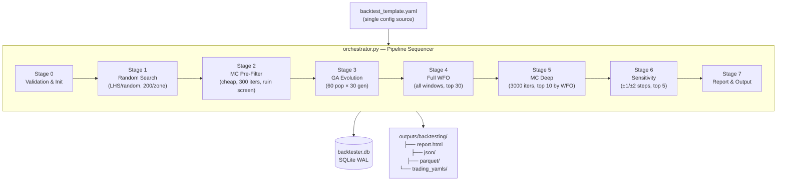
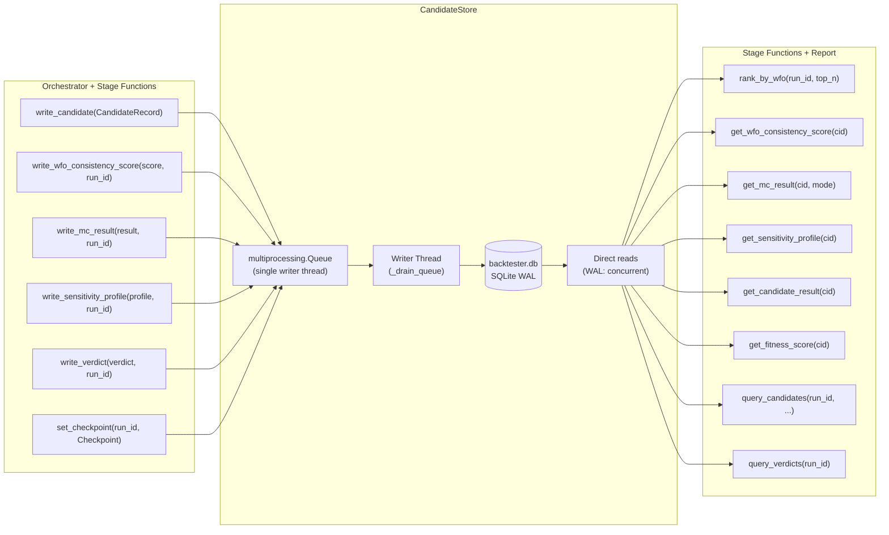
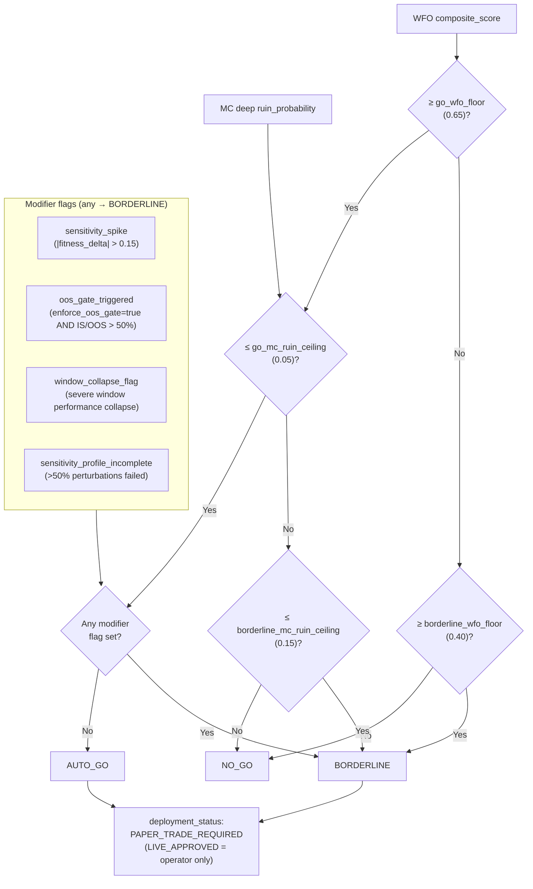

# ARCHITECTURE.md — Backtesting & Optimization Framework
**Version**: 1.0.0 — Initial (Phase 6)
**Date**: 2026-03-02
**Audience**: Any developer working on any aspect of the backtester pipeline
**Status**: Living document — update when module interfaces, contracts, or data flow change

---

## 1. What This System Does

An 8-stage automated optimization pipeline for the WBWSStrategy. Given a parameter space definition and a strategy base config, it searches for parameter combinations that are robust across time (WFO), robust under market noise (Monte Carlo), and not fragile to small parameter changes (Sensitivity). It produces a verdict (`auto_go` / `borderline` / `no_go`) for each surviving candidate and — for go/borderline verdicts — a trading-ready strategy YAML.

**One run = one config hash.** Resumable at any of 8 checkpoints. All state lives in SQLite.

---

## 2. Repository Layout

```
src/backtesting/
├── orchestrator.py          ← Pipeline entry point. Sequences all stages.
├── contracts.py             ← ALL inter-module contracts (frozen dataclasses + enums)
├── candidate_store.py       ← SQLite WAL store. Single-writer queue. Thread-safe.
├── parameter_space.py       ← Expands YAML zone defs → discrete parameter grids
├── sampler.py               ← LHS / random sampling over expanded parameter space
├── scenario.py              ← Loads ScenarioProfile from config dict
├── strategy_runner.py       ← Single candidate eval. Writes temp YAML. Never raises.
├── fitness.py               ← Stateless. MetricsReport + ScenarioProfile → FitnessResult
├── ranker.py                ← Stateless. Query spec → ranked CandidateRecord list
├── report_generator.py      ← Self-contained HTML + JSON + Parquet. Reads from store.
├── yaml_generator.py        ← Merges params into base YAML. Embeds backtester metadata.
├── ga/
│   ├── population.py        ← Init from MC_PREFILTER_PASS. Elite extraction.
│   ├── selection.py         ← Tournament selection
│   ├── crossover.py         ← Uniform crossover (zone_name from parent_a)
│   ├── mutation.py          ← Gaussian on step grid, clamped to zone bounds
│   ├── diversity.py         ← Hybrid Euclidean/Hamming distance penalty
│   └── ga_engine.py         ← Full evolution loop. Writes all candidates to store.
├── wfo/
│   ├── window_generator.py  ← YAML → sorted WFOWindow list (min 3, no overlaps)
│   ├── wfo_evaluator.py     ← One candidate × one window → WFOWindowResult. Never raises.
│   ├── wfo_engine.py        ← "lightweight" (GA) + "full" (Stage 4) modes
│   └── consistency_scorer.py← WFOWindowResults → 4 sub-metrics → composite [0,1]
├── monte_carlo/
│   ├── perturbation.py      ← Named perturbation profiles from YAML
│   ├── equity_simulator.py  ← Vectorised np.cumsum. No Python loops over paths.
│   ├── mc_metrics.py        ← avg_equity, worst_dd, ruin_prob, p5_equity. Vectorised.
│   └── mc_engine.py         ← pre-filter + deep dispatch. Never raises.
└── evaluation/
    ├── sensitivity.py       ← ±1/±2 step perturbation. ProcessPoolExecutor workers.
    └── verdict.py           ← Two-pillar + modifier flags → VerdictResult. Never raises.

configs/backtesting/
└── backtest_template.yaml   ← Single source of truth for all pipeline config

docs/backtesting/
├── TECHNICAL_SPEC.md        ← Contracts, decisions, module signatures, YAML schema
├── BACKTESTER_PLAN.md       ← Master requirements
├── FUNCTIONAL_SPEC.md       ← Plain-language 8-stage spec
├── SQLITE_SCHEMA.md         ← 9 tables, indexes, 10 query examples
├── CHANGE_LOG.md            ← All changes + session handoff blocks
└── ARCHITECTURE.md          ← This file

tests/backtesting/
├── unit/                    ← Per-module unit tests (123 tests, all green)
├── integration/
│   ├── test_live_pipeline.py    ← 17 tests (Phase 5)
│   ├── test_sqlite_queries.py   ← 12 tests (Phase 5)
│   ├── test_report_yaml.py      ← 19 tests (Phase 5)
│   └── test_e2e_wbws_real_data.py ← E2E real data test (Phase 6)
└── benchmarks/
    └── bench_d01_strategy_speed.py ← Strategy call speed benchmark
```

---

## 3. Pipeline Overview



**Checkpoint system**: After each stage completes, `set_checkpoint()` is called. On resume, the orchestrator skips all stages whose checkpoint is already recorded. This makes every stage boundary a safe interruption point.

---

## 4. Module Dependency Graph

```mermaid
graph TD
    ORC["orchestrator.py"]

    ORC --> CS["candidate_store.py"]
    ORC --> SCN["scenario.py"]
    ORC --> PS["parameter_space.py"]
    ORC --> SMP["sampler.py"]
    ORC --> SR["strategy_runner.py"]
    ORC --> FIT["fitness.py"]
    ORC --> RNK["ranker.py"]
    ORC --> GA["ga/ga_engine.py"]
    ORC --> WFO["wfo/wfo_engine.py"]
    ORC --> MC["monte_carlo/mc_engine.py"]
    ORC --> SENS["evaluation/sensitivity.py"]
    ORC --> VRD["evaluation/verdict.py"]
    ORC --> RPT["report_generator.py"]
    ORC --> YML["yaml_generator.py"]

    SR --> FIT
    SR --> STRAT["src/strategies/\norchestrator.py\n(frozen — do not modify)"]

    GA --> POP["ga/population.py"]
    GA --> SEL["ga/selection.py"]
    GA --> CRS["ga/crossover.py"]
    GA --> MUT["ga/mutation.py"]
    GA --> DIV["ga/diversity.py"]
    GA --> WFOE["wfo/wfo_engine.py\n(lightweight mode)"]

    WFO --> WFOV["wfo/wfo_evaluator.py"]
    WFO --> WFOC["wfo/consistency_scorer.py"]
    WFO --> WFOG["wfo/window_generator.py"]
    WFOV --> SR

    MC --> PTB["monte_carlo/perturbation.py"]
    MC --> EQS["monte_carlo/equity_simulator.py"]
    MC --> MCM["monte_carlo/mc_metrics.py"]

    SENS --> SR
    SENS --> FIT

    CS --> CON["contracts.py"]
    SCN --> CON
    ORC --> CON

    classDef frozen fill:#f9d,stroke:#c66
    classDef store fill:#ddf,stroke:#66c
    classDef contract fill:#dfd,stroke:#6a6
    class STRAT frozen
    class CS store
    class CON contract
```



**Key rules**:
- `contracts.py` is imported by every module — it defines the only shared types
- `candidate_store.py` is the only module that writes to SQLite
- `strategy_runner.py` is the only module that calls into `src/strategies/`
- `orchestrator.py` is the only module that calls `store.set_checkpoint()`

---

## 5. Data Flow — What Passes Between Modules

```mermaid
flowchart LR
    subgraph IN["Inputs"]
        YAML["backtest_template.yaml"]
        STRAT_YAML["strategy_template.yaml\n(base strategy config)"]
    end

    subgraph STAGE1["Stage 1 — Random Search"]
        PS["parameter_space\n.expand_zones(config)\n→ Dict[zone, List[params]]"]
        SMP["sampler\n.sample_lhs(...)\n→ List[CandidateParameterSet]"]
        SR1["strategy_runner\n.evaluate(candidate, yaml, temp)\n→ CandidateResult"]
        FIT1["fitness\n.evaluate_fitness(result, scenario)\n→ FitnessResult"]
        WC1["write_candidate(CandidateRecord)"]
    end

    subgraph STAGE2["Stage 2 — MC Pre-Filter"]
        MC_PRE["mc_engine\n.run_mc(candidate, result, PRE_FILTER, config, seed)\n→ MCResult"]
        WMC1["write_mc_result(MCResult, run_id)"]
    end

    subgraph STAGE3["Stage 3 — GA"]
        GA["ga_engine\n.run_ga(store, run_id, scenario, windows, config, seed)\n[reads from store, writes CandidateRecord per candidate per generation]"]
        WFO_LW["wfo_engine (lightweight)\n2 random windows per generation\n→ WFOWindowResult × 2"]
    end

    subgraph STAGE4["Stage 4 — Full WFO"]
        WFO_FULL["wfo_engine (full)\nAll windows, top 30 candidates\n→ Dict[cid, WFOConsistencyScore]"]
        WWFO["write_wfo_consistency_score(WFOConsistencyScore, run_id)"]
    end

    subgraph STAGE5["Stage 5 — MC Deep"]
        RNK5["store.rank_by_wfo(run_id, top_n=10)\n→ List[Dict] with candidate_id + parameters"]
        MC_DEEP["mc_engine\n.run_mc(candidate, result, DEEP, config, seed)\n→ MCResult"]
        WMC2["write_mc_result(MCResult, run_id)"]
    end

    subgraph STAGE6["Stage 6 — Sensitivity"]
        RNK6["store.rank_by_wfo(run_id, top_n=5)\n→ List[Dict]"]
        SENS["sensitivity\n.evaluate_sensitivity(candidate, baseline_fitness, ...)\n→ SensitivityProfile"]
        WSENS["write_sensitivity_profile(SensitivityProfile, run_id)"]
    end

    subgraph STAGE7["Stage 7 — Report"]
        RNK7["store.rank_by_wfo(run_id, top_n=5)"]
        VRD["verdict\n.compute_verdict(cid, wfo_score, mc_result, sensitivity, scenario, ...)\n→ VerdictResult"]
        WVRD["write_verdict(VerdictResult, run_id)"]
        YGEN["yaml_generator\n.generate_trading_yaml(candidate, verdict, run_meta, base_yaml, out)\n→ Path"]
        RPT["report_generator\n.generate_report(store, run_id, scenario, output_dir, formats)\n→ HTML + JSON + Parquet"]
    end

    YAML --> PS
    STRAT_YAML --> SR1
    PS --> SMP --> SR1 --> FIT1 --> WC1

    WC1 --> MC_PRE --> WMC1
    WMC1 --> GA --> WFO_LW
    GA --> WFO_FULL --> WWFO
    WWFO --> RNK5 --> MC_DEEP --> WMC2
    WMC2 --> RNK6 --> SENS --> WSENS
    WSENS --> RNK7 --> VRD --> WVRD --> YGEN
    WVRD --> RPT
```



---

## 6. Contract Types — Quick Reference

All contracts are **frozen dataclasses** in `src/backtesting/contracts.py`. Never pass raw dicts between modules.

| Contract | Produced by | Consumed by | Key fields |
|---|---|---|---|
| `CandidateParameterSet` | `sampler`, `ga_engine` | `strategy_runner`, `wfo_evaluator`, `sensitivity` | `candidate_id` (SHA-256 of params), `zone_name`, `parameters` |
| `CandidateResult` | `strategy_runner` | `fitness`, `mc_engine` | `metrics`, `trades`, `total_trades`, `error` |
| `FitnessResult` | `fitness` | `orchestrator` (→ store) | `fitness_score`, `passed_constraints`, `actual_*` |
| `WFOWindow` | `window_generator` | `wfo_evaluator`, `ga_engine` | `window_id`, `start_date`, `end_date` |
| `WFOWindowResult` | `wfo_evaluator` | `consistency_scorer`, store | `fitness_score`, `net_pnl`, `win_rate`, `oos_delta` |
| `WFOConsistencyScore` | `consistency_scorer` | store, `verdict`, ranker | `composite_score`, `fraction_positive_windows` |
| `MCResult` | `mc_engine` | store, `verdict` | `ruin_probability`, `avg_final_equity`, `p5_final_equity` |
| `SensitivityProfile` | `sensitivity` | store, `verdict` | `spike_detected`, `spike_parameters`, `profile_complete` |
| `VerdictResult` | `verdict` | store, `yaml_generator`, `report_generator` | `verdict` (enum), `deployment_status`, `evidence_summary` |
| `ScenarioProfile` | `scenario` | `fitness`, `wfo_evaluator`, `consistency_scorer`, `verdict`, `report_generator` | fitness weights, constraint thresholds, verdict floors |
| `RunMetadata` | `orchestrator` | store, `yaml_generator` | `run_id`, `config_hash`, `wfo_window_ids`, `checkpoint` |
| `CandidateRecord` | `orchestrator` | store | All stage data flattened to primitives for SQLite |

**Constructor rule**: Always use `CandidateParameterSet.create(zone_name, parameters, generation)` — never construct directly.

---

## 7. CandidateStore — Write/Read API



**Threading model**: All writes are non-blocking (enqueued). `store.flush()` blocks until the queue drains. `store.close()` flushes, stops writer thread, closes connection. `store.close()` is always called in `orchestrator.run()` finally block.

---

## 8. Verdict Logic



**Threshold values** are per-scenario, defined in `backtest_template.yaml → scenarios → verdict_thresholds`. The values shown above are `capital_accumulation` defaults (D-07 starting values — recalibrate after first real run).

---

## 9. ProcessPoolExecutor — Patch Rules

Two modules use `ProcessPoolExecutor` (Windows spawn mode):

| Module | Worker function | Correct patch target |
|---|---|---|
| `evaluation/sensitivity.py` | `_evaluate_perturbation` | `src.backtesting.evaluation.sensitivity._evaluate_perturbation` |
| `monte_carlo/mc_engine.py` | `run_mc` (local import) | `src.backtesting.monte_carlo.mc_engine.run_mc` |

**Rule**: Patch where the name is **looked up at call time**, not where it is defined. Patching `orchestrator.run_mc` → `AttributeError`. Patching functions called *inside* a worker → patch does not cross spawn boundary.

---

## 10. SQLite Schema — 9 Tables

```
runs                   ← Immutable run identity: config_hash, 5 seeds, checkpoint
candidates             ← One row per unique candidate_id
candidate_parameters   ← Individual columns per parameter + parameters_json backup
evaluations            ← One row per candidate per stage: all constraint actuals + fitness
wfo_window_results     ← One row per candidate per window (is_ga_fitness_window flag)
wfo_consistency_scores ← 4 sub-metrics + composite score per candidate
mc_results             ← pre_filter and deep as separate rows per candidate
sensitivity_results    ← One row per candidate per parameter per step
sensitivity_profiles   ← Summary: spike_detected, spike_parameters, profile_complete
verdicts               ← Final verdict + evidence + deployment_status per candidate
```

Full DDL and 10 annotated query examples: `docs/backtesting/SQLITE_SCHEMA.md`

---

## 11. Adding a New Stage or Module

1. Define a new contract in `contracts.py` (frozen dataclass, `__post_init__` validation)
2. Add a write method to `CandidateStore` (enqueued, non-blocking)
3. Add a read method to `CandidateStore` (direct, synchronous)
4. Add the new table to `_SCHEMA_SQL` in `candidate_store.py`
5. Add the stage function `_run_stage_N_*` in `orchestrator.py`
6. Add `Checkpoint.STAGE_N_COMPLETE` to the `Checkpoint` enum in `contracts.py`
7. Wire the stage into `_execute_pipeline` with checkpoint skip logic
8. Update `SQLITE_SCHEMA.md`, `TECHNICAL_SPEC.md`, `CHANGE_LOG.md`, and this file

---

## 12. Key Non-Negotiables (never override)

| Rule | Why |
|---|---|
| Frozen dataclasses between every module | No mutable shared state; fail fast on bad data |
| `CandidateParameterSet.create()` always | `candidate_id` is a SHA-256 hash of params — must be consistent |
| `strategy_runner` never raises | Worker crashes must not kill the orchestrator |
| `datetime.now(UTC)` not `datetime.utcnow()` | `utcnow()` deprecated in Python 3.12+ |
| `pathlib.Path` + `src/utils/paths.py` | Windows compatibility |
| `ProcessPoolExecutor` spawn mode | Windows: no fork |
| `LIVE_APPROVED` never set in code | Operator-only manual action after paper trading |
| No `print()` in production code | Use `structured_logger` |
| `store.close()` in `finally` always | Drains write queue; prevents data loss |

---

## 13. Changelog

| Version | Date | Change |
|---|---|---|
| 1.0.0 | 2026-03-02 | Initial — Phase 6. Full module map, data flow, contract table, verdict logic, store threading model. |