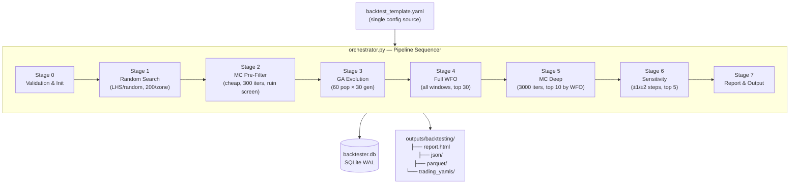
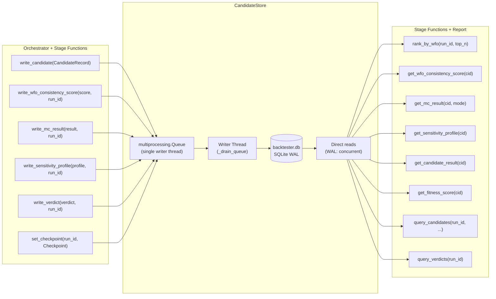
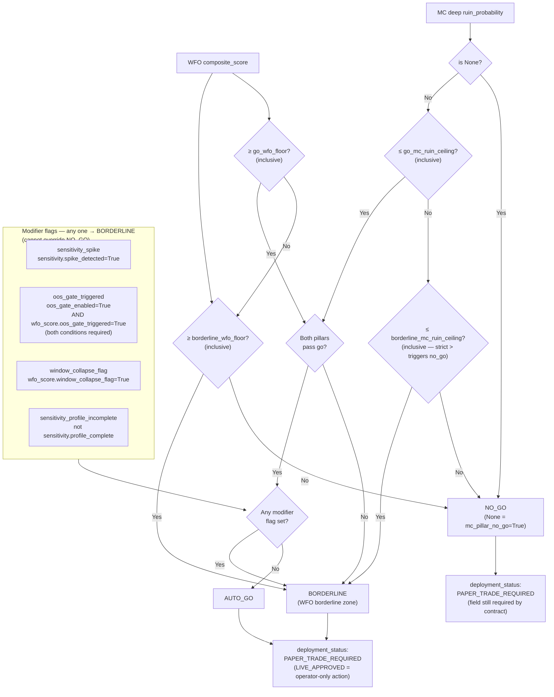

# ARCHITECTURE.md — Backtesting & Optimization Framework
**Version**: 1.1.0
**Date**: 2026-03-03
**Audience**: Any developer working on any aspect of the backtester pipeline
**Status**: Living document — update when module interfaces, contracts, or data flow change

---

## 1. What This System Does

An 8-stage automated optimization pipeline for the WBWSStrategy. Given a parameter space definition and a strategy base config, it searches for parameter combinations that are robust across time (WFO), robust under market noise (Monte Carlo), and not fragile to small parameter changes (Sensitivity). It produces a verdict (`auto_go` / `borderline` / `no_go`) for each surviving candidate and — for go/borderline verdicts — a trading-ready strategy YAML.

**One run = one config hash.** Resumable at any of 8 checkpoints. All state lives in SQLite.

---

## 2. Repository Layout

```
src/backtesting/
├── orchestrator.py          ← Pipeline entry point. Sequences all stages.
├── contracts.py             ← ALL inter-module contracts (frozen dataclasses + enums)
├── candidate_store.py       ← SQLite WAL store. Single-writer queue. Thread-safe.
├── parameter_space.py       ← Expands YAML zone defs → discrete parameter grids
├── sampler.py               ← LHS / random sampling over expanded parameter space
├── scenario.py              ← Loads ScenarioProfile from config dict
├── strategy_runner.py       ← Single candidate eval. Writes temp YAML. Never raises.
├── fitness.py               ← Stateless. MetricsReport + ScenarioProfile → FitnessResult
├── ranker.py                ← Stateless. Query spec → ranked CandidateRecord list
├── report_generator.py      ← Self-contained HTML + JSON + Parquet. Reads from store.
├── yaml_generator.py        ← Merges params into base YAML. Embeds backtester metadata.
├── ga/
│   ├── population.py        ← Init from MC_PREFILTER_PASS. Elite extraction.
│   ├── selection.py         ← Tournament selection
│   ├── crossover.py         ← Uniform crossover (zone_name from parent_a)
│   ├── mutation.py          ← Gaussian on step grid, clamped to zone bounds
│   ├── diversity.py         ← Hybrid Euclidean/Hamming distance penalty
│   └── ga_engine.py         ← Full evolution loop. Writes all candidates to store.
├── wfo/
│   ├── window_generator.py  ← YAML → sorted WFOWindow list (min 3, no overlaps)
│   ├── wfo_evaluator.py     ← One candidate × one window → WFOWindowResult. Never raises.
│   ├── wfo_engine.py        ← "lightweight" (GA) + "full" (Stage 4) modes
│   └── consistency_scorer.py← WFOWindowResults → 4 sub-metrics → composite [0,1]
├── monte_carlo/
│   ├── perturbation.py      ← Named perturbation profiles from YAML
│   ├── equity_simulator.py  ← Vectorised np.cumsum. No Python loops over paths.
│   ├── mc_metrics.py        ← avg_equity, worst_dd, ruin_prob, p5_equity. Vectorised.
│   └── mc_engine.py         ← pre-filter + deep dispatch. Never raises.
└── evaluation/
    ├── sensitivity.py       ← ±1/±2 step perturbation. ProcessPoolExecutor workers.
    └── verdict.py           ← Two-pillar + modifier flags → VerdictResult. Never raises.

configs/backtesting/
└── backtest_template.yaml   ← Single source of truth for all pipeline config

docs/backtesting/
├── architecture/
│   └── ARCHITECTURE.md      ← This file
├── TECHNICAL_SPEC.md        ← Contracts, decisions, module signatures, YAML schema
├── BACKTESTER_PLAN.md       ← Master requirements
├── FUNCTIONAL_SPEC.md       ← Plain-language 8-stage spec
├── SQLITE_SCHEMA.md         ← 9 tables, indexes, 10 query examples
└── CHANGE_LOG.md            ← All changes + session handoff blocks

tests/backtesting/
├── unit/                    ← Per-module unit tests (123 tests, Phase 2–4, all green)
├── integration/
│   ├── test_live_pipeline.py        ← 17 tests (Phase 5) — full pipeline smoke tests
│   ├── test_sqlite_queries.py       ← 12 tests (Phase 5) — store read/write contract
│   ├── test_report_yaml.py          ← 19 tests (Phase 5) — HTML + YAML output
│   ├── test_e2e_wbws_real_data.py   ← 13 tests (Phase 6 Block 0) — real OHLCV data
│   ├── test_adversarial_suite.py    ← 8 tests  (Phase 6 Block 2) — overfit/adversarial
│   ├── test_performance.py          ← 7 tests  (Phase 6 Block 3) — timing baselines
│   ├── test_robustness.py           ← 12 tests (Phase 6 Block 4) — resume + isolation
│   └── test_threshold_calibration.py← 22 tests (Phase 6 Block 5) — verdict grid
└── benchmarks/
    └── bench_d01_strategy_speed.py ← Strategy call speed benchmark

Total: 233 tests — all green as of 2026-03-03
```

---

## 3. Pipeline Overview



**Checkpoint system**: After each stage completes, `set_checkpoint()` is called. On resume, the orchestrator skips all stages whose checkpoint is already recorded. This makes every stage boundary a safe interruption point.

**Verified (Block 4)**: All 8 `Checkpoint` values tested — pipeline resumes correctly from any interruption point and always reaches `COMPLETE`.

---

## 4. Module Dependency Graph

```mermaid
graph TD
    ORC["orchestrator.py"]

    ORC --> CS["candidate_store.py"]
    ORC --> SCN["scenario.py"]
    ORC --> PS["parameter_space.py"]
    ORC --> SMP["sampler.py"]
    ORC --> SR["strategy_runner.py"]
    ORC --> FIT["fitness.py"]
    ORC --> RNK["ranker.py"]
    ORC --> GA["ga/ga_engine.py"]
    ORC --> WFO["wfo/wfo_engine.py"]
    ORC --> MC["monte_carlo/mc_engine.py"]
    ORC --> SENS["evaluation/sensitivity.py"]
    ORC --> VRD["evaluation/verdict.py"]
    ORC --> RPT["report_generator.py"]
    ORC --> YML["yaml_generator.py"]

    SR --> FIT
    SR --> STRAT["src/strategies/\norchestrator.py\n(frozen — do not modify)"]

    GA --> POP["ga/population.py"]
    GA --> SEL["ga/selection.py"]
    GA --> CRS["ga/crossover.py"]
    GA --> MUT["ga/mutation.py"]
    GA --> DIV["ga/diversity.py"]
    GA --> WFOE["wfo/wfo_engine.py\n(lightweight mode)"]

    WFO --> WFOV["wfo/wfo_evaluator.py"]
    WFO --> WFOC["wfo/consistency_scorer.py"]
    WFO --> WFOG["wfo/window_generator.py"]
    WFOV --> SR

    MC --> PTB["monte_carlo/perturbation.py"]
    MC --> EQS["monte_carlo/equity_simulator.py"]
    MC --> MCM["monte_carlo/mc_metrics.py"]

    SENS --> SR
    SENS --> FIT

    CS --> CON["contracts.py"]
    SCN --> CON
    ORC --> CON

    classDef frozen fill:#f9d,stroke:#c66
    classDef store fill:#ddf,stroke:#66c
    classDef contract fill:#dfd,stroke:#6a6
    class STRAT frozen
    class CS store
    class CON contract
```



**Key rules**:
- `contracts.py` is imported by every module — it defines the only shared types
- `candidate_store.py` is the only module that writes to SQLite
- `strategy_runner.py` is the only module that calls into `src/strategies/`
- `orchestrator.py` is the only module that calls `store.set_checkpoint()`

---

## 5. Data Flow — What Passes Between Modules

```mermaid
flowchart LR
    subgraph IN["Inputs"]
        YAML["backtest_template.yaml"]
        STRAT_YAML["strategy_template.yaml\n(base strategy config)"]
    end

    subgraph STAGE1["Stage 1 — Random Search"]
        PS["parameter_space\n.expand_zones(config)\n→ Dict[zone, List[params]]"]
        SMP["sampler\n.sample_lhs(...)\n→ List[CandidateParameterSet]"]
        SR1["strategy_runner\n.evaluate(candidate, yaml, temp)\n→ CandidateResult"]
        FIT1["fitness\n.evaluate_fitness(result, scenario)\n→ FitnessResult"]
        WC1["write_candidate(CandidateRecord)"]
    end

    subgraph STAGE2["Stage 2 — MC Pre-Filter"]
        MC_PRE["mc_engine\n.run_mc(candidate, result, PRE_FILTER, config, seed)\n→ MCResult"]
        WMC1["write_mc_result(MCResult, run_id)"]
    end

    subgraph STAGE3["Stage 3 — GA"]
        GA["ga_engine\n.run_ga(store, run_id, scenario, windows, config, seed)\n[reads from store, writes CandidateRecord per candidate per generation]"]
        WFO_LW["wfo_engine (lightweight)\n2 random windows per generation\n→ WFOWindowResult × 2"]
    end

    subgraph STAGE4["Stage 4 — Full WFO"]
        WFO_FULL["wfo_engine (full)\nAll windows, top 30 candidates\n→ Dict[cid, WFOConsistencyScore]"]
        WWFO["write_wfo_consistency_score(WFOConsistencyScore, run_id)"]
    end

    subgraph STAGE5["Stage 5 — MC Deep"]
        RNK5["store.rank_by_wfo(run_id, top_n=10)\n→ List[Dict] with candidate_id + parameters"]
        MC_DEEP["mc_engine\n.run_mc(candidate, result, DEEP, config, seed)\n→ MCResult"]
        WMC2["write_mc_result(MCResult, run_id)"]
    end

    subgraph STAGE6["Stage 6 — Sensitivity"]
        RNK6["store.rank_by_wfo(run_id, top_n=5)\n→ List[Dict]"]
        SENS["sensitivity\n.evaluate_sensitivity(candidate, baseline_fitness, ...)\n→ SensitivityProfile"]
        WSENS["write_sensitivity_profile(SensitivityProfile, run_id)"]
    end

    subgraph STAGE7["Stage 7 — Report"]
        RNK7["store.rank_by_wfo(run_id, top_n=5)"]
        VRD["verdict\n.compute_verdict(cid, wfo_score, mc_result, sensitivity, scenario, oos_gate_enabled)\n→ VerdictResult"]
        WVRD["write_verdict(VerdictResult, run_id)"]
        YGEN["yaml_generator\n.generate_trading_yaml(candidate, verdict, run_meta, base_yaml, out)\n→ Path"]
        RPT["report_generator\n.generate_report(store, run_id, scenario, output_dir, formats)\n→ HTML + JSON + Parquet"]
    end

    YAML --> PS
    STRAT_YAML --> SR1
    PS --> SMP --> SR1 --> FIT1 --> WC1

    WC1 --> MC_PRE --> WMC1
    WMC1 --> GA --> WFO_LW
    GA --> WFO_FULL --> WWFO
    WWFO --> RNK5 --> MC_DEEP --> WMC2
    WMC2 --> RNK6 --> SENS --> WSENS
    WSENS --> RNK7 --> VRD --> WVRD --> YGEN
    WVRD --> RPT
```



---

## 6. Contract Types — Quick Reference

All contracts are **frozen dataclasses** in `src/backtesting/contracts.py`. Never pass raw dicts between modules.

| Contract | Produced by | Consumed by | Key fields |
|---|---|---|---|
| `CandidateParameterSet` | `sampler`, `ga_engine` | `strategy_runner`, `wfo_evaluator`, `sensitivity` | `candidate_id` (SHA-256 of params), `zone_name`, `parameters` |
| `CandidateResult` | `strategy_runner` | `fitness`, `mc_engine` | `metrics`, `trades`, `total_trades`, `error` |
| `FitnessResult` | `fitness` | `orchestrator` (→ store) | `fitness_score`, `passed_constraints`, `actual_*` |
| `WFOWindow` | `window_generator` | `wfo_evaluator`, `ga_engine` | `window_id`, `start_date`, `end_date` |
| `WFOWindowResult` | `wfo_evaluator` | `consistency_scorer`, store | `fitness_score`, `net_pnl`, `win_rate`, `oos_delta` |
| `WFOConsistencyScore` | `consistency_scorer` | store, `verdict`, ranker | `composite_score`, `fraction_positive_windows`, `oos_gate_triggered`, `window_collapse_flag` |
| `MCResult` | `mc_engine` | store, `verdict` | `ruin_probability`, `avg_final_equity`, `p5_final_equity`, `error` |
| `SensitivityProfile` | `sensitivity` | store, `verdict` | `spike_detected`, `spike_parameters`, `profile_complete` |
| `VerdictResult` | `verdict` | store, `yaml_generator`, `report_generator` | `verdict` (enum), `deployment_status`, `evidence_summary` |
| `ScenarioProfile` | `scenario` | `fitness`, `wfo_evaluator`, `consistency_scorer`, `verdict`, `report_generator` | fitness weights, constraint thresholds, verdict floors |
| `RunMetadata` | `orchestrator` | store, `yaml_generator` | `run_id`, `config_hash`, `wfo_window_ids`, `checkpoint` |
| `CandidateRecord` | `orchestrator` | store | All stage data flattened to primitives for SQLite |

**Constructor rule**: Always use `CandidateParameterSet.create(zone_name, parameters, generation)` — never construct directly.

**`MCResult.error` field**: `run_mc` never raises. Failures are communicated via `MCResult(error="...", ruin_probability=None)`. `verdict.py` maps `ruin_probability=None` → `mc_pillar_no_go=True` → `NO_GO`. The orchestrator logs a warning and continues — the result is still written to the store.

**`SensitivityProfile.profile_complete`**: `False` when >50% of perturbation evaluations failed for that candidate. Sets `sensitivity_profile_incomplete` modifier flag in verdict → demotes `AUTO_GO` to `BORDERLINE`. Pipeline never aborts — the profile is always written.

---

## 7. CandidateStore — Write/Read API



**Threading model**: All writes are non-blocking (enqueued). `store.flush()` blocks until the queue drains. `store.close()` flushes, stops writer thread, closes connection. `store.close()` is always called in `orchestrator.run()` finally block.

---

## 8. Verdict Logic — Two-Pillar Model

Confirmed by source review (verdict.py) and full calibration test suite (Block 5, 2026-03-03).



### Exact operators (from verdict.py source — do not approximate)

```python
wfo_pillar_go    = wfo_composite >= wfo_go_floor        # >= INCLUSIVE
wfo_pillar_no_go = wfo_composite < wfo_borderline_floor  # < strictly less than

mc_pillar_go    = ruin_prob <= mc_go_ceiling             # <= INCLUSIVE
mc_pillar_no_go = ruin_prob > mc_borderline_ceiling      # > strictly greater than

# ruin_prob is None → mc_pillar_no_go = True → NO_GO
# (verdict.py logs WARNING for None — expected, not a bug)

# oos_gate_triggered = oos_gate_enabled AND wfo_score.oos_gate_triggered
# Either condition alone does NOT trigger the flag.

# Verdict
if wfo_pillar_no_go OR mc_pillar_no_go:          → NO_GO
elif wfo_pillar_go AND mc_pillar_go AND no flags: → AUTO_GO
else:                                             → BORDERLINE
```

### Confirmed verdict grid (Block 5, e2e_test scenario thresholds)

```
Thresholds: go_wfo>=0.55  borderline_wfo>=0.40  go_mc<=0.10  borderline_mc<=0.25

WFO region              MC<go    MC=go    MC=bdr   MC>bdr   MC=None
────────────────────────────────────────────────────────────────────
wfo > 0.55 (ABOVE_GO)   AUTO_GO  AUTO_GO  BORDER   NO_GO    NO_GO
wfo = 0.55 (AT_GO)      AUTO_GO  AUTO_GO  BORDER   NO_GO    NO_GO
wfo = 0.47 (BORDERLINE) BORDER   BORDER   BORDER   NO_GO    NO_GO
wfo = 0.30 (NO_GO)      NO_GO    NO_GO    NO_GO    NO_GO    NO_GO

Modifier demotion (AUTO_GO base → one flag active):
  spike=True           → BORDERLINE
  collapse=True        → BORDERLINE
  incomplete=True      → BORDERLINE
  oos_gate (both)=True → BORDERLINE
  All flags on NO_GO   → NO_GO  (flags cannot override)
```

**Note**: Threshold values above are the `e2e_test` scenario used in calibration tests.
Production `capital_accumulation` scenario thresholds are defined in `backtest_template.yaml`
and should be recalibrated after the first real run.

---

## 9. ProcessPoolExecutor — Spawn Mode & Patch Rules

Two modules use `ProcessPoolExecutor`. On Windows, the **spawn** start method is used (no fork). This has critical implications for both production behaviour and test design.

### Production rules

| Module | Worker function | Called by |
|---|---|---|
| `evaluation/sensitivity.py` | `_evaluate_perturbation` | `evaluate_sensitivity()` via `ProcessPoolExecutor` |
| `monte_carlo/mc_engine.py` | `run_mc` (local import) | `mc_engine` pool (if parallelised) |

Workers must be picklable. Any object submitted to a worker must survive `pickle.dumps()`. `CandidateParameterSet`, `ScenarioProfile`, and all contracts are frozen dataclasses — they pickle correctly.

### Test patch rules — Windows spawn constraint

> **CRITICAL**: `unittest.mock.patch` decorates objects in the **parent process**. On Windows spawn mode, child processes are fresh Python interpreters — they import modules from scratch and do **not** inherit parent-process patches. Patching a worker function from a test has no effect on the child; the original function runs instead.

```
unittest.mock patches DO NOT cross the ProcessPoolExecutor spawn boundary on Windows.
```

| What you want to test | Wrong patch target | Correct patch target |
|---|---|---|
| Stage 6 loop behaviour (continue on failure, write profile, advance checkpoint) | `src.backtesting.evaluation.sensitivity._evaluate_perturbation` — patch silently ignored in worker | `src.backtesting.orchestrator.evaluate_sensitivity` — patches the whole Stage 6 call above the worker boundary |
| Stage 5 MC result injection | `src.backtesting.orchestrator.run_mc` — AttributeError (not on orchestrator namespace) | `src.backtesting.monte_carlo.mc_engine.run_mc` — local import patched at module level |

**Confirmed by Block 4 ROB-09:**
```
ERROR: Can't pickle <class 'unittest.mock.MagicMock'>:
       it's not the same object as unittest.mock.MagicMock
```
Root cause: the mock object itself failed pickling when `ProcessPoolExecutor` attempted to send it to a worker process.

**Rule**: Patch at or above the orchestrator boundary for Stage 6 tests. The unit under test is the stage's orchestration behaviour — loop, write, checkpoint advance — not the worker's internal execution. Worker-level tests belong in the sensitivity module's own unit tests where `ProcessPoolExecutor` is not involved.

---

## 10. SQLite Schema — 9 Tables

```
runs                   ← Immutable run identity: config_hash, 5 seeds, checkpoint
candidates             ← One row per unique candidate_id
candidate_parameters   ← Individual columns per parameter + parameters_json backup
evaluations            ← One row per candidate per stage: all constraint actuals + fitness
wfo_window_results     ← One row per candidate per window (is_ga_fitness_window flag)
wfo_consistency_scores ← 4 sub-metrics + composite score per candidate
mc_results             ← pre_filter and deep as separate rows per candidate
sensitivity_results    ← One row per candidate per parameter per step
sensitivity_profiles   ← Summary: spike_detected, spike_parameters, profile_complete
verdicts               ← Final verdict + evidence + deployment_status per candidate
```

Full DDL and 10 annotated query examples: `docs/backtesting/SQLITE_SCHEMA.md`

---

## 11. Performance Baseline — Stage Timing (Block 3, 2026-03-03, LOCKED)

```
Hardware:  Windows 10, 6 workers
Config:    mc.deep.iterations=3000, mc.deep.input_count=10,
           sens.input_count=5, sens.max_steps=2, max_workers=6

Run 1:  Total=457.2s  Stage5=2.5s   Stage6=446.3s  Stage7=8.3s
Run 2:  Total=337.2s  Stage5=0.3s   Stage6=332.6s  Stage7=4.4s
        (Run 2 faster — warm pool / OS cache effects on Windows)

Key findings:
  Stage 5 MC Deep:     0.3–2.5s for 10 candidates × 3000 iters
                       Fully vectorised (np.cumsum). Never the bottleneck.
  Stage 6 Sensitivity: 333–446s for 5 candidates (~66–89s/candidate)
                       Structural bottleneck. Windows ProcessPoolExecutor
                       spawn mode pays per-worker startup cost per candidate.
  Stage 7 Report:      4–8s. Acceptable.

Budget: 337–457s of 14,400s daily budget (2.3–3.2%). Well within tolerance.
```

### Planned optimisations (Block 7)

| ID | Description | Expected gain | File |
|---|---|---|---|
| OPT-01 | Reuse `ProcessPoolExecutor` pool across candidates in Stage 6 | 40–60% Stage 6 reduction | `evaluation/sensitivity.py` |
| OPT-02 | Batch all perturbations for one candidate into a single worker task | Additional 15–25% | `evaluation/sensitivity.py` |
| OPT-03 | Reduce `sensitivity.input_count` from 5 to 3 (YAML only) | ~130–180s saved | `backtest_template.yaml` |
| OPT-04 | Stage 5 — no action needed until `input_count > 50` | Negligible | — |
| OPT-05 | Clean up `evaluate_sensitivity` `max_workers` param after OPT-01 | Code quality | `evaluation/sensitivity.py` |

---

## 12. Adding a New Stage or Module

1. Define a new contract in `contracts.py` (frozen dataclass, `__post_init__` validation)
2. Add a write method to `CandidateStore` (enqueued, non-blocking)
3. Add a read method to `CandidateStore` (direct, synchronous)
4. Add the new table to `_SCHEMA_SQL` in `candidate_store.py`
5. Add the stage function `_run_stage_N_*` in `orchestrator.py`
6. Add `Checkpoint.STAGE_N_COMPLETE` to the `Checkpoint` enum in `contracts.py`
7. Wire the stage into `_execute_pipeline` with checkpoint skip logic
8. Update `SQLITE_SCHEMA.md`, `TECHNICAL_SPEC.md`, `CHANGE_LOG.md`, and this file

---

## 13. Key Non-Negotiables (never override)

| Rule | Why |
|---|---|
| Frozen dataclasses between every module | No mutable shared state; fail fast on bad data |
| `CandidateParameterSet.create()` always | `candidate_id` is a SHA-256 hash of params — must be consistent |
| `strategy_runner` never raises | Worker crashes must not kill the orchestrator |
| `run_mc` never raises | MC failures surface via `MCResult(error=..., ruin_probability=None)` |
| `evaluate_sensitivity` never raises | Profile written even when all perturbations fail |
| `datetime.now(UTC)` not `datetime.utcnow()` | `utcnow()` deprecated in Python 3.12+ |
| `pathlib.Path` + `src/utils/paths.py` | Windows compatibility |
| `ProcessPoolExecutor` spawn mode | Windows: no fork |
| `LIVE_APPROVED` never set in code | Operator-only manual action after paper trading |
| No `print()` in production code | Use `structured_logger` |
| `store.close()` in `finally` always | Drains write queue; prevents data loss |

---

## 14. Changelog

| Version | Date | Change |
|---|---|---|
| 1.0.0 | 2026-03-02 | Initial — Phase 6. Full module map, data flow, contract table, verdict logic, store threading model. |
| 1.1.0 | 2026-03-03 | Block 4: Added Windows spawn mock patching constraint (Section 9). Corrected patch targets table. Added confirmed verdict grid from Block 5 calibration. Fixed verdict diagram to match exact operators from verdict.py source (>= and <= inclusive at go thresholds; ruin=None → NO_GO path). Added performance baseline and OPT table (Section 11). Updated test file list in Section 2 (233 total). Added MCResult.error and SensitivityProfile.profile_complete behaviour notes to Section 6. |