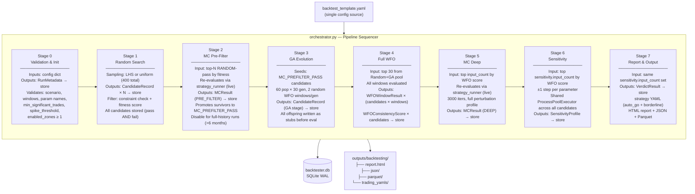
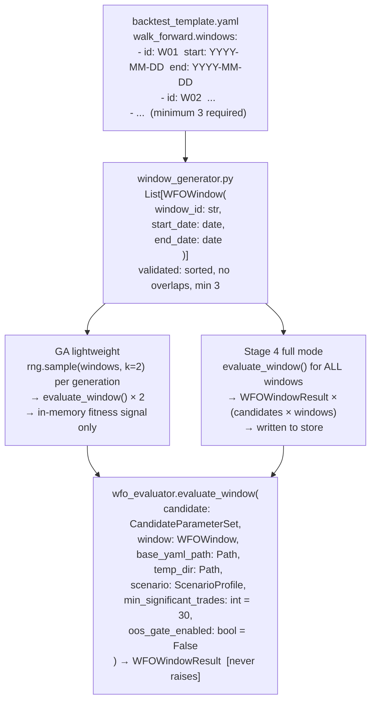
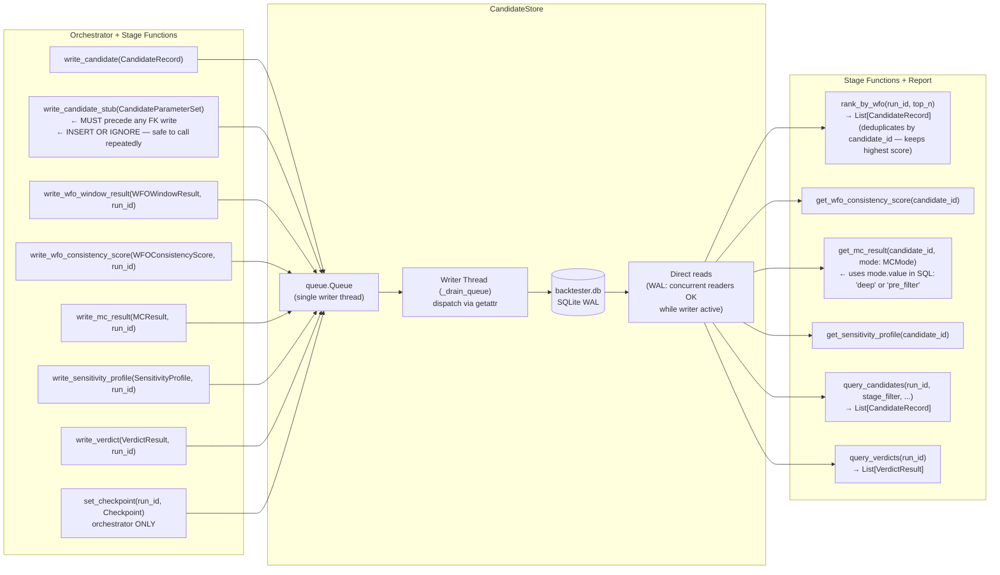
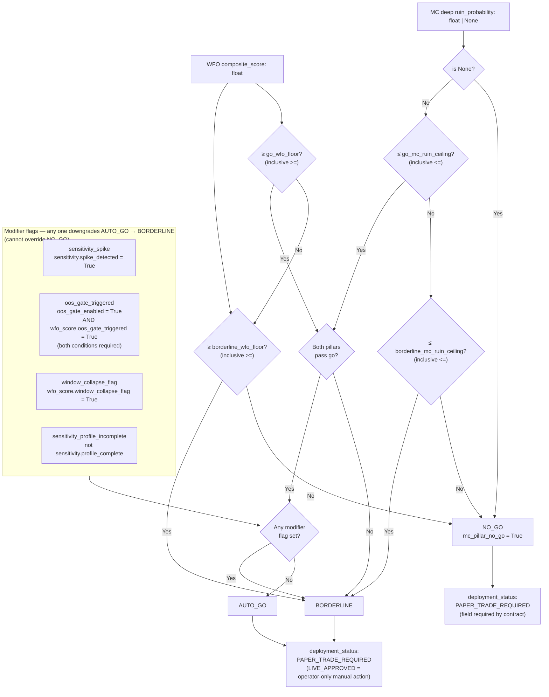

# ARCHITECTURE.md — Backtesting & Optimization Framework
**Version**: 5.0.0
**Date**: 2026-03-11
**Audience**: Developers working on V2 / V3 of the backtester pipeline
**Promise**: Describes what the code **actually does**. Every claim verified against source.

---

## §1 — What This System Does

An 8-stage automated parameter optimization pipeline for the WBWSStrategy. Given a parameter
space definition and a strategy base config, it searches for parameter combinations that are:
- **Robust across time** — Walk-Forward Optimization (WFO) across multiple non-overlapping windows
- **Robust under market noise** — Monte Carlo simulation of trade-sequence perturbations
- **Not fragile to small changes** — Parameter sensitivity analysis (±1 grid steps)

It produces a **verdict** (`auto_go` / `borderline` / `no_go`) for each surviving candidate
and — for `auto_go` and `borderline` verdicts — a trading-ready strategy YAML file.

**One run = one config hash.** Every run is identified by its `run_id` (UUID) and
`config_hash` (SHA-256 of `backtest_template.yaml`). Resumable at any of 8 checkpoints.
All state lives in SQLite WAL.

**Metric units**: All trading metrics (`net_pnl`, `expectancy`) are in **pips/points** —
not currency. `WFOWindowResult.net_pnl` stores `total_pnl_points`. `FitnessResult` reads
`expectancy_points`. There is no currency conversion at any stage. All normalisation
constants (`_SIGMOID_SCALE`, `_MAX_EXPECTED_DRAWDOWN`, `_MAX_EXPECTED_VARIANCE`) are
DAX-specific and must be recalibrated for any other instrument (see §7).

---

## §2 — Repository Layout

```
src/backtesting/
├── orchestrator.py          ← Pipeline entry point. Sequences all 8 stages.
│                              Only caller of store.set_checkpoint().
│                              Injects config['_base_yaml_path'] before calling ga_engine.
├── contracts.py             ← ALL inter-module contracts (frozen dataclasses + enums).
│                              Single import for all shared types. Never raw dicts.
├── candidate_store.py       ← SQLite WAL store. Single-writer queue. Thread-safe.
│                              All writes: non-blocking enqueue. All reads: direct.
├── parameter_space.py       ← Expands YAML zone definitions → discrete parameter grids.
├── sampler.py               ← LHS / random sampling over expanded parameter space.
├── scenario.py              ← Loads ScenarioProfile from config dict.
├── strategy_runner.py       ← Single candidate evaluation. Writes temp YAML. Never raises.
│                              _PARAM_KEY_MAP: one of TWO twin files mapping param → YAML key.
│                              Both strategy_runner._PARAM_KEY_MAP and yaml_generator._PARAM_MAP
│                              must always be updated together when parameters change.
├── fitness.py               ← Stateless. MetricsReport + ScenarioProfile → FitnessResult.
│                              NaN guard applied before constraint loop.
├── ranker.py                ← Stateless. Query spec → ranked List[CandidateRecord].
│                              rank_by_wfo() deduplicates by candidate_id before top_n.
├── report_generator.py      ← Self-contained HTML + JSON + Parquet. Reads from store.
├── yaml_generator.py        ← Merges params into base YAML. Embeds backtester metadata.
│                              _PARAM_MAP: second twin file — must stay in sync with
│                              strategy_runner._PARAM_KEY_MAP. Template top-level keys:
│                              asset, data, execution, filters, trade_management, output.
├── ga/
│   ├── population.py        ← Init from MC_PREFILTER_PASS. Elite extraction. Typed API.
│   ├── selection.py         ← Tournament selection. Raises on empty population.
│   ├── crossover.py         ← Uniform crossover. Zone guard: if parent zones differ,
│   │                          return parent_a unchanged (cross-zone crossover blocked).
│   ├── mutation.py          ← Gaussian on step grid. Snap-then-clamp to zone bounds.
│   ├── diversity.py         ← Hybrid Euclidean/Hamming distance penalty.
│   └── ga_engine.py         ← Full evolution loop. Writes all candidates to store.
│                              Reads config['_base_yaml_path'] (injected by orchestrator).
│                              Calls write_candidate_stub() + flush() before pool.submit().
├── wfo/
│   ├── window_generator.py  ← YAML → sorted WFOWindow list (min 3, no overlaps).
│   ├── wfo_evaluator.py     ← One candidate × one window → WFOWindowResult. Never raises.
│   │                          IS/OOS split implemented (70/30 by calendar days).
│   ├── wfo_engine.py        ← "lightweight" (GA) + "full" (Stage 4) modes.
│   │                          Correctly passes oos_gate_enabled flags to scorer.
│   └── consistency_scorer.py← WFOWindowResults → 4 sub-metrics → composite [0,1].
│                              _SIGMOID_SCALE, _MAX_EXPECTED_DRAWDOWN: DAX-calibrated constants.
│                              Recalibrate via: _SIGMOID_SCALE = stdev(net_pnl) × 0.5
│                              using Stage 1+4 only run (not GA partial-window samples).
├── monte_carlo/
│   ├── perturbation.py      ← Named perturbation profiles from YAML.
│   ├── equity_simulator.py  ← Vectorised np.cumsum. No Python loops over paths.
│   ├── mc_metrics.py        ← avg_equity, worst_dd, ruin_prob, p5_equity. Vectorised.
│   └── mc_engine.py         ← pre-filter + deep dispatch. Never raises.
│                              All config blocks accessed via config.get("key", {}) + defaults.
└── evaluation/
    ├── sensitivity.py       ← ±1 step perturbation. ProcessPoolExecutor workers.
    │                          Single pool shared across all candidates (OPT-01).
    │                          input_count controls candidate set for both Stage 6 and Stage 7.
    └── verdict.py           ← Two-pillar + modifier flags → VerdictResult. Never raises.
                               Uses >= on go_wfo_floor (inclusive). Confirmed correct.

configs/backtesting/
└── backtest_template.yaml   ← Single source of truth for all pipeline configuration.
                               Changing this file creates a new config_hash → new run.

src/strategies/              ← FROZEN. strategy_runner.py is the only module that calls in.
src/utils/
├── paths.py                 ← All path construction. Never hardcode separators.
└── run_cleaner.py           ← Pre-run cache + temp YAML cleaner. Auto-called by runner.

scripts/runners/
└── run_backtester.py        ← Entry point. Calls clean_environment() before every run.
                               Use --no-clean to resume from checkpoint.
```

---

## §3 — Pipeline Overview



**Checkpoint system**: `store.set_checkpoint()` is called after every stage completes.
On resume (`--no-clean`), stages whose checkpoint is already recorded are skipped.
Checkpoint sequence:
```
NOT_STARTED → RUN_INITIALISED → RANDOM_SEARCH_COMPLETE → MC_PREFILTER_COMPLETE
            → GA_COMPLETE → WFO_COMPLETE → MONTE_CARLO_COMPLETE
            → SENSITIVITY_COMPLETE → COMPLETE
```

**Stage 2 / Stage 3 coupling**: When `mc_prefilter` is disabled in config, the orchestrator
calls `_promote_random_to_mc_pass()` to promote RANDOM-pass candidates to `MC_PREFILTER_PASS`
stage before Stage 3 runs. Stage 3 GA seeds from `MC_PREFILTER_PASS` — without this
promotion it finds no seed candidates and skips silently.

**Stage 6 / Stage 7 coupling**: Both stages operate on the same candidate set, sized by
`sensitivity.input_count`. `monte_carlo.deep.input_count` controls only Stage 5. A candidate
appearing in Stage 5 MC results but absent from Stage 7 verdicts is expected behaviour when
that candidate ranks outside `sensitivity.input_count` by WFO score.

---

## §4 — Module Dependency Graph

```mermaid
graph TD
    ORC["orchestrator.py"]

    ORC --> CS["candidate_store.py"]
    ORC --> SCN["scenario.py"]
    ORC --> PS["parameter_space.py"]
    ORC --> SMP["sampler.py"]
    ORC --> SR["strategy_runner.py"]
    ORC --> FIT["fitness.py"]
    ORC --> RNK["ranker.py"]
    ORC --> GA["ga/ga_engine.py"]
    ORC --> WFO["wfo/wfo_engine.py"]
    ORC --> MC["monte_carlo/mc_engine.py"]
    ORC --> SENS["evaluation/sensitivity.py"]
    ORC --> VRD["evaluation/verdict.py"]
    ORC --> RPT["report_generator.py"]
    ORC --> YML["yaml_generator.py"]

    SR --> FIT
    SR --> STRAT["src/strategies/\norchestrator.py\n(FROZEN — do not modify)"]

    GA --> POP["ga/population.py"]
    GA --> SEL["ga/selection.py"]
    GA --> CRS["ga/crossover.py"]
    GA --> MUT["ga/mutation.py"]
    GA --> DIV["ga/diversity.py"]
    GA --> WFOE["wfo/wfo_engine.py\n(lightweight mode)"]
    GA --> CS

    WFO --> WFOV["wfo/wfo_evaluator.py"]
    WFO --> WFOC["wfo/consistency_scorer.py"]
    WFO --> WFOG["wfo/window_generator.py"]
    WFOV --> SR

    MC --> PTB["monte_carlo/perturbation.py"]
    MC --> EQS["monte_carlo/equity_simulator.py"]
    MC --> MCM["monte_carlo/mc_metrics.py"]

    SENS --> SR
    SENS --> FIT

    CS --> CON["contracts.py"]
    SCN --> CON
    ORC --> CON

    classDef frozen fill:#f9d,stroke:#c66
    classDef store fill:#ddf,stroke:#66c
    classDef contract fill:#dfd,stroke:#6a6
    class STRAT frozen
    class CS store
    class CON contract
```



**Key dependency rules** (non-negotiable):
- `contracts.py` is imported by every module — it defines the only shared types
- `candidate_store.py` is the only module that writes to SQLite
- `strategy_runner.py` is the only module that calls into `src/strategies/`
- `orchestrator.py` is the only module that calls `store.set_checkpoint()`
- `ga/population.py` is the only GA module consuming typed `CandidateRecord`

---

## §5 — Data Flow — Contracts and Variables Across Stages

```mermaid
flowchart LR
    subgraph IN["Inputs"]
        YAML["backtest_template.yaml"]
        STRAT_YAML["strategy_template.yaml\n(base strategy config)"]
    end

    subgraph STAGE1["Stage 1 — Random Search"]
        PS["parameter_space.expand_zones(config)\n→ Dict[zone_name: str,\n      List[CandidateParameterSet]]"]
        SMP["sampler.sample_lhs(\n  universe: Dict,\n  n: int,\n  seed: int\n) → List[CandidateParameterSet]"]
        SR1["strategy_runner.evaluate(\n  candidate: CandidateParameterSet,\n  base_yaml: Path,\n  temp_dir: Path,\n  date_start: date | None,\n  date_end: date | None\n) → CandidateResult"]
        FIT1["fitness.evaluate_fitness(\n  result: CandidateResult,\n  scenario: ScenarioProfile\n) → FitnessResult\n  .fitness_score: float | None\n  .passed_constraints: bool\n  .actual_win_rate: float\n  .actual_expectancy: float\n  .actual_profit_factor: float\n  .actual_max_drawdown: float\n  .actual_losing_streak: int\n  .actual_trades_per_week: float"]
        WC1["store.write_candidate(\n  CandidateRecord\n)  ← ALL candidates,\n   pass AND fail"]
    end

    subgraph STAGE2["Stage 2 — MC Pre-Filter"]
        RE2["strategy_runner.evaluate()  ← LIVE re-eval\n(never store.get_candidate_result —\ntrades/metrics not persisted)"]
        MC_PRE["mc_engine.run_mc(\n  candidate: CandidateParameterSet,\n  result: CandidateResult,\n  mode: MCMode.PRE_FILTER,\n  config: dict,\n  seed: int\n) → MCResult\n  .ruin_probability: float | None\n  .avg_final_equity: float | None\n  .p5_final_equity: float | None\n  .error: str | None"]
        PROMOTE["_promote_random_to_mc_pass()\nif mc_prefilter disabled in config"]
    end

    subgraph STAGE3["Stage 3 — GA"]
        STUB["write_candidate_stub(\n  candidate: CandidateParameterSet\n) + flush()\nMUST precede any FK write"]
        GA["ga_engine.run_ga(\n  store, run_id,\n  scenario: ScenarioProfile,\n  windows: List[WFOWindow],\n  config: dict  ← contains _base_yaml_path\n) → None  (writes directly to store)"]
        WFO_LW["wfo_engine (lightweight)\n2 random windows/generation\n→ WFOWindowResult × 2 per candidate\n(in-memory fitness only — not written)"]
    end

    subgraph STAGE4["Stage 4 — Full WFO"]
        STUB4["write_candidate_stub() + flush()\nfor all top-30 candidates"]
        WFO_FULL["wfo_engine.run_wfo(\n  candidates: List[CandidateParameterSet],\n  windows: List[WFOWindow],\n  mode: WFOMode.FULL,\n  oos_gate_enabled: bool\n) → Dict[candidate_id: str,\n         WFOConsistencyScore]"]
        WWFO["store.write_wfo_window_result(\n  WFOWindowResult, run_id\n)\nstore.write_wfo_consistency_score(\n  WFOConsistencyScore, run_id\n)"]
    end

    subgraph STAGE5["Stage 5 — MC Deep"]
        RNK5["store.rank_by_wfo(\n  run_id,\n  top_n = mc.deep.input_count\n) → List[CandidateRecord]\n(deduplicated by candidate_id)"]
        RE5["strategy_runner.evaluate()  ← LIVE re-eval"]
        MC_DEEP["mc_engine.run_mc(\n  mode: MCMode.DEEP,\n  iterations: 3000\n) → MCResult"]
        WMC2["store.write_mc_result(\n  MCResult, run_id\n)"]
    end

    subgraph STAGE6["Stage 6 — Sensitivity"]
        RNK6["store.rank_by_wfo(\n  run_id,\n  top_n = sensitivity.input_count\n) → List[CandidateRecord]"]
        SENS["sensitivity.evaluate_sensitivity(\n  candidate: CandidateParameterSet,\n  scenario: ScenarioProfile,\n  pool: ProcessPoolExecutor  ← shared\n) → SensitivityProfile\n  .spike_detected: bool\n  .spike_parameters: List[str]\n  .profile_complete: bool\n  .per_param_deltas: Dict[str, float]"]
        WSENS["store.write_sensitivity_profile(\n  SensitivityProfile, run_id\n)"]
    end

    subgraph STAGE7["Stage 7 — Verdict & Output"]
        RNK7["same sensitivity.input_count set\n(Stage 6 and Stage 7 always paired)"]
        VRD["verdict.compute_verdict(\n  candidate_id: str,\n  wfo_score: WFOConsistencyScore,\n  mc_result: MCResult,\n  sensitivity: SensitivityProfile,\n  scenario: ScenarioProfile,\n  oos_gate_enabled: bool\n) → VerdictResult\n  .verdict: Verdict (enum)\n  .deployment_status: DeploymentStatus\n  .evidence_summary: str\n  .yaml_output_path: Path | None"]
        WVRD["store.write_verdict(\n  VerdictResult, run_id\n)"]
        YGEN["yaml_generator.generate_trading_yaml(\n  candidate, run_metadata,\n  verdict, base_yaml\n) → Path\n(auto_go + borderline only)"]
        RPT["report_generator.generate_report(\n  run_id, store\n) → HTML + JSON + Parquet"]
    end

    YAML --> PS
    STRAT_YAML --> SR1
    PS --> SMP --> SR1 --> FIT1 --> WC1
    WC1 --> RE2 --> MC_PRE
    MC_PRE --> PROMOTE
    PROMOTE --> STUB --> GA --> WFO_LW
    GA --> STUB4 --> WFO_FULL --> WWFO
    WWFO --> RNK5 --> RE5 --> MC_DEEP --> WMC2
    WMC2 --> RNK6 --> SENS --> WSENS
    WSENS --> RNK7 --> VRD --> WVRD
    WVRD --> YGEN
    WVRD --> RPT
```



---

## §6 — Stage Execution Model

### Stage 0 — Validation & Init
Validates in this order, fail-fast:
1. `load_scenario()` — scenario name exists, all required fields present, constraint defaults applied via `.get()` (never hard dict access)
2. `_validate_wfo_windows()` — min 3 windows, unique IDs, valid ISO dates, start < end, no overlaps
3. `_validate_parameter_names()` — all enabled zone parameter names exist in `_PARAM_KEY_MAP`
4. `min_significant_trades >= 1`
5. `spike_threshold ∈ (0, 1)`
6. `enabled_zones >= 1`

### Stage 1 — Random Search
- `parameter_space.expand_zones()` generates discrete grids; `expand_zones()` returns `Dict[str, Dict[str, List]]` — per-param lists, not Cartesian product
- `sampler._lhs_sample()` always returns exactly `n` candidates; strata cycle for `n > universe_size`
- Both passing and failing candidates written to store — all preserved for audit

### Stage 2 — MC Pre-Filter
- Reads top-N `RANDOM`-pass candidates by fitness
- **Must re-evaluate via `strategy_runner.evaluate()`** — never `store.get_candidate_result()` (returns `trades=None / metrics=None` always; `CandidateResult.is_valid` always False on reconstructed objects)
- Ruin threshold from `scenario.mc_prefilter_ruin_threshold` — not raw config dict
- **Disable for full-history runs** (data range > ~6 months): MC perturbation compounds over long equity curves, producing false ruin signals. Stage 4 WFO is the correct gate for full-history.

### Stage 3 — GA
- `config['_base_yaml_path']` is injected by orchestrator before calling `ga_engine.run_ga()`. This key is never in `backtest_template.yaml` — it is a private orchestrator-to-engine contract.
- `write_candidate_stub()` + `store.flush()` must be called for every GA offspring **before** `pool.submit()`. GA offspring do not exist in the `candidates` table until the stub is written; any FK-referencing write without the stub causes a constraint failure.
- Lightweight WFO (2 random windows per generation) evaluates fitness in-memory — results not written to store.

### Stage 4 — Full WFO
- All candidates receive `write_candidate_stub()` before `run_wfo()` (same FK invariant as Stage 3)
- All windows evaluated; `WFOWindowResult` written per candidate per window
- `WFOConsistencyScore` written per candidate after all windows complete

### Stage 5 — MC Deep
- Uses `monte_carlo.deep.input_count` (default 10) — independently configurable from Stage 6/7
- **Must re-evaluate via `strategy_runner.evaluate()`** — same reason as Stage 2
- On evaluation failure: `run_mc()` is still called, returns `MCResult(error=..., ruin_probability=None)`; verdict engine treats `ruin_probability=None` as `NO_GO`

### Stage 6 — Parameter Sensitivity
- Uses `sensitivity.input_count` (default 5) — this is also the Stage 7 candidate count
- One `ProcessPoolExecutor` shared across all candidates (spawn cost paid once)
- ±1 step only per parameter (not ±2)
- **Spike definition**: `abs(delta) > scenario.verdict_sensitivity_spike_threshold`. Spike on any parameter → `spike_detected=True` in profile

### Stage 7 — Report & Output
- Candidate set = same `sensitivity.input_count` set from Stage 6 (always paired)
- Guard: if `wfo_score is None` or `mc_result is None` → skip candidate, log WARNING
- For `AUTO_GO` / `BORDERLINE`: `generate_trading_yaml()` called; `yaml_output_path` set in rebuilt `VerdictResult` (frozen dataclass → new instance required)
- `deployment_status = PAPER_TRADE_REQUIRED` always — `LIVE_APPROVED` is operator-only manual action

---

## §7 — Evaluation Data Flow

### Fitness evaluation
```
CandidateResult  ──►  fitness.evaluate_fitness(result, scenario)  ──►  FitnessResult
                            │
                            ▼
                    NaN guard (explicit check before constraint loop —
                    NaN < x is False under IEEE 754, would silently pass all constraints)
                            │
                    _CONSTRAINT_CHECKS: 6 checks, cheapest first, fail-fast:
                    1. max_drawdown    (upper bound — op.gt)
                    2. win_rate        (lower bound — op.lt)
                    3. losing_streak   (upper bound — op.gt)
                    4. trades_per_week (lower bound — op.lt)
                    5. expectancy      (lower bound — op.lt)
                    6. profit_factor   (lower bound — op.lt)
                            │
                    All pass?  ──► _compute_weighted_score(metrics, scenario)
                                        │
                                        ▼
                                   fitness_score ∈ [0, 1]
```

**Constraint boundary semantics**: Lower-bound constraints use `op.lt` — a value exactly
equal to the threshold is **accepted** (`actual >= threshold`). Upper-bound constraints
use `op.gt` — value at threshold is also accepted. This implements `>=` for minimums
and `<=` for maximums throughout.

**Constraint config loading**: All constraint fields in `scenario.py` must be loaded via
`ct.get(key, default)` — never `ct[key]`. Hard access raises `KeyError` at Stage 0 when
a constraint is omitted from the YAML. Defaults must semantically disable the constraint
(e.g. `max_drawdown=1.0` = allow 100% drawdown = effectively disabled).

**Expectancy normalisation**: `expectancy_norm = clamp(expectancy_points / ref_pts, 0.0, 1.0)`
where `ref_pts = scenario.normalisation_expectancy_ref_pts` (default 3.0 pts).
Set ref_pts to approximately the 90th percentile of observed expectancy across passing candidates.

### WFO evaluation
```
candidates × windows  ──►  ProcessPoolExecutor (spawn mode — Windows)
                                │
                      evaluate_window(
                        candidate: CandidateParameterSet,
                        window: WFOWindow,
                        base_yaml_path: Path,
                        temp_dir: Path,
                        scenario: ScenarioProfile,
                        min_significant_trades: int,
                        oos_gate_enabled: bool         ← 7th positional arg
                      )   ← never raises
                                │
                                ▼
                      WFOWindowResult
                        ├── fitness_score: float | None
                        ├── net_pnl: float             (= total_pnl_points, in points)
                        ├── win_rate: float
                        ├── total_trades: int
                        ├── drawdown: float
                        └── oos_delta: float | None    (None if OOS eval failed)
                                │
                      store.write_wfo_window_result()
                                │
                    [all windows done for candidate]
                                │
                      compute_consistency(window_results, scenario)
                                │
                      WFOConsistencyScore
                        ├── composite_score: float     [0,1]
                        ├── fraction_positive_windows: float
                        ├── median_return: float
                        ├── variance_score: float
                        ├── worst_drawdown: float
                        ├── median_oos_delta: float | None
                        ├── oos_gate_triggered: bool
                        └── window_collapse_flag: bool
                                │
                      store.write_wfo_consistency_score()
```

**WFO modes**:
- `lightweight` (GA, Stage 3): 2 random windows per generation, in-memory fitness only
- `full` (Stage 4): all windows, all results written to store

**WFO sigmoid scale**: `median_return_norm = sigmoid(median_return_raw, scale=_SIGMOID_SCALE)`.
`_SIGMOID_SCALE = stdev(net_pnl) × 0.5` calibrated from Stage 1+4 only run (full-window WFO
net_pnl distribution). Do not use GA partial-window samples for calibration — they produce
a different distribution and inflate stdev. Recalibrate on instrument change or data range
change > 6 months.

**Window collapse flag**: `window_collapse_flag=True` when `worst_drawdown > wfo_collapse_drawdown_threshold`
in any window. Threshold is in raw instrument points (DAX default: 400 pts). This is a
BORDERLINE modifier, not a NO_GO trigger.

**WFO with full-history data ranges (>6 months)**:
- Remove `max_drawdown` from Stage 1 constraints — drawdown accumulates over the full date range and the constraint misfires. The WFO per-window gate is the correct granularity.
- Raise `max_losing_streak` accordingly (observed values scale with data range length).
- `_MAX_EXPECTED_DRAWDOWN` must be raised to reflect full-history worst-case (e.g. 2,500 pts for 38-month DAX). `wfo_collapse_drawdown_threshold` does not change — it is per-window.

### IS/OOS gate architecture
```
evaluate_window() with oos_gate_enabled=True:
    │
    ├── full_result = _evaluate_candidate(window.start_date, window.end_date)
    │
    └── _compute_oos_delta():
            is_end = start + timedelta(days=int(total_days × 0.70))
            is_result  = _evaluate_candidate(start, is_end)     [70%]
            oos_result = _evaluate_candidate(is_end, end)       [30%]
            │
            ├── Either sub-eval fails → oos_delta = None  (safe default)
            └── OOS passes eval but fails constraints → oos_fitness = 0.0
                (floor value preserves signal of severe OOS degradation)
            │
            return oos_fitness - is_fitness

WFOWindowResult.fitness_score = full window evaluation (not IS or OOS sub-period)
WFOWindowResult.oos_delta     = float | None

compute_consistency():
    median_oos_delta = median([r.oos_delta for r where r.oos_delta is not None])
    oos_gate_triggered = abs(median_oos_delta) > oos_degradation_threshold
                         AND oos_gate_enabled
```

**OOS gate default threshold**: `oos_degradation_threshold = 0.50` (50 fitness point drop
across [0,1] scale). Intentionally lenient — catches only severe degradation. Calibrate
against observed `median_oos_delta` distribution after the first production run.

### MC path model
```
CandidateResult.trades  ──►  extract_trade_returns()
                              └── trade.pnl_points  (use this — NOT trade.pnl)
                              └── skip open trades (trade.exit is None → pnl_points=None)
                              → trade_returns: np.ndarray

simulate_paths(
  trade_returns: np.ndarray,
  n_iterations: int,
  profile: PerturbationProfile,
  seed: int,
  starting_equity: float
)
    │
    ▼
equity_paths: shape (n_iterations, n_trades+1)   [np.cumsum — vectorised]
    │
    ▼
compute_metrics(equity_paths, starting_equity, ruin_threshold)
    ├── avg_final_equity    = mean(equity_paths[:, -1])
    ├── ruin_probability    = fraction of paths where min(path) <= ruin_floor
    ├── worst_drawdown      = max per-path (running_max - equity) / running_max
    └── p5_final_equity     = 5th percentile of final equity
```

**Seed model**: One seed shared across all candidates within a stage — identical
perturbations make MC results directly comparable across candidates.

---

## §8 — WFO Window Model



**Window contract**: `WFOWindow` carries only `window_id: str`, `start_date: date`,
`end_date: date`. There are no IS/OOS boundary fields in the contract — the 70/30
split is computed inside `evaluate_window()` and is not part of the public interface.

**Window constraints** (Stage 0 enforced):
- Minimum 3 windows (required for GA random sampling diversity)
- Unique IDs, `start_date < end_date`, no overlapping date ranges

---

## §9 — CandidateStore Threading Model



**Write path**: All writes are non-blocking. `write_*` methods enqueue a
`(method_name, payload)` tuple. Single writer thread dispatches via `getattr` — no write
contention possible.

**`write_candidate_stub()` FK invariant**: Must be called and `store.flush()` called after,
before any FK-referencing write (`write_wfo_window_result`, `write_mc_result`, etc.).
`INSERT OR IGNORE` makes repeated calls safe — already-present candidates are no-ops.

**Ranker deduplication invariant**: Any function calling `query_candidates()` with
`ORDER BY` must deduplicate by `candidate_id` after ordering, keeping the first
(highest-scoring) occurrence. A candidate evaluated across multiple stages produces multiple
rows — without deduplication, Stages 5–7 receive duplicate entries.

**Two MC query methods — do not confuse**:
- `store.get_mc_result(candidate_id, mode: MCMode)` — pipeline verdict path; returns single `MCResult`
- `store.query_mc_results(run_id, mode: str)` — diagnostic/reporting only; returns `List[Dict]`

**Flush / close**: `store.flush()` = `queue.join()` — blocks until queue drains.
`store.close()` = flush + stop writer + close connection. Always in `finally` block.

---

## §10 — Verdict Logic — Two-Pillar Model



### Exact operators (from verdict.py — do not approximate)

```python
wfo_pillar_go    = wfo_composite >= wfo_go_floor          # >= INCLUSIVE
wfo_pillar_no_go = wfo_composite < wfo_borderline_floor   # < strictly less than

mc_pillar_go    = ruin_prob <= mc_go_ceiling              # <= INCLUSIVE
mc_pillar_no_go = ruin_prob > mc_borderline_ceiling       # > strictly greater than

# ruin_prob is None → mc_pillar_no_go = True → NO_GO
# oos_gate_triggered = oos_gate_enabled AND wfo_score.oos_gate_triggered
# Either condition alone does NOT trigger the flag.

if wfo_pillar_no_go or mc_pillar_no_go:          → NO_GO
elif wfo_pillar_go and mc_pillar_go and no flags: → AUTO_GO
else:                                             → BORDERLINE
```

### Verdict grid (capital_accumulation scenario defaults)

```
Thresholds: go_wfo >= 0.65  borderline_wfo >= 0.40  go_mc <= 0.05  borderline_mc <= 0.15

WFO region              MC < go   MC = bdr   MC > bdr   MC = None
──────────────────────────────────────────────────────────────────
wfo >= 0.65 (go zone)   AUTO_GO   BORDER     NO_GO      NO_GO
wfo = 0.52 (borderline) BORDER    BORDER     NO_GO      NO_GO
wfo < 0.40 (no_go)      NO_GO     NO_GO      NO_GO      NO_GO

Modifier demotion (AUTO_GO base → any one flag active → BORDERLINE):
  spike_detected = True        → BORDERLINE
  window_collapse_flag = True  → BORDERLINE
  profile_complete = False     → BORDERLINE
  oos_gate (both) = True       → BORDERLINE
  Any flag on NO_GO base       → NO_GO  (flags cannot upgrade or override)
```

---

## §11 — Supporting Module Design Notes

### parameter_space.py
- `expand_zones()` returns `Dict[str, Dict[str, List]]` — per-param value lists, not Cartesian product. Cartesian product happens in `sampler.py`.
- `_range_values()` uses integer-scaled arithmetic to avoid floating-point accumulation errors.
- Disabled zones excluded; empty ranges raise `ValueError` (fail-fast at Stage 0).

### sampler.py
- Both `sample_lhs()` and `sample_random()` use a single `rng = stdlib_random.Random(seed)` — fully reproducible.
- `_lhs_sample()` always returns exactly `n` candidates. For `n > universe_size`, strata cycle via `stratum_idx % n_vals`.
- All outputs are `CandidateParameterSet.create()` instances — immutable, deterministic SHA-256 IDs.

### scenario.py
- `load_scenario()` delegates all validation to `ScenarioProfile.__post_init__`.
- All constraint fields loaded via `ct.get(key, default)` — never `ct[key]` (see §6 Stage 0).
- `verdict_sensitivity_spike_threshold` is loaded from YAML into `ScenarioProfile` — it is the single source of truth for sensitivity spike detection.
- `wfo_collapse_drawdown_threshold` loaded via `s.get("wfo_collapse_drawdown_threshold", 400.0)` — optional YAML field.

### ranker.py
- `rank()`, `rank_by_wfo()`, `rank_combined()` all return `List[CandidateRecord]` (typed).
- `rank_by_wfo()` queries without stage filter — WFO scores span all stages by design.
- `rank_combined()` deduplicates by `candidate_id` before re-sorting.
- Any ranker function that calls `query_candidates()` with `ORDER BY` must deduplicate by `candidate_id`, keeping the first (highest-scoring) occurrence.

### yaml_generator.py
- Always sets `deployment_status = PAPER_TRADE_REQUIRED` — never `LIVE_APPROVED`.
- Embeds all 5 run seeds in `backtester_metadata` for immutable audit trail.
- `generate_trading_yaml()` deepcopies base config — base YAML is never mutated.
- Validation: attempts `StrategyConfig.from_yaml()` first; falls back to `_structural_validate()` on ImportError. `_structural_validate()` checks real template sections (`filters`, `trade_management`) and spot-checks `filters.technical_filters` and `trade_management.risk` are dicts.
- **Twin key map**: `_PARAM_MAP` uses format `(top_section, nested_path_tuple, leaf_key)`. Must be kept in sync with `strategy_runner._PARAM_KEY_MAP` at all times. Both files contain a co-update warning comment.

### wfo_engine.py
- Lightweight/full mode dispatch: both modes pass `oos_gate_enabled` flags to `compute_consistency()`.
- Full mode writes `WFOConsistencyScore` to store; lightweight mode does not.
- `evaluate_window()` takes `oos_gate_enabled` as its **7th positional argument**. Pass positionally in `pool.submit()` — keyword arguments are not reliably serialised across `ProcessPoolExecutor` spawn boundaries on Windows.

### ga/crossover.py
- Zone guard is applied first: if parent zones differ, return `parent_a` unchanged.
- Cross-zone crossover is blocked — offspring must always belong to a single zone.

### ga/mutation.py
- **Snap-then-clamp** order is mandatory for both `int` and `float` parameters:
  ```
  new_value → snap_to_grid(new_value, low, step) → clamp(snapped, low, high)
  ```
  Clamp-first breaks when `max` is not on the step grid.

---

## §12 — Contract Catalogue

All contracts are **frozen dataclasses** in `src/backtesting/contracts.py`.
Never pass raw dicts between modules. Always use `CandidateParameterSet.create()` factory.

| Contract | Produced by | Consumed by | Key fields | None-path |
|---|---|---|---|---|
| `RunMetadata` | `orchestrator` | store, `yaml_generator` | `run_id` (UUID), `config_hash` (64-char SHA-256), `wfo_window_ids` (min 3), `started_at`, `perturbation_profile_name`, 5 seeds, `checkpoint` | No Optional fields |
| `ScenarioProfile` | `scenario` | `fitness`, `wfo_evaluator`, `consistency_scorer`, `verdict`, `report_generator` | fitness weights, constraint thresholds, verdict floors, `normalisation_expectancy_ref_pts`, `wfo_collapse_drawdown_threshold` (pts), `verdict_sensitivity_spike_threshold` | `report_emphasis` must be non-empty list/tuple |
| `CandidateParameterSet` | `sampler`, `ga_engine` | `strategy_runner`, `wfo_evaluator`, `sensitivity` | `candidate_id` (SHA-256 of params — deterministic, content-addressed), `zone_name`, `parameters: Dict[str, Any]` | `generation`: None for Random Search |
| `CandidateResult` | `strategy_runner` | `fitness`, `mc_engine` | `metrics`, `trades: List[Trade]`, `total_trades`, `error` | All None on error. **Never reconstruct from store** — trades/metrics not persisted. |
| `FitnessResult` | `fitness` | `orchestrator` (→ store) | `fitness_score`, `passed_constraints`, `actual_win_rate`, `actual_expectancy`, `actual_profit_factor`, `actual_max_drawdown`, `actual_losing_streak`, `actual_trades_per_week` | `fitness_score`: None when constraints failed |
| `WFOWindow` | `window_generator` | `wfo_evaluator`, `ga_engine` | `window_id: str`, `start_date: date`, `end_date: date` | No Optional fields. No IS/OOS split fields — split computed internally in evaluator. |
| `WFOWindowResult` | `wfo_evaluator` | `consistency_scorer`, store | `fitness_score`, `net_pnl` (points), `win_rate`, `total_trades`, `drawdown`, `oos_delta`, `error` | All metrics None on error; `oos_delta` None if sub-eval failed |
| `WFOConsistencyScore` | `consistency_scorer` | store, `verdict`, ranker | `composite_score`, `fraction_positive_windows`, `median_return`, `variance_score`, `worst_drawdown`, `oos_gate_triggered`, `window_collapse_flag`, `median_oos_delta` | `median_oos_delta`: None when no windows have valid oos_delta |
| `MCResult` | `mc_engine` | store, `verdict` | `ruin_probability`, `avg_final_equity`, `p5_final_equity`, `worst_drawdown`, `mode: MCMode`, `error` | All metrics None on error; `ruin_probability=None` → NO_GO |
| `SensitivityProfile` | `sensitivity` | store, `verdict` | `spike_detected`, `spike_parameters: List[str]`, `profile_complete`, `per_param_deltas: Dict[str, float]` | `profile_complete=False` → BORDERLINE modifier |
| `VerdictResult` | `verdict` | store, `yaml_generator`, `report_generator` | `verdict: Verdict`, `deployment_status`, `evidence_summary`, `scenario_name`, `oos_gate_triggered`, `window_collapse_flag`, `sensitivity_profile_incomplete`, `median_oos_delta`, `parameter_region_width`, `yaml_output_path` | `yaml_output_path`: None for NO_GO; `parameter_region_width`: reserved for future ML density layer |
| `CandidateRecord` | `orchestrator` | store | All stage data flattened to primitives for SQLite. `stage` field is `str` (`.value`), not enum. | Most fields Optional |

**`candidate_id` identity**: SHA-256 of canonical JSON of `parameters` dict — deterministic
and content-addressed. `CandidateParameterSet.create()` from the same parameters always
yields the same ID. Reconstructing via `.create()` from stored parameters always matches
the stored DB row.

**Trade attribute**: Use `trade.pnl_points` (not `trade.pnl` — does not exist).
Skip open trades: `trade.exit is None → pnl_points = None → skip`.
Source: `src/strategies/contracts/trade_contracts.py`.

---

## §13 — ProcessPoolExecutor — Spawn Mode & Patch Rules

Two modules use `ProcessPoolExecutor`. On Windows, the **spawn** start method is used (no fork).

### Pool lifetimes

| Module | Worker function | Pool lifetime |
|---|---|---|
| `evaluation/sensitivity.py` | `_evaluate_perturbation` | Single pool shared across ALL candidates (spawn cost paid once) |
| `ga/ga_engine.py` | `evaluate_window` | One pool per generation |
| `wfo/wfo_engine.py` | `evaluate_window` | One pool per `run_wfo()` call |

Workers must be picklable. All frozen dataclasses pickle correctly.

### Test patch rules — Windows spawn constraint

`unittest.mock.patch` decorates objects in the **parent process**. Child processes (Windows
spawn mode) are fresh Python interpreters — they do not inherit parent-process patches.

```
unittest.mock patches DO NOT cross the ProcessPoolExecutor spawn boundary on Windows.
```

| What to test | Wrong approach | Correct approach |
|---|---|---|
| Stage 6 loop behaviour | patch `sensitivity._evaluate_perturbation` | patch `orchestrator.evaluate_sensitivity` |
| Stage 5 MC injection | patch `orchestrator.run_mc` | patch `monte_carlo.mc_engine.run_mc` |
| `wfo_engine` write behaviour | patch `evaluate_window` alone | patch `ProcessPoolExecutor` + `as_completed` at engine level to resolve futures synchronously |

---

## §14 — GA Package — Design Notes

### Population seeding
`population.py` seeds the initial GA population exclusively from `MC_PREFILTER_PASS`
candidates. When `mc_prefilter` is disabled, Stage 2 must promote `RANDOM`-pass candidates
to `MC_PREFILTER_PASS` via `_promote_random_to_mc_pass()` before GA runs.

### Crossover
Uniform crossover. Zone guard applied first — if parent zones differ, `parent_a` is
returned unchanged. Cross-zone offspring are never produced.

### Mutation — snap-then-clamp
```python
new_value = gaussian_perturbation(current_value, step_size)
snapped   = snap_to_grid(new_value, zone_low, step)
clamped   = clamp(snapped, zone_low, zone_high)
```
Order is non-negotiable. Clamp-first breaks when `zone_high` is not on the step grid.

### Diversity penalty
Hybrid Euclidean (continuous params) / Hamming (discrete params) distance. Applied as
a fitness penalty proportional to how similar a candidate is to existing elites.

### Seed threading
`rng = random.Random(seed)` created once in `run_ga()` and threaded to all operators
(selection, crossover, mutation, window sampling). Full reproducibility guaranteed.

### Elite preservation
`next_population = n_elites (unchanged) + exactly (population_size - n_elites) offspring`.
Population size is constant across all generations.

---

## §15 — SQLite Schema — 9 Tables

```
runs                   ← Immutable run identity: run_id, config_hash, 5 seeds, checkpoint
candidates             ← One row per unique candidate_id (zone_name, parameters_json)
candidate_parameters   ← Individual columns per parameter + parameters_json backup
evaluations            ← One row per candidate per stage: constraint actuals + fitness_score
                          Fields: actual_win_rate, actual_expectancy, actual_profit_factor,
                                  actual_max_drawdown, actual_losing_streak, actual_trades_per_week
                          No net_pnl or total_trades columns — those are in wfo_window_results
wfo_window_results     ← One row per candidate per window
                          is_ga_fitness_window: bool (lightweight GA eval flag)
                          result_id: deterministic SHA-256[:32] of run_id+candidate_id+window_id
                          INSERT OR REPLACE — deduplicates correctly
wfo_consistency_scores ← composite_score, fraction_positive_windows, median_return,
                          variance_score, worst_drawdown, oos_gate_triggered,
                          window_collapse_flag, median_oos_delta
mc_results             ← pre_filter and deep as separate rows (mode column: 'deep' / 'pre_filter')
sensitivity_results    ← One row per candidate per parameter per step
                          (parameter_name, step, perturbed_value, base_fitness, perturbed_fitness, delta)
sensitivity_profiles   ← Summary: spike_detected, spike_parameters (JSON), profile_complete
verdicts               ← verdict (enum str), deployment_status, evidence_summary,
                          oos_gate_triggered, window_collapse_flag, yaml_output_path
```

Full DDL and annotated query examples: `docs/backtesting/SQLITE_SCHEMA.md`

**net_pnl for analysis**: Available only in `wfo_window_results.net_pnl` (Stage 4 output).
Do not query `evaluations` for net_pnl — the column does not exist there.

---

## §16 — Adding a New Stage or Module

1. Define contract(s) in `contracts.py` — frozen dataclass, `__post_init__` validation, no raw dicts
2. Add `Checkpoint.STAGE_N_COMPLETE` to the `Checkpoint` enum in `contracts.py`
3. Add write method to `CandidateStore` (enqueued, non-blocking)
4. Add read method(s) to `CandidateStore` (direct, synchronous)
5. Add new table to `_SCHEMA_SQL` in `candidate_store.py`
6. Implement `_run_stage_N_*()` in `orchestrator.py`
7. Wire into `_execute_pipeline()` with:
   - Checkpoint skip guard (`store.get_checkpoint().value < target.value`)
   - Stage toggle read from `config.get("stages", {}).get("stage_name", True)`
   - `store.set_checkpoint(run_id, Checkpoint.STAGE_N_COMPLETE)` after completion
8. Add config block access via `config.get("stage_block", {})` merged over `_DEFAULTS` dict — never `config["stage_block"]`
9. Update `SQLITE_SCHEMA.md`, `TECHNICAL_SPEC.md`, `CHANGE_LOG.md`, and this file

---

## §17 — Key Non-Negotiables

| Rule | Rationale |
|---|---|
| Frozen dataclasses between every module | No mutable shared state; fail fast on bad data |
| `CandidateParameterSet.create()` always | `candidate_id` is SHA-256 of params — must be deterministic and content-addressed |
| `strategy_runner` never raises | Worker crashes must not kill the orchestrator |
| `run_mc` never raises | MC failures surface via `MCResult(error=..., ruin_probability=None)` |
| `evaluate_sensitivity` never raises | Profile written even when all perturbations fail |
| `datetime.now(UTC)` not `datetime.utcnow()` | `utcnow()` deprecated Python 3.12+ |
| `pathlib.Path` + `src/utils/paths.py` | Windows path separator compatibility |
| `ProcessPoolExecutor` spawn mode | Windows: no fork available |
| `LIVE_APPROVED` never set in code | Operator-only manual action after paper trading validation |
| No `print()` in production code | Use `logger.info` throughout |
| `store.close()` in `finally` always | Drains write queue; prevents data loss on exception |
| Snap-then-clamp in GA mutation | Clamp-first breaks when zone_high is not on step grid |
| `CandidateRecord.stage` is `str` (.value) | SQLite stores string; enum comparison would fail |
| `WFOWindow` has `start_date`/`end_date` only | IS/OOS split computed internally — not part of public contract |
| Both `_PARAM_KEY_MAP` files updated together | `strategy_runner.py` + `yaml_generator.py` must always be in sync |
| All config block access via `.get()` + defaults dict | Hard `config["key"]` raises KeyError when stage disabled and block omitted from YAML |
| `write_candidate_stub()` + `flush()` before any FK write | Candidates table must exist before wfo_window_results / mc_results write |
| `strategy_runner.evaluate()` for MC input — never `store.get_candidate_result()` | Store reconstructs with trades=None/metrics=None; CandidateResult.is_valid always False |
| Any ranker with ORDER BY must deduplicate by candidate_id | Multi-stage candidates produce multiple rows; duplicates corrupt stage 5–7 inputs |
| `trade.pnl_points` not `trade.pnl` | `trade.pnl` does not exist on the Trade dataclass |
| Stage 6 and Stage 7 always use `sensitivity.input_count` | They operate on the same candidate set — this is by design, not a bug |
| `sensitivity.input_count` controls Stage 7 verdicts — not `monte_carlo.deep.input_count` | To give verdicts to all MC candidates: raise `sensitivity.input_count` to match |
| `mc_prefilter` disabled for full-history runs | Perturbation compounds over long equity curves → false ruin |
| `_SIGMOID_SCALE` calibrated from Stage 1+4 only runs | GA partial-window samples inflate stdev — wrong distribution |