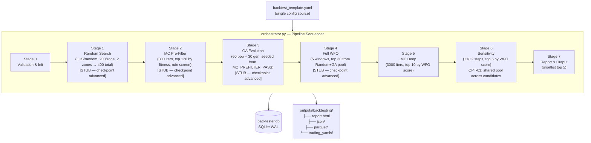
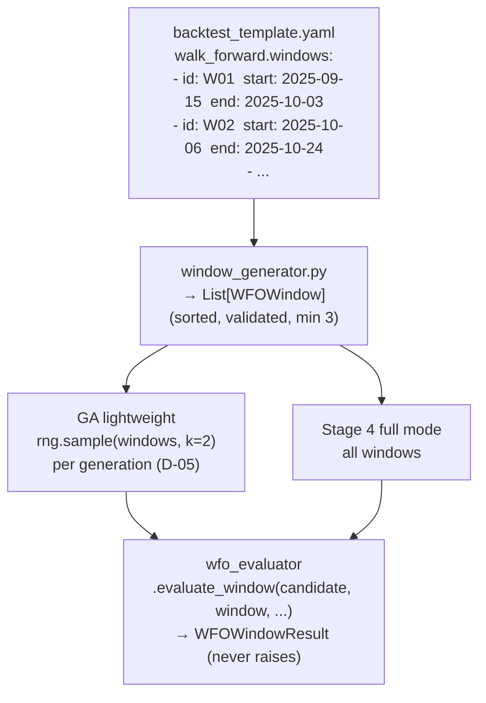
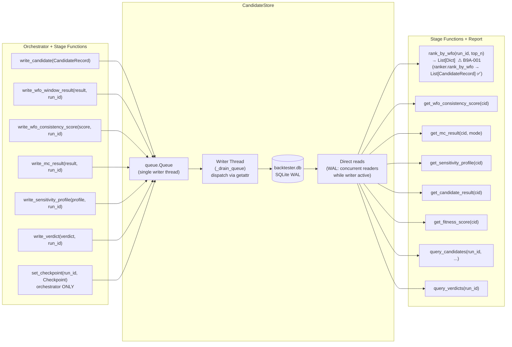
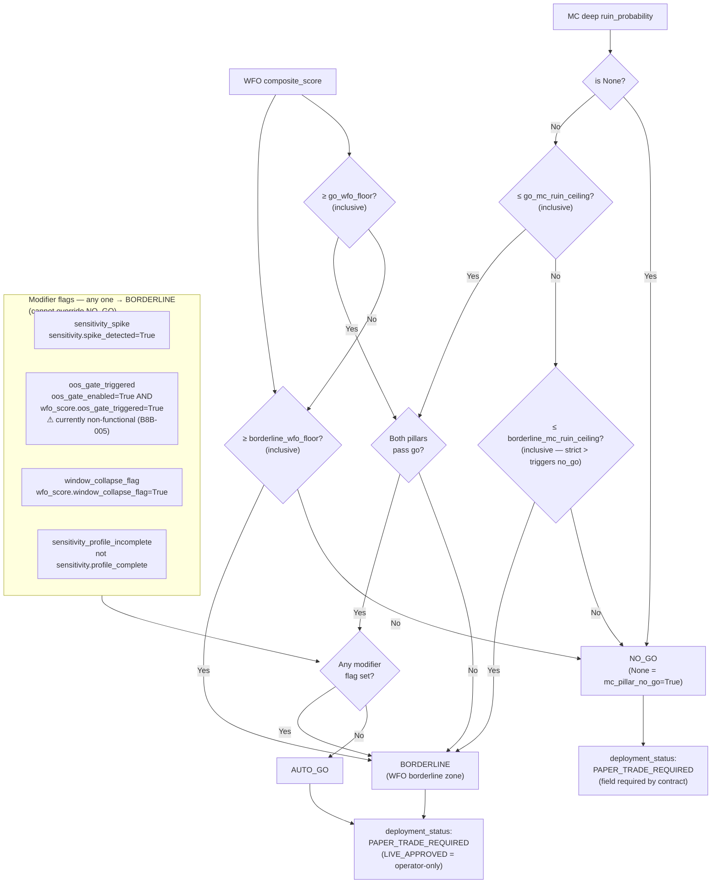

# ARCHITECTURE.md — Backtesting & Optimization Framework
**Version**: 4.0.0
**Date**: 2026-03-05
**Audience**: Any developer working on any aspect of the backtester pipeline
**Status**: Block 9C complete. All sections verified against source.
**Promise**: This document describes what the code **actually does**, verified against source.
No aspirational content. Every claim was confirmed by code review.

---

## §1 — What This System Does

An 8-stage automated parameter optimization pipeline for the WBWSStrategy. Given a parameter
space definition and a strategy base config, it searches for parameter combinations that are:
- **Robust across time** — Walk-Forward Optimization (WFO) across multiple non-overlapping windows
- **Robust under market noise** — Monte Carlo simulation of trade-sequence perturbations
- **Not fragile to small changes** — Parameter sensitivity analysis (±1/±2 grid steps)

It produces a **verdict** (`auto_go` / `borderline` / `no_go`) for each surviving candidate
and — for `auto_go` and `borderline` verdicts — a trading-ready strategy YAML file.

**One run = one config hash.** Every run is identified by its `config_hash` (SHA-256 of
`backtest_template.yaml`). Resumable at any of 8 checkpoints. All state lives in SQLite WAL.

**Metric units**: All trading metrics (net_pnl, expectancy) are in **pips/points** — not
currency. `WFOWindowResult.net_pnl` stores `total_pnl_points`. `FitnessResult` reads
`expectancy_points`. There is no currency conversion at any stage. The WFO sigmoid scale
(`scale=0.10`) is calibrated for pips/points — verify against your actual per-window
distribution before the first production run (B8B-012).

---

## §2 — Repository Layout

```
src/backtesting/
├── orchestrator.py          ← Pipeline entry point. Sequences all 8 stages.
│                              Stages 0, 5, 6, 7 fully implemented.
│                              Stages 1–4 are stubs (pending Phase 4).
│                              All stub stages advance their checkpoint (B9A-002 fixed).
├── contracts.py             ← ALL inter-module contracts (frozen dataclasses + enums).
│                              Single import for all shared types. Never raw dicts.
│                              report_emphasis validation added (B8C-001 fixed).
├── candidate_store.py       ← SQLite WAL store. Single-writer queue. Thread-safe.
│                              All writes: non-blocking enqueue. All reads: direct.
├── parameter_space.py       ← Expands YAML zone definitions → discrete parameter grids.
│                              AUDITED (Block 9C). B9C-005 open (str(step) fragility).
├── sampler.py               ← LHS / random sampling over expanded parameter space.
│                              AUDITED (Block 9C). B9C-006 (docstring), B9C-007 (sort
│                              key bug — fix before Stage 1) open.
├── scenario.py              ← Loads ScenarioProfile from config dict. AUDITED (Block 9C). Clean.
├── strategy_runner.py       ← Single candidate evaluation. Writes temp YAML. Never raises.
│                              _PARAM_KEY_MAP is one of TWO files that knows strategy YAML keys
│                              (yaml_generator._STRATEGY_PARAM_KEY_MAP is the second — B8-006).
├── fitness.py               ← Stateless. MetricsReport + ScenarioProfile → FitnessResult.
│                              NaN guard added (B8B-001 fixed).
├── ranker.py                ← Stateless. Query spec → ranked List[CandidateRecord].
│                              AUDITED (Block 9C). Returns typed records correctly.
├── report_generator.py      ← Self-contained HTML + JSON + Parquet. Reads from store.
├── yaml_generator.py        ← Merges params into base YAML. Embeds backtester metadata.
│                              AUDITED (Block 9C). _STRATEGY_PARAM_KEY_MAP second source
│                              of truth — must stay in sync with strategy_runner._PARAM_KEY_MAP.
├── ga/
│   ├── population.py        ← Init from MC_PREFILTER_PASS. Elite extraction. Typed API.
│   ├── selection.py         ← Tournament selection. Raises on empty population.
│   ├── crossover.py         ← Uniform crossover (zone_name from parent_a). B9B-001 open.
│   ├── mutation.py          ← Gaussian on step grid. Snap-then-clamp to zone bounds.
│   ├── diversity.py         ← Hybrid Euclidean/Hamming distance penalty.
│   └── ga_engine.py         ← Full evolution loop. Writes all candidates to store.
│                              B9B-003 open: config['_base_yaml_path'] injection contract.
├── wfo/
│   ├── window_generator.py  ← YAML → sorted WFOWindow list (min 3, no overlaps).
│   ├── wfo_evaluator.py     ← One candidate × one window → WFOWindowResult. Never raises.
│   │                          B8B-018 fixed: total_pnl_points, expectancy_points.
│   ├── wfo_engine.py        ← "lightweight" (GA) + "full" (Stage 4) modes.
│   │                          AUDITED (Block 9C). Correctly passes OOS gate flags to scorer.
│   │                          B8B-005 bug lives in evaluator/scorer, not here.
│   └── consistency_scorer.py← WFOWindowResults → 4 sub-metrics → composite [0,1].
│                              B8B-012 open: sigmoid scale=0.10 (calibrate before first run).
├── monte_carlo/
│   ├── perturbation.py      ← Named perturbation profiles from YAML.
│   ├── equity_simulator.py  ← Vectorised np.cumsum. No Python loops over paths.
│   ├── mc_metrics.py        ← avg_equity, worst_dd, ruin_prob, p5_equity. Vectorised.
│   └── mc_engine.py         ← pre-filter + deep dispatch. Never raises.
│                              B8B-013 open: ruin_threshold dual-source.
└── evaluation/
    ├── sensitivity.py       ← ±1/±2 step perturbation. ProcessPoolExecutor workers.
    │                          OPT-01: single pool shared across all candidates (Block 7C).
    └── verdict.py           ← Two-pillar + modifier flags → VerdictResult. Never raises.

configs/backtesting/
└── backtest_template.yaml   ← Single source of truth for all pipeline configuration.
                               Changing this file creates a new config_hash → new run.

docs/backtesting/
├── architecture/
│   └── ARCHITECTURE.md      ← This file
├── OPERATOR_RUNBOOK.md
├── BLOCK8_AUDIT_REPORT.md
├── TECHNICAL_SPEC.md
├── BACKTESTER_PLAN.md
├── FUNCTIONAL_SPEC.md
├── SQLITE_SCHEMA.md
└── CHANGE_LOG.md

tests/backtesting/
├── unit/                              ← 123 tests (Phase 2–4, all green)
├── integration/
│   ├── test_live_pipeline.py          ← 17 tests (Phase 5)
│   ├── test_sqlite_queries.py         ← 12 tests (Phase 5)
│   ├── test_report_yaml.py            ← 19 tests (Phase 5)
│   ├── test_e2e_wbws_real_data.py     ← 13 tests (Phase 6 Block 0)
│   ├── test_adversarial_suite.py      ←  8 tests (Phase 6 Block 2)
│   ├── test_performance.py            ←  7 tests (Phase 6 Block 3)
│   ├── test_robustness.py             ← 12 tests (Phase 6 Block 4)
│   ├── test_threshold_calibration.py  ← 22 tests (Phase 6 Block 5)
│   ├── test_h02_wfo_window_writes.py  ←  2 tests (Block 7A)
│   ├── test_block8a_foundation.py     ← 12 tests (Block 8A)
│   ├── test_block8b_engines.py        ← 14 tests (Block 8B)
│   ├── test_block8c_verdict_sensitivity.py ← 11 tests (Block 8C)
│   ├── test_block9a_orchestrator.py   ←  7 tests (Block 9A)
│   ├── test_block9b_ga.py             ← 28 tests (Block 9B)
│   └── test_block9c_supporting.py     ← 42 tests (Block 9C)

Total: ~345 tests — all green as of 2026-03-05 (Block 9C)
```

---

## §3 — Pipeline Overview



**Checkpoint system**: After each stage completes, `store.set_checkpoint()` is called.
On resume, the orchestrator skips all stages whose checkpoint is already recorded.
All 8 stages — including the 4 stubs — correctly advance their checkpoint (B9A-002 fixed).

**Checkpoint sequence**:
```
NOT_STARTED → RUN_INITIALISED → RANDOM_SEARCH_COMPLETE → MC_PREFILTER_COMPLETE
            → GA_COMPLETE → WFO_COMPLETE → MONTE_CARLO_COMPLETE
            → SENSITIVITY_COMPLETE → COMPLETE
```

**Stages 1–4 are currently stubs.** They log "not yet implemented" and advance their
checkpoint without producing output. Stages 5–7 consume data loaded from test fixtures
or a prior partial run. Temporary development state — see OPERATOR_RUNBOOK §3.

---

## §4 — Module Dependency Graph



```mermaid
graph TD
    ORC["orchestrator.py"]

    ORC --> CS["candidate_store.py"]
    ORC --> SCN["scenario.py"]
    ORC --> PS["parameter_space.py"]
    ORC --> SMP["sampler.py"]
    ORC --> SR["strategy_runner.py"]
    ORC --> FIT["fitness.py"]
    ORC --> RNK["ranker.py"]
    ORC --> GA["ga/ga_engine.py"]
    ORC --> WFO["wfo/wfo_engine.py"]
    ORC --> MC["monte_carlo/mc_engine.py"]
    ORC --> SENS["evaluation/sensitivity.py"]
    ORC --> VRD["evaluation/verdict.py"]
    ORC --> RPT["report_generator.py"]
    ORC --> YML["yaml_generator.py"]

    SR --> FIT
    SR --> STRAT["src/strategies/\norchestrator.py\n(frozen — do not modify)"]

    GA --> POP["ga/population.py"]
    GA --> SEL["ga/selection.py"]
    GA --> CRS["ga/crossover.py"]
    GA --> MUT["ga/mutation.py"]
    GA --> DIV["ga/diversity.py"]
    GA --> WFOE["wfo/wfo_engine.py\n(lightweight mode)"]

    WFO --> WFOV["wfo/wfo_evaluator.py"]
    WFO --> WFOC["wfo/consistency_scorer.py"]
    WFO --> WFOG["wfo/window_generator.py"]
    WFOV --> SR

    MC --> PTB["monte_carlo/perturbation.py"]
    MC --> EQS["monte_carlo/equity_simulator.py"]
    MC --> MCM["monte_carlo/mc_metrics.py"]

    SENS --> SR
    SENS --> FIT

    CS --> CON["contracts.py"]
    SCN --> CON
    ORC --> CON

    classDef frozen fill:#f9d,stroke:#c66
    classDef store fill:#ddf,stroke:#66c
    classDef contract fill:#dfd,stroke:#6a6
    class STRAT frozen
    class CS store
    class CON contract
```

**Key rules**:
- `contracts.py` is imported by every module — it defines the only shared types
- `candidate_store.py` is the only module that writes to SQLite
- `strategy_runner.py` is the only module that calls into `src/strategies/`
- `orchestrator.py` is the only module that calls `store.set_checkpoint()`
- `ga/population.py` is the only GA module consuming typed `CandidateRecord` (not raw dicts)
- `ranker.py` returns `List[CandidateRecord]` (typed) — orchestrator's inline `rank_by_wfo` returns `List[Dict]` (B9A-001 open)

---

## §5 — Data Flow — What Passes Between Modules

```mermaid
flowchart LR
    subgraph IN["Inputs"]
        YAML["backtest_template.yaml"]
        STRAT_YAML["strategy_template.yaml\n(base strategy config)"]
    end

    subgraph STAGE1["Stage 1 — Random Search"]
        PS["parameter_space\n.expand_zones(config)\n→ Dict[zone, List[params]]"]
        SMP["sampler\n.sample_lhs(...)\n→ List[CandidateParameterSet]\n⚠ B9C-007: fix sort key before use"]
        SR1["strategy_runner\n.evaluate(candidate, yaml, temp)\n→ CandidateResult"]
        FIT1["fitness\n.evaluate_fitness(result, scenario)\n→ FitnessResult"]
        WC1["write_candidate(CandidateRecord)"]
    end

    subgraph STAGE2["Stage 2 — MC Pre-Filter"]
        MC_PRE["mc_engine\n.run_mc(candidate, result, PRE_FILTER, config, seed)\n→ MCResult"]
        WMC1["write_mc_result(MCResult, run_id)"]
    end

    subgraph STAGE3["Stage 3 — GA"]
        GA["ga_engine\n.run_ga(store, run_id, scenario, windows, config, seed)\n[reads CandidateRecord from store,\nwrites CandidateRecord per generation]\n⚠ B9B-003: inject config['_base_yaml_path'] before calling"]
        WFO_LW["wfo_engine (lightweight)\n2 random windows per generation\n→ WFOWindowResult × 2"]
    end

    subgraph STAGE4["Stage 4 — Full WFO"]
        WFO_FULL["wfo_engine (full)\nAll windows, top 30 candidates\n→ Dict[cid, WFOConsistencyScore]"]
        WWFO["write_wfo_consistency_score\n(WFOConsistencyScore, run_id)"]
    end

    subgraph STAGE5["Stage 5 — MC Deep"]
        RNK5["store.rank_by_wfo(run_id, top_n=10)\n→ List[Dict]  ⚠ B9A-001"]
        MC_DEEP["mc_engine\n.run_mc(candidate, result, DEEP, config, seed)\n→ MCResult"]
        WMC2["write_mc_result(MCResult, run_id)"]
    end

    subgraph STAGE6["Stage 6 — Sensitivity"]
        RNK6["store.rank_by_wfo(run_id, top_n=5)\n→ List[Dict]  ⚠ B9A-001"]
        SENS["sensitivity\n.evaluate_sensitivity(candidate, ...)\n→ SensitivityProfile\n(OPT-01: shared pool)"]
        WSENS["write_sensitivity_profile\n(SensitivityProfile, run_id)"]
    end

    subgraph STAGE7["Stage 7 — Report"]
        RNK7["store.rank_by_wfo(run_id, top_n=5)"]
        VRD["verdict\n.compute_verdict(cid, wfo_score, mc_result,\nsensitivity, scenario, oos_gate_enabled)\n→ VerdictResult\n(None wfo_score/mc_result → skip, log WARNING)"]
        WVRD["write_verdict(VerdictResult, run_id)"]
        YGEN["yaml_generator\n.generate_trading_yaml(...)\n→ Path"]
        RPT["report_generator\n.generate_report(...)\n→ HTML + JSON + Parquet"]
    end

    YAML --> PS
    STRAT_YAML --> SR1
    PS --> SMP --> SR1 --> FIT1 --> WC1

    WC1 --> MC_PRE --> WMC1
    WMC1 --> GA --> WFO_LW
    GA --> WFO_FULL --> WWFO
    WWFO --> RNK5 --> MC_DEEP --> WMC2
    WMC2 --> RNK6 --> SENS --> WSENS
    WSENS --> RNK7 --> VRD --> WVRD --> YGEN
    WVRD --> RPT
```



---

## §6 — Stage Execution Model

### Stage 0 — Validation & Init
Validates in this order:
1. `load_scenario()` — scenario name exists in config, all required fields present
2. `_validate_wfo_windows()` — min 3 windows, unique IDs, valid ISO dates, start < end
3. `_validate_parameter_names()` — all enabled zone parameter names exist in `_PARAM_KEY_MAP` (M-05)
4. `min_significant_trades >= 1` check
5. `spike_threshold ∈ (0, 1)` — validated from config dict (B9A-003: becomes redundant once fixed)
6. `enabled_zones` count — at least one zone enabled

### Checkpoint system
`store.set_checkpoint(run_id, Checkpoint.X)` is called after every stage.
On resume, `_execute_pipeline` compares `store.get_checkpoint().value` against each
stage's target checkpoint value. Stages already completed are skipped. The monotonic
`<` comparison prevents a checkpoint from ever retreating.

### Stage 5 — MC Deep
Reads `store.rank_by_wfo(run_id, top_n=input_count)` → top candidates by WFO score.
For each: calls `run_mc(..., mode=MCMode.DEEP)` → writes `MCResult` even on error.
On error: logs WARNING, continues. `ruin_probability=None` → `NO_GO` in Stage 7.

### Stage 6 — Parameter Sensitivity (OPT-01)
Opens **one** `ProcessPoolExecutor` for all candidates (pool reuse). Spawn cost paid once.
For each candidate: calls `evaluate_sensitivity(..., pool=pool)` → `SensitivityProfile`.
Pool closed once after all candidates — not once per candidate (pre-OPT-01 behaviour).

**OPT-01 re-analysis planned**: Pool reuse was applied in Block 7C but the ≤200s target
was not confirmed by a post-change benchmark. A new timing run and analysis of remaining
bottlenecks (task granularity, IPC overhead) is scheduled.

### Stage 7 — Report & Output
For each top candidate:
1. Fetch `WFOConsistencyScore`, `MCResult` (DEEP), `SensitivityProfile` from store
2. **Guard**: if `wfo_score is None` or `mc_result is None` → skip, log WARNING (B8C-007 confirmed)
3. Call `compute_verdict()` → `VerdictResult`
4. For `AUTO_GO` / `BORDERLINE`: call `generate_trading_yaml()` → YAML file
5. Rebuild `VerdictResult` with `yaml_output_path` (frozen dataclass → new instance)
6. Write `VerdictResult` to store; then call `generate_report()` for HTML + JSON + Parquet

**Always-None fields** in current production state:
- `VerdictResult.parameter_region_width` — deferred, WF-07
- `WFOWindowResult.oos_delta` — always None, B8B-005

---

## §7 — Evaluation Data Flow

### Fitness evaluation
```
CandidateResult  ──►  fitness.evaluate_fitness(result, scenario)  ──►  FitnessResult
                            │
                            ▼
                    NaN guard (B8B-001 fixed)
                            │
                    _CONSTRAINT_CHECKS (6 checks, cheapest first, fail-fast)
                            │
                    All pass?  ──► _compute_weighted_score(metrics, scenario)
                                        │
                                        ▼
                                   fitness_score ∈ [0, 1]
```

**Constraint boundary semantics**: Lower-bound constraints use `op.lt` (reject when
`actual < threshold`) — a value exactly equal to the threshold is **accepted**. Upper-bound
constraints use `op.gt` — a value exactly at the threshold is also accepted. This implements
`>=` for minimums and `<=` for maximums throughout.

**NaN handling** (B8B-001 fixed): `NaN < x` is always `False` under IEEE 754, so NaN values
previously passed all constraints silently. An explicit NaN guard is now applied before
the constraint loop.

### WFO evaluation
```
candidates × windows  ──►  ProcessPoolExecutor
                                │
                      evaluate_window(candidate, window, ...)   [wfo_evaluator]
                                │  never raises
                                ▼
                      WFOWindowResult
                        ├── fitness_score
                        ├── net_pnl        (= total_pnl_points, in pips — B8B-018 fixed)
                        ├── win_rate
                        └── oos_delta      (always None — B8B-005)
                                │
                      store.write_wfo_window_result()
                                │
                    [all windows done for candidate]
                                │
                      compute_consistency(window_results, ...)  [consistency_scorer]
                                │
                      WFOConsistencyScore
                        ├── composite_score
                        ├── fraction_positive_windows
                        ├── median_oos_delta   (always None — B8B-005)
                        ├── oos_gate_triggered (always False — B8B-005)
                        └── window_collapse_flag
                                │
                      store.write_wfo_consistency_score()
```

**WFO modes**:
- `lightweight` (GA, Stage 3): 2 random windows per generation, used in-memory for GA fitness
- `full` (Stage 4): all windows, scores written to store

**WFO sigmoid scale** (B8B-012): `median_return_norm` uses `scale=0.10`. Metrics are in
pips/points — verify scale against actual per-window distribution before first production
run. Until calibrated, WFO composite scores rank primarily by fraction of positive windows.
Relative ranking within a run is still meaningful; absolute thresholds may need adjustment.

### MC path model
```
CandidateResult.trades  ──►  extract_trade_returns()  ──►  trade_returns: np.ndarray
                                                                  │
simulate_paths(trade_returns, n_iterations, profile, seed, ...)   │
      │                                                            │
      ▼                                                            │
equity_paths: shape (n_iterations, n_trades+1)  ◄─────────────────┘
      │
      ▼
compute_metrics(equity_paths, starting_equity, ruin_threshold)
      │
      ├── avg_final_equity         = mean(equity_paths[:, -1])
      ├── ruin_probability         = fraction of paths where min(path) <= ruin_floor
      ├── worst_drawdown           = max per-path (running_max - equity) / running_max
      └── p5_final_equity          = 5th percentile of final equity  [reporting only]
```

**Seed model**: One seed shared across all candidates within a stage — identical
perturbations applied to each trade history makes MC results directly comparable.

**Ruin threshold**: Read from config dict in `mc_engine`. `ScenarioProfile` also carries
`mc_prefilter_ruin_threshold`. Both must agree in `backtest_template.yaml` (B8B-013 open).

---

## §8 — WFO Window Model



**Window constraints** (Stage 0 enforced):
- Minimum 3 windows (required for GA random sampling diversity)
- Unique IDs, `start_date < end_date`, no overlapping date ranges

**`WFOWindow` contract**: Fields are `window_id: str`, `start_date: date`, `end_date: date`.
There is no IS/OOS field split in the contract — each window is a single date range.

**IS/OOS split**: Not implemented. `oos_delta` remains `None` until Block 9E implements
the split (B8B-005).

---

## §9 — CandidateStore Threading Model



**Write path**: All writes are non-blocking. `write_*` methods `queue.put()` a
`(method_name, payload)` tuple. The writer thread dispatches via `getattr(self, method_name)`.
All SQLite INSERT/UPDATE operations execute on this single thread — no write contention.

**Read path**: Direct synchronous queries. WAL mode allows concurrent readers.

**Flush / close**: `store.flush()` calls `queue.join()` — blocks until queue drains.
`store.close()` flushes, stops writer thread, closes connection. Always in `finally` block.

**B9A-001 (open)**: Orchestrator's inline `rank_by_wfo()` returns `List[Dict]` rather than
`List[CandidateRecord]`. `ranker.rank_by_wfo()` (the module-level function) is correct and
returns typed records. When Stages 5–7 are refactored, use `ranker.rank_by_wfo()` directly.

---

## §10 — Verdict Logic — Two-Pillar Model



### Exact operators (from verdict.py source — do not approximate)

```python
wfo_pillar_go    = wfo_composite >= wfo_go_floor        # >= INCLUSIVE
wfo_pillar_no_go = wfo_composite < wfo_borderline_floor  # < strictly less than

mc_pillar_go    = ruin_prob <= mc_go_ceiling             # <= INCLUSIVE
mc_pillar_no_go = ruin_prob > mc_borderline_ceiling      # > strictly greater than

# ruin_prob is None → mc_pillar_no_go = True → NO_GO
# oos_gate_triggered = oos_gate_enabled AND wfo_score.oos_gate_triggered
# Either condition alone does NOT trigger the flag.
# NOTE: oos_gate_triggered is always False in current pipeline (B8B-005)

if wfo_pillar_no_go or mc_pillar_no_go:          → NO_GO
elif wfo_pillar_go and mc_pillar_go and no flags: → AUTO_GO
else:                                             → BORDERLINE
```

### Confirmed verdict grid (Block 5, `capital_accumulation` scenario)

```
Thresholds: go_wfo>=0.65  borderline_wfo>=0.40  go_mc<=0.05  borderline_mc<=0.15

WFO region              MC<go    MC=go    MC=bdr   MC>bdr   MC=None
────────────────────────────────────────────────────────────────────
wfo > 0.65 (ABOVE_GO)   AUTO_GO  AUTO_GO  BORDER   NO_GO    NO_GO
wfo = 0.65 (AT_GO)      AUTO_GO  AUTO_GO  BORDER   NO_GO    NO_GO
wfo = 0.52 (BORDERLINE) BORDER   BORDER   BORDER   NO_GO    NO_GO
wfo = 0.30 (NO_GO)      NO_GO    NO_GO    NO_GO    NO_GO    NO_GO

Modifier demotion (AUTO_GO base → one flag active):
  spike=True           → BORDERLINE
  collapse=True        → BORDERLINE
  incomplete=True      → BORDERLINE
  oos_gate (both)=True → BORDERLINE  (currently non-functional — B8B-005)
  Any flag on NO_GO    → NO_GO  (flags cannot override)
```

---

## §11 — Supporting Module Design Notes (Block 9C)

### parameter_space.py
- `expand_zones()` generates discrete parameter grids via `itertools.product` (Cartesian product)
- `_range_values()` uses integer-scaled arithmetic to avoid floating-point accumulation
- Disabled zones are excluded; empty ranges raise `ValueError` (fail-fast)
- **B9C-005 (P3)**: `str(step)` for scale detection is fragile for floats with non-canonical repr — recommend `Decimal(str(step))`

### sampler.py
- Both `sample_lhs()` and `sample_random()` use single `rng = stdlib_random.Random(seed)` — fully reproducible
- All outputs are `CandidateParameterSet.create()` instances — immutable, deterministic IDs
- **B9C-007 (P3) — FIX BEFORE STAGE 1**: `_lhs_sample()` sorts parameter value universe by `(str(type), str(val))` — lexicographic for numerics. Breaks LHS space-filling for multi-digit int/float ranges (e.g. `[9,10,11]` sorts as `[10,11,9]`). Fix: `sorted(seen, key=lambda x: float(x))` for numeric params
- **B9C-006 (P3)**: `sample_random()` docstring says "with replacement" — implementation uses `rng.sample()` (without replacement). Fix: update docstring only

### scenario.py
- `load_scenario()` correctly delegates all validation to `ScenarioProfile.__post_init__`
- `verdict_sensitivity_spike_threshold` is loaded from YAML and placed in `ScenarioProfile` field
- B9A-003 is orchestrator-only — scenario.py has no cross-config alignment responsibility

### ranker.py
- `rank()`, `rank_by_wfo()`, `rank_combined()` all return `List[CandidateRecord]` (typed) ✅
- B9A-001 is orchestrator-only — the ranker module itself is correct
- `rank_by_wfo()` intentionally queries without stage filter (WFO scores span all stages)
- `rank_combined()` deduplicates by `candidate_id` before re-sorting

### yaml_generator.py
- Always sets `deployment_status = PAPER_TRADE_REQUIRED` — never `LIVE_APPROVED` ✅
- Embeds all 5 run seeds in `backtester_metadata` for immutable audit trail ✅
- `generate_trading_yaml()` deepcopies base config — base YAML is never mutated ✅
- Validation: attempts `StrategyConfig.from_yaml()` first; falls back to `_structural_validate()` on ImportError
- **B8-006 scope expanded**: `_STRATEGY_PARAM_KEY_MAP` is a second instance of the YAML key mapping alongside `strategy_runner._PARAM_KEY_MAP`. Both files must be updated together when adding new strategy parameters

### wfo_engine.py
- Lightweight/full mode dispatch correct; both modes pass `oos_gate_enabled` flags to `compute_consistency()` ✅
- B8B-005 (OOS gate non-functional) lives in `wfo_evaluator.py` / `consistency_scorer.py` — not in wfo_engine
- Full mode writes `WFOConsistencyScore` to store; lightweight mode does not ✅

---

## §12 — Contract Catalogue

All contracts are **frozen dataclasses** in `src/backtesting/contracts.py`.
Never pass raw dicts between modules. Always use `CandidateParameterSet.create()` factory.

| Contract | Produced by | Consumed by | Key fields | None-path notes |
|---|---|---|---|---|
| `RunMetadata` | `orchestrator` | store, `yaml_generator` | `run_id`, `config_hash` (64-char SHA-256), `wfo_window_ids` (min 3), `started_at`, `perturbation_profile_name`, 5 seeds, `checkpoint` | No Optional fields |
| `ScenarioProfile` | `scenario` | `fitness`, `wfo_evaluator`, `consistency_scorer`, `verdict`, `report_generator` | fitness weights, constraint thresholds, verdict floors | `report_emphasis` must be non-empty list/tuple (B8C-001 fixed) |
| `CandidateParameterSet` | `sampler`, `ga_engine` | `strategy_runner`, `wfo_evaluator`, `sensitivity` | `candidate_id` (SHA-256 of params — deterministic), `zone_name`, `parameters` | `generation`: None for Random Search |
| `CandidateResult` | `strategy_runner` | `fitness`, `mc_engine` | `metrics`, `trades`, `total_trades`, `error` | `metrics`, `trades`, `total_trades`: all None on error |
| `FitnessResult` | `fitness` | `orchestrator` (→ store) | `fitness_score`, `passed_constraints`, `actual_*` | `fitness_score`: None when constraints failed; NaN guard applied (B8B-001 fixed) |
| `WFOWindow` | `window_generator` | `wfo_evaluator`, `ga_engine` | `window_id`, `start_date: date`, `end_date: date` | No Optional fields. No IS/OOS split fields. |
| `WFOWindowResult` | `wfo_evaluator` | `consistency_scorer`, store | `fitness_score`, `net_pnl` (pips), `win_rate`, `oos_delta` | All metrics: None on error; `oos_delta`: always None (B8B-005) |
| `WFOConsistencyScore` | `consistency_scorer` | store, `verdict`, ranker | `composite_score`, `fraction_positive_windows`, `oos_gate_triggered`, `window_collapse_flag`, `median_oos_delta` | `median_oos_delta`: None when no windows carry oos_delta; persisted correctly after B8-001 fix |
| `MCResult` | `mc_engine` | store, `verdict` | `ruin_probability`, `avg_final_equity`, `p5_final_equity`, `error` | All metrics: None on error; `ruin_probability=None` → `NO_GO` |
| `SensitivityProfile` | `sensitivity` | store, `verdict` | `spike_detected`, `spike_parameters`, `profile_complete` | `profile_complete=False` → `sensitivity_profile_incomplete` modifier → BORDERLINE |
| `VerdictResult` | `verdict` | store, `yaml_generator`, `report_generator` | `verdict` (enum), `deployment_status`, `evidence_summary`, `scenario_name`, `oos_gate_triggered`, `window_collapse_flag`, `sensitivity_profile_incomplete`, `median_oos_delta`, `parameter_region_width`, `yaml_output_path` | `yaml_output_path`: None for NO_GO; `parameter_region_width`: always None (WF-07) |
| `CandidateRecord` | `orchestrator` | store | All stage data flattened to primitives for SQLite. `stage` field is `str` (`.value`), not enum. | Most fields Optional |

**`candidate_id` identity**: SHA-256 of the canonical JSON of `parameters` dict — deterministic
and content-addressed. Reconstructing via `.create()` from the same parameters always yields
the same ID as stored in DB (B9A-006 confirmed).

---

## §13 — ProcessPoolExecutor — Spawn Mode & Patch Rules

Two modules use `ProcessPoolExecutor`. On Windows, the **spawn** start method is used (no fork).

### Production pool lifetimes

| Module | Worker function | Pool lifetime |
|---|---|---|
| `evaluation/sensitivity.py` | `_evaluate_perturbation` | Single pool shared across ALL candidates (OPT-01) |
| `ga/ga_engine.py` | `evaluate_window` | One pool per generation |
| `wfo/wfo_engine.py` | `evaluate_window` | One pool per `run_wfo()` call |

Workers must be picklable. All frozen dataclasses pickle correctly.

### Test patch rules — Windows spawn constraint

> **CRITICAL**: `unittest.mock.patch` decorates objects in the **parent process**. Child
> processes (Windows spawn mode) are fresh Python interpreters — they do **not** inherit
> parent-process patches. Patching a worker function has no effect on the child.

```
unittest.mock patches DO NOT cross the ProcessPoolExecutor spawn boundary on Windows.
```

| What to test | Wrong target | Correct target |
|---|---|---|
| Stage 6 loop behaviour | `src.backtesting.evaluation.sensitivity._evaluate_perturbation` | `src.backtesting.orchestrator.evaluate_sensitivity` |
| Stage 5 MC injection | `src.backtesting.orchestrator.run_mc` (AttributeError — local import) | `src.backtesting.monte_carlo.mc_engine.run_mc` |
| `wfo_engine` write behaviour | `src.backtesting.wfo.wfo_engine.evaluate_window` alone (not sufficient) | Patch `ProcessPoolExecutor` + `as_completed` at engine module level to resolve futures synchronously |

**Confirmed by Block 4 ROB-09**: `Can't pickle <class 'unittest.mock.MagicMock'>`.

---

## §14 — GA Package — Design Notes (Block 9B)

### Mutation clamping order (mutation.py)
**Snap-then-clamp** is the correct and implemented order for both `int` and `float`:
```
new_value → snap_to_grid(new_value, low, step) → clamp(snapped, low, high)
```

### Seed threading (ga_engine.py)
`rng = random.Random(seed)` is created once in `run_ga()` and passed to all operators.

### Elite preservation
`next_population` = `n_elites` (unchanged) + exactly `population_size - n_elites` offspring.

### Known GA gaps
- **B9B-001** (P3): `crossover.py` has no zone-name assertion for cross-zone parents.
- **B9B-003** (P3): `config['_base_yaml_path']` is an orchestrator-injected key. When Stage 3 is implemented, `_run_stage_3_ga()` must inject this before calling `run_ga()`.

---

## §15 — SQLite Schema — 9 Tables

```
runs                   ← Immutable run identity: config_hash, 5 seeds, checkpoint
candidates             ← One row per unique candidate_id
candidate_parameters   ← Individual columns per parameter + parameters_json backup
evaluations            ← One row per candidate per stage: all constraint actuals + fitness
wfo_window_results     ← One row per candidate per window (is_ga_fitness_window flag)
wfo_consistency_scores ← 4 sub-metrics + composite score per candidate
mc_results             ← pre_filter and deep as separate rows per candidate
sensitivity_results    ← One row per candidate per parameter per step
sensitivity_profiles   ← Summary: spike_detected, spike_parameters, profile_complete
verdicts               ← Final verdict + evidence + deployment_status per candidate
```

Full DDL and 10 annotated query examples: `docs/backtesting/SQLITE_SCHEMA.md`

---

## §16 — Performance Baseline (Block 3, 2026-03-03, LOCKED)

```
Hardware:  Windows 10, 6 workers
Config:    mc.deep.iterations=3000, mc.deep.input_count=10,
           sens.input_count=5, sens.max_steps=2, max_workers=6

Run 1:  Total=457.2s  Stage5=2.5s   Stage6=446.3s  Stage7=8.3s
Run 2:  Total=337.2s  Stage5=0.3s   Stage6=332.6s  Stage7=4.4s

Stage 5 MC Deep:     0.3–2.5s — fully vectorised (np.cumsum). Never the bottleneck.
Stage 6 Sensitivity: 333–446s — structural bottleneck (~66–89s/candidate).
Stage 7 Report:      4–8s — fine.

Budget: 337–457s of 14,400s daily (2.3–3.2%). Well within tolerance.
NOTE: TIMING SUMMARY log covers Stages 5–7 only (B8-008). Extends when 1–4 implemented.
```

---

## §17 — Known Deferral Decisions

| ID | Finding | Severity | Status | Target |
|---|---|---|---|---|
| B8B-005 | OOS gate non-functional — `oos_delta` always None | P2 | Open | Block 9E |
| B8B-012 | WFO sigmoid scale — verify before first prod run | Pre-prod blocker | Open | After first real run |
| B9A-001 | orchestrator `rank_by_wfo()` returns `List[Dict]` | P3 | Open | Block 9D |
| B9A-003 | `spike_threshold` dual-source | P3 | Open | Block 9D |
| B9C-007 | `_lhs_sample()` lexicographic sort breaks LHS | P3 | Open — **fix before Stage 1** | Block 9D |
| B9C-006 | `sample_random()` docstring wrong | P3 | Open | Block 9D |
| B9C-005 | `str(step)` fragile for float repr | P3 | Open | Block 9D |
| B9C-004 | `wfo_engine` no guard for empty candidates | P3 | Open | Block 9D |
| B9C-008 | `_structural_validate` fallback type-blind | P3 | Open | Block 9D |
| B8-006 | `_PARAM_KEY_MAP` dual-file (strategy_runner + yaml_generator) | P3 | Open | Block 9D |
| B8-009 | Raw sqlite3 in `_resume_or_start` | P3 | Open | Deferred |
| B9B-001 | No zone-name guard in crossover.py | P3 | Open | Deferred |
| B9B-003 | `config['_base_yaml_path']` injected private key | P3 | Open | Fix when Stage 3 implemented |
| B8B-013 | `ruin_threshold` dual-source | P3 | Open | Deferred |
| B8B-003 | `expectancy_norm scale=3.0` hardcoded | P3 | Open | Deferred |
| B8B-011 | Single-window variance optimistic | P3 | Open | Deferred |
| B8B-013 | ruin_threshold dual-source | P3 | Open | Deferred |
| B8C-002 | Chart figsize hardcoded | P3 | Open | Deferred |
| B8C-003 | `query_wfo_window_results` missing run_id filter | P3 | Open | Deferred |
| WF-07 | `parameter_region_width` always None | P4 | Deferred | ML density layer |
| B8-007/B8-008 | Stage 1–4 stubs; timing covers Stage 5–7 only | P4 | Resolves when stubs implemented | Block 9D |

---

## §18 — Architecture Principles Compliance

| # | Principle | Status | Notes |
|---|---|---|---|
| P1 SRP | ✅ | B9A-004 (P4): Stage 6 calls `load_scenario()` internally |
| P2 Contracts | ⚠️ | B9A-001 (`rank_by_wfo` dict in orchestrator), B8-009 (raw sqlite3) |
| P3 Immutability | ✅ | All contracts `frozen=True`. GA ops use `.create()`. yaml_generator deepcopies base config. |
| P4 Explicit | ⚠️ | B8C-006, B9C-006 (docstring mismatch), B9C-003 (KeyError vs ValueError) — all P4 cosmetic |
| P5 Vectorisation | ✅ | MC: `np.cumsum`. Diversity: `min()` over list comprehension. |
| P6 Fail Fast | ✅ | Stage 0 validates all config. NaN guard (B8B-001). `report_emphasis` validation (B8C-001). All stubs advance checkpoint (B9A-002). GA: empty pop/tournament guarded. parameter_space raises on empty range. |
| P7 Single Source | ⚠️ | B9A-003 (spike_threshold), B8B-013 (ruin_threshold), B8-006 (two YAML key maps: strategy_runner + yaml_generator) |
| P8 Cache Lifecycle | ✅ | `clear_all_caches()` in every `strategy_runner.evaluate()` finally block. |
| P9 Code Hygiene | ✅ | No `print()` in production code. All logging via logger. |
| P10 Reproducibility | ✅ | Seeds immutable in RunMetadata. GA seed threaded to all random ops. SHA-256 candidate_id deterministic. Sampler seed threaded through single rng. yaml_generator embeds all 5 seeds. |

---

## §19 — Adding a New Stage or Module

1. Define a new contract in `contracts.py` (frozen dataclass, `__post_init__` validation)
2. Add a write method to `CandidateStore` (enqueued, non-blocking)
3. Add a read method to `CandidateStore` (direct, synchronous)
4. Add the new table to `_SCHEMA_SQL` in `candidate_store.py`
5. Add the stage function `_run_stage_N_*` in `orchestrator.py`
6. Add `Checkpoint.STAGE_N_COMPLETE` to the `Checkpoint` enum in `contracts.py`
7. Wire into `_execute_pipeline` with checkpoint skip logic **and** `store.set_checkpoint()` call
8. Update `SQLITE_SCHEMA.md`, `TECHNICAL_SPEC.md`, `CHANGE_LOG.md`, and this file

---

## §20 — Key Non-Negotiables

| Rule | Why |
|---|---|
| Frozen dataclasses between every module | No mutable shared state; fail fast on bad data |
| `CandidateParameterSet.create()` always | `candidate_id` is SHA-256 of params — must be deterministic |
| `strategy_runner` never raises | Worker crashes must not kill the orchestrator |
| `run_mc` never raises | MC failures surface via `MCResult(error=..., ruin_probability=None)` |
| `evaluate_sensitivity` never raises | Profile written even when all perturbations fail |
| `datetime.now(UTC)` not `datetime.utcnow()` | `utcnow()` deprecated in Python 3.12+ |
| `pathlib.Path` + `src/utils/paths.py` | Windows compatibility |
| `ProcessPoolExecutor` spawn mode | Windows: no fork |
| `LIVE_APPROVED` never set in code | Operator-only manual action after paper trading |
| No `print()` in production code | Use `logger.info` |
| `store.close()` in `finally` always | Drains write queue; prevents data loss |
| Snap-then-clamp in mutation | Clamp-first breaks when `max` is not on step grid |
| `CandidateRecord.stage` is `str` (`.value`) | Not enum — SQLite stores the string value |
| `WFOWindow` has `start_date`/`end_date` only | No IS/OOS split in contract — single date range per window |
| Both `_PARAM_KEY_MAP` files updated together | strategy_runner.py + yaml_generator.py both map param → YAML key |

---

## §21 — Changelog

| Version | Date | Change |
|---|---|---|
| 1.0.0 | 2026-03-02 | Initial — Phase 6. Module map, data flow, contract table, verdict logic, store threading model. |
| 1.1.0 | 2026-03-03 | Block 4: Windows spawn mock patching constraint. Confirmed verdict grid. Performance baseline. OPT table. |
| 1.2.0 | 2026-03-03 | Block 6: Stage counts updated. Verdict grid updated to `capital_accumulation` thresholds. |
| 2.0.0 | 2026-03-04 | Block 8A: Full rewrite for production readiness. §1–3 (module map, stage execution model), §4–§11 (evaluation data flows, MC path model, WFO window model, contract catalogue, verdict logic, threading model, deferral decisions, principles compliance). |
| 3.0.0 | 2026-03-04 | Block 9B: Restored all 5 Mermaid diagrams. Applied all Block 8B–9B deltas: metric units corrected to pips/points; B8B-018 fixed; B8B-001 fixed; B8C-001 fixed; B8C-007 closed; B9A-002 fixed; B9A-006 confirmed; GA design notes added (§13); store diagram updated; OPT-01 status updated; known deferral table §16; principles compliance §17; test counts updated to ~303. |
| 4.0.0 | 2026-03-05 | Block 9C: Supporting modules audited (ranker, scenario, parameter_space, sampler, wfo_engine, yaml_generator). §2 module map updated with audit status and open findings. §5 data flow annotated with B9C-007 and B9B-003 warnings. §8 WFOWindow contract fields clarified. §9 store diagram updated — ranker.rank_by_wfo() noted as correct. §11 new section: Supporting Module Design Notes. §12 contract table expanded (VerdictResult full fields, WFOWindow corrected, CandidateRecord stage=str). §13 wfo_engine pool added; wfo_engine test patch pattern added. §17 deferral table expanded with B9C findings. §18 principles updated. §20 non-negotiables expanded. Test count updated to ~345. |