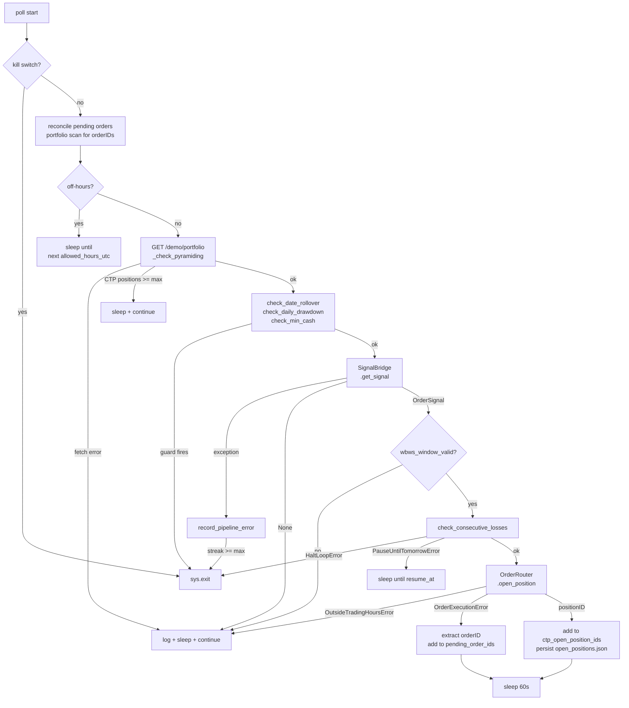
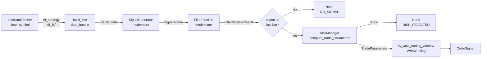
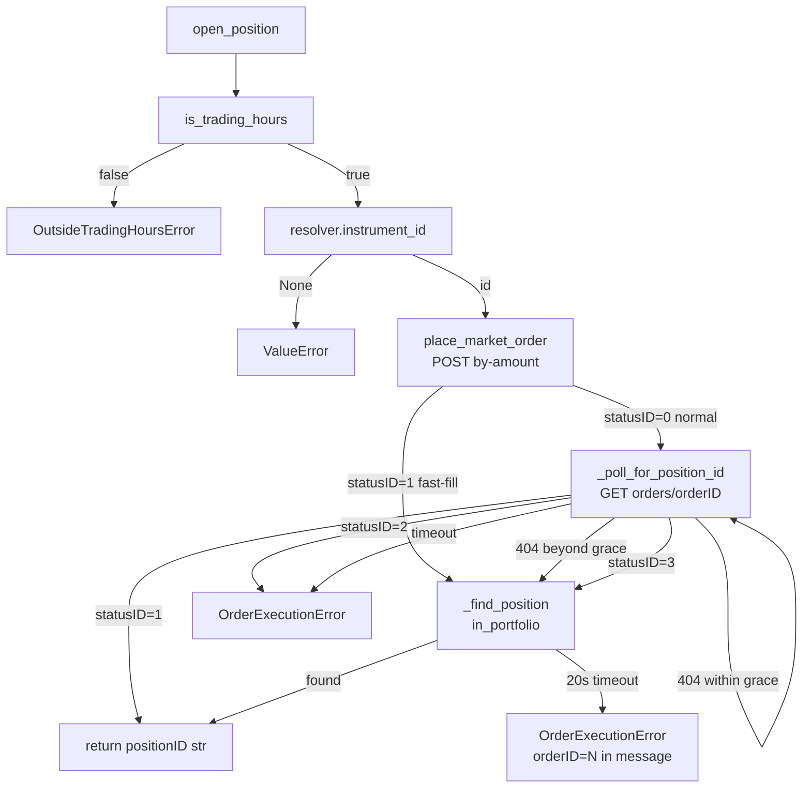
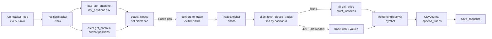
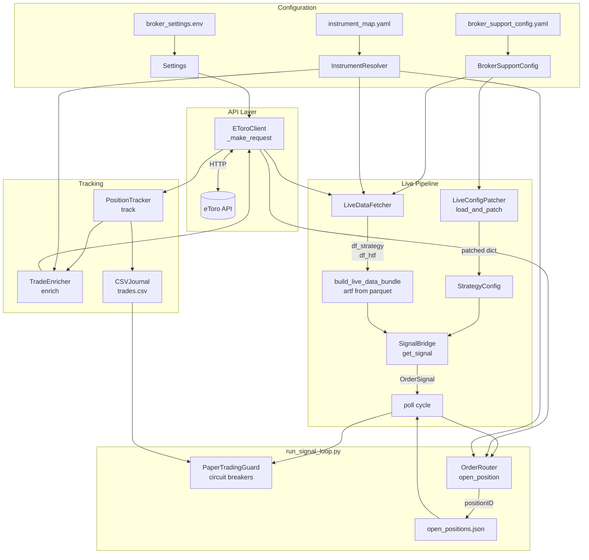

# ARCHITECTURE.md — Broker Integration Layer
# CTP / broker_support — Developer Reference
# Factual. Developer-oriented. No status, no history, no debug narrative.
# Updated: 2026-03-28
---
## 1. SCOPE
The broker integration layer connects the CTP signal pipeline to the eToro
demo account API. Covers: configuration, API client, instrument resolution,
live data fetching, signal generation, order execution, position tracking,
and safety circuit breakers.
All production code: `src/broker_support/`. Scripts: `scripts/broker_support/`.
---
## 2. PACKAGE STRUCTURE
```
src/broker_support/
  client/
    client.py                   EToroClient — sole HTTP engine
  config/
    broker_support_config.py    BrokerSupportConfig — typed config, fail-fast
    settings.py                 Settings — env vars via pydantic-settings
  enrichment/
    instrument_resolver.py      InstrumentResolver — symbol ↔ instrument_id
    trade_enricher.py           TradeEnricher — fills exit_price/PnL post-close
  execution/
    order_router.py             OrderRouter — two-step open, close, fast-fill
  live/
    live_data_fetcher.py        LiveDataFetcher — candles → DataFrame
    live_config_patcher.py      LiveConfigPatcher — patches strategy YAML
    live_data_bundle.py         build_live_data_bundle() — DataBundle from live frames
    order_signal.py             OrderSignal — typed signal contract
    signal_bridge.py            SignalBridge — full pipeline → OrderSignal
  models/
    trade.py                    Trade — closed trade Pydantic model
    portfolio.py                OpenPosition, ClientPortfolio — portfolio models
  safeguards/
    paper_trading_guard.py      PaperTradingGuard — all circuit breakers
  tracking/
    csv_journal.py              CSVJournal — append-only closed trade CSV
    position_tracker.py         PositionTracker — snapshot diff → close detection
  utils/
    time_utils.py               Trading hours + WBWS+ window functions
  cli.py                        broker-support CLI (console_scripts entry point)
scripts/broker_support/
  run_demo_trading.py           Unified loop — signal + tracker, 4 instances replace 8
  run_signal_loop.py            SUPERSEDED by run_demo_trading.py
  run_tracker_loop.py           SUPERSEDED by run_demo_trading.py
  run_signal.py                 Single-run dry-run / supervised single trade
  inspect_portfolio.py          Portfolio diagnostic
scripts/diagnostics/
  week_one_health_check.py      Log analyser — multi-instance health report
configs/broker_support/
  broker_support_config.yaml    Instance config (one file per instance)
  broker_settings.env           API credentials (gitignored)
  instrument_map.yaml           Symbol → instrument_id cache
outputs/broker_support/
  journal/<instance>/
    trades.csv                  Closed trade journal
    open_positions.json         CTP-placed positionIDs (survives restart)
  logs/
    run_signal_loop_<id>_YYYY-MM-DD.log
    tracker_<id>_YYYY-MM-DD.log
  snapshots/
    last_positions.csv          Latest portfolio snapshot for tracker
  diagnostics/
    week_one_health_check_YYYY-MM-DD.txt
```
---
## 3. CONFIGURATION
### 3.1 Credentials (broker_settings.env → settings.py)
Loaded via pydantic-settings. Single global `settings` instance imported by all modules.
| Field | Env var | Default | Description |
|-------|---------|---------|-------------|
| `etoro_api_key` | `ETORO_API_KEY` | required | App-level key — unlocks all API features |
| `etoro_user_key` | `ETORO_USER_KEY` | required | User-level key — determines account |
| `etoro_base_url` | `ETORO_BASE_URL` | `https://public-api.etoro.com` | |
| `etoro_username` | `ETORO_USERNAME` | None | Optional |
| `default_days_back` | `DEFAULT_DAYS_BACK` | 30 | History lookback window in days |
| `max_retries` | `MAX_RETRIES` | 3 | tenacity retry count per request |
| `timeout_seconds` | `TIMEOUT_SECONDS` | 30 | Per-request HTTP timeout |
**Key architecture:** `ETORO_API_KEY` is app-level and unlocks all eToro public API
features. `ETORO_USER_KEY` is user-level and determines account access (demo/live)
and permission (read/write). CTP uses a demo account read/write key. There is no
second key and no live account key in the system.
### 3.2 BrokerSupportConfig (broker_support_config.py)
Loaded via `BrokerSupportConfig.from_yaml(path)`. All sub-configs are frozen
dataclasses validated at construction — fail fast, no silent fallbacks.
```
BrokerSupportConfig
  ├── StrategyRef
  │     yaml_path: Path                     strategy YAML (must exist)
  ├── LiveDataConfig
  │     artf_ohlcv_path: Path               ARTF parquet for RiskManager (must exist)
  │     strategy_bars_to_fetch: int         1-min bars [50–1000], default 500
  │     htf_bars_to_fetch: int              HTF bars [10–1000], default 120
  │     strategy_interval: str              eToro interval e.g. "OneMinute"
  │     htf_interval: str                   e.g. "OneHour"
  │     candle_direction: str               always "desc" (reversed to asc in fetcher)
  ├── TradingWindowConfig
  │     enabled: bool
  │     allowed_hours_utc: List[int]        hours when order placement is permitted
  │     skip_hours_utc: List[int]           explicit block within allowed hours
  │     monday_size_factor: float           (0, 1.0]
  ├── ExecutionConfig
  │     instrument_map_path: Path           path to instrument_map.yaml (must exist)
  │     symbol: str                         must match key in instrument_map.yaml exactly
  │     amount_usd: float                   USD per order (> 0)
  │     leverage: int                       leverage multiplier (≥ 1)
  └── SafetyConfig
        max_open_positions: int             belt-and-suspenders cap (≥ 1)
        min_available_cash_usd: float       capital floor (≥ 0)
        max_consecutive_losses: int         circuit breaker count (≥ 1)
        consecutive_loss_action: str        "hard_stop" | "pause_until_next_day"
        max_daily_drawdown_pct: float       CTP journal-scoped drawdown limit (0–100]
        max_pipeline_errors: int            SignalBridge failure streak limit (≥ 1)
        kill_switch_file: str               filename checked in project root each poll
```
Valid `strategy_interval` / `htf_interval` strings: `OneMinute`, `FiveMinutes`,
`TenMinutes`, `FifteenMinutes`, `ThirtyMinutes`, `OneHour`, `FourHours`,
`OneDay`, `OneWeek`.
### 3.3 Instrument Map (instrument_map.yaml)
```yaml
instruments:
  32:
    symbol: "GER40"
    display: "DAX (GER40 Index)"
```
Keys are `instrument_id` (int). `symbol` must match `internalSymbolFull` from eToro
API exactly. IDs are immutable — confirmed once, cached forever.
`execution.symbol` in the instance config must match a `symbol` value here.
---
## 4. API CLIENT (client.py)
`EToroClient` is the sole HTTP interface to the eToro API.
All public methods delegate to `_make_request()`. No other module implements HTTP.
**`_make_request(method, endpoint, **kwargs)` — DO NOT REFACTOR.**
Builds fresh headers per call (new UUID `x-request-id`), calls
`requests.Session.request()`, raises `RequestException` on failure,
returns parsed JSON.
**Headers sent on every request:**
```
x-api-key:      ETORO_API_KEY
x-user-key:     ETORO_USER_KEY
x-request-id:   fresh UUID
Content-Type:   application/json
Accept:         application/json
```
**Public methods:**
| Method | HTTP | Endpoint |
|--------|------|----------|
| `test_connection()` | GET | `/watchlists` |
| `get_portfolio()` | GET | `/trading/info/demo/portfolio` |
| `get_order_info(order_id)` | GET | `/trading/info/demo/orders/{orderId}` |
| `fetch_closed_trades(from_date, page, page_size)` | GET | `/trading/info/trade/history` |
| `get_current_rates(instrument_ids)` | GET | `/market-data/instruments/rates` |
| `search_instrument(symbol)` | GET | `/market-data/search` |
| `place_market_order(instrument_id, is_buy, amount, leverage, stop_loss_rate, take_profit_rate)` | POST | `/trading/execution/demo/market-open-orders/by-amount` |
| `close_position(position_id, instrument_id, units_to_deduct)` | POST | `/trading/execution/demo/market-close-orders/positions/{positionId}` |
All public methods use `@retry(stop_after_attempt(settings.max_retries), wait_exponential(...))`.
`get_portfolio()` unwraps and returns `result["clientPortfolio"]` dict.
`fetch_closed_trades()` default `from_date` = `settings.default_days_back` (30) days ago.
Working lookback window: 30 days. Requests beyond this return 403.
`place_market_order()` request body (PascalCase + capital ID):
```python
{ "InstrumentID": int, "IsBuy": bool, "Leverage": int, "Amount": float,
  "StopLossRate": float,      # optional — absolute price level
  "TakeProfitRate": float }   # optional — absolute price level
```
Response: `{ orderForOpen: { orderID, statusID, ... }, token }`.
`positionID` is NOT in this response.
`close_position()` request body:
```python
{ "InstrumentID": int, "UnitsToDeduct": null }   # null = full close
```
---
## 5. INSTRUMENT RESOLUTION (instrument_resolver.py)
```python
InstrumentResolver(map_path: Path)
  .symbol(instrument_id: int) → str          # returns "UNKNOWN_<id>" if unresolvable
  .display(instrument_id: int) → str
  .instrument_id(symbol: str) → int | None   # case-insensitive lookup
```
**Resolution order:**
1. YAML map (`instrument_map.yaml`) — primary. Loaded at construction into
   `_by_id: Dict[int, {symbol, display}]` and `_by_symbol: Dict[str, int]`.
2. `GET /market-data/instruments?instrumentIds=<id>` — API fallback.
   Uses `instrumentDisplayDatas[0].symbolFull` and `.instrumentDisplayName`.
   Caches result in-memory. Does NOT persist to YAML.
API fallback instantiates its own `EToroClient()` lazily on first use.
---
## 6. LIVE DATA PIPELINE
### 6.1 LiveDataFetcher (live_data_fetcher.py)
```python
LiveDataFetcher(client: EToroClient, resolver: InstrumentResolver, config: LiveDataConfig)
  .fetch(symbol: str) → (df_strategy: DataFrame, df_htf: DataFrame)
```
Endpoint:
```
GET /market-data/instruments/{id}/history/candles/{direction}/{interval}/{count}
```
- Fetches `direction="desc"` (newest first), reverses to ascending before return.
- OHLC: `bar.get("field") or 0.0` — value can be `None`, not missing key.
- Timestamp: `pd.to_datetime(..., format="ISO8601", utc=True)` then
  `.dt.tz_localize(None).dt.floor("s")` → tz-naive UTC DatetimeIndex.
- Drops duplicate timestamps (keep last).
**Response structure navigated:**
`response["candles"][0]["candles"]` — inner array of bar dicts.
**DataFrame schema** (strategy and HTF):
```
Index:   DatetimeIndex (tz-naive UTC, floored to second, ascending)
Columns: open, high, low, close, volume (float64)
```
### 6.2 LiveConfigPatcher (live_config_patcher.py)
```python
LiveConfigPatcher(bs_config: BrokerSupportConfig)
  .patch(raw_strategy_dict: dict) → dict        # deep copy, original not mutated
  .load_and_patch(bs_config) → dict             # classmethod: load YAML + patch
```
**Fields patched** (live context overrides):

| Field | Value | Reason |
|-------|-------|--------|
| `data.paths.strategy_ohlcv` | `artf_ohlcv_path` (sentinel) | Must exist; never read in live |
| `data.paths.htf_ohlcv` | `artf_ohlcv_path` (sentinel) | Must exist; never read in live |
| `data.paths.artf_ohlcv` | `artf_ohlcv_path` (real) | Used by RiskManager |
| `data.paths.ltf_ohlcv` | `None` | LTF not fetched live |
| `data.date_range` | `None` | No date filtering on live data |
| `execution.mode` | `"core"` | No analytics overhead |
| `output.reports.enabled` | `False` | No HTML reports |
**Fields never patched** (backtested values, frozen):
`filters.*`, `trade_management.*`, `asset.*`
### 6.3 build_live_data_bundle (live_data_bundle.py)
```python
build_live_data_bundle(
    df_strategy: DataFrame,
    df_htf: DataFrame,
    artf_ohlcv_path: Path,
) → DataBundle
```
Bypasses `DataLoader`. Loads ARTF parquet directly (columns lowercased, index
floored to second). Produces `DataBundle` with:
| Field | Value |
|-------|-------|
| `full` | `df_strategy` |
| `strategy` | `df_strategy` |
| `htf` | `df_htf` |
| `ltf` | `None` |
| `artf` | loaded from parquet |
| `config` | `None` (DataLoader bypassed) |
| `info.ltf_timeframe` | `"1s"` (required by DataInfo schema) |
| `info.artf_timeframe` | `"1ME"` |
| `info.cache_hit` | `False` |
| `validation` | OHLC checks: no NaN, positive prices, high ≥ low |
### 6.4 SignalBridge (signal_bridge.py)
```python
SignalBridge(bs_config: BrokerSupportConfig, fetcher: LiveDataFetcher)
  .get_signal() → OrderSignal | None
```
Constructed once per loop instance. At construction: loads and patches strategy
config via `LiveConfigPatcher.load_and_patch()`, extracts `candidate_id`,
`max_positions`, `pyramiding_enabled` from raw strategy YAML.
**7-stage pipeline per `get_signal()` call:**
| Stage | Component | Output |
|-------|-----------|--------|
| 1 | `LiveDataFetcher.fetch(symbol)` | `(df_strategy, df_htf)` |
| 2 | `build_live_data_bundle(...)` | `DataBundle` |
| 3 | `SignalGenerator(config, mode="core").generate_signals(bundle)` | `SignalFrame` |
| 4 | `FilterPipeline(config, mode="core").apply_filters(signal_frame, df, mode="core")` | `FilterPipelineResult` |
| 5 | Last-bar check on `filter_result.final_signals.signals` at `bundle.strategy.index[-1]` | `SignalType` or `None → return None (NO_SIGNAL)` |
| 6 | `RiskManager(...).compute_trade_parameters(timestamp, bid_price, is_long)` | `TradeParameters` or `None → return None (RISK_REJECTED)` |
| 7 | `is_valid_trading_window(last_ts, allowed_hours_utc, skip_hours_utc)` | `wbws_window_valid` (non-blocking flag) |
Returns `OrderSignal` or `None`. `bid_price = bundle.strategy.at[last_ts, "close"]`.
### 6.5 OrderSignal (order_signal.py)
Frozen dataclass. Validated at construction (`direction` must be `"BUY"` or `"SELL"`;
all price fields must be positive).
| Field | Type | Source |
|-------|------|--------|
| `timestamp` | `pd.Timestamp` | Signal bar (UTC) |
| `symbol` | `str` | From config |
| `direction` | `str` | `"BUY"` or `"SELL"` |
| `entry_price_mid` | `float` | `trade_params.entry_price_mid` |
| `stop_loss_rate` | `float` | `trade_params.stop_loss_trigger` |
| `take_profit_rate` | `float` | `trade_params.take_profit_trigger` |
| `atr_value` | `float` | `trade_params.atr_value` |
| `sl_distance` | `float` | `trade_params.sl_distance` |
| `tp_distance` | `float` | `trade_params.tp_distance` |
| `risk_reward_ratio` | `float` | `trade_params.risk_reward_ratio` |
| `candidate_id` | `str` | From strategy YAML `backtester_metadata` |
| `wbws_window_valid` | `bool` | From `is_valid_trading_window()` |
| `max_positions` | `int` | From strategy YAML `position_control` |
| `meta` | `dict` | spread_applied, spread_points, atr_multiplier, tp_mode, risk_comment |
Properties: `is_long`, `is_short`. Method: `summary() → str`.
---
## 7. ORDER EXECUTION (order_router.py)
```python
OrderRouter(client: EToroClient, resolver: InstrumentResolver)
  .open_position(symbol, direction, amount, leverage,
                 stop_loss_rate, take_profit_rate) → str   # positionID as str
  .close_position(position_id, instrument_id,
                  units_to_deduct=None) → bool
```
**Constants:**
```python
_ORDER_POLL_INTERVAL_S   = 2.0
_ORDER_POLL_MAX_ATTEMPTS = 15      # 30s total
_ORDER_POLL_404_GRACE    = 3
_PORTFOLIO_POLL_INTERVAL_S   = 2.0
_PORTFOLIO_POLL_MAX_ATTEMPTS = 10  # 20s total
```
**Exceptions:**
- `OutsideTradingHoursError` — raised before any API call if `is_trading_hours()` False.
- `OrderExecutionError` — rejection, cancellation, or timeout. When raised after a
  portfolio scan timeout, message contains `orderID=<N>` — used by the loop
  for pending-order reconciliation.
**`open_position()` — two-step flow:**
```
1. _assert_trading_hours()
2. _resolve_symbol(symbol) → instrument_id
3. client.place_market_order(...) → { orderForOpen: { orderID, statusID } }
   statusID == 1 (fast-fill):
     _find_position_in_portfolio(orderID)
   statusID == 0 (normal):
     _poll_for_position_id(orderID)
       per attempt: client.get_order_info(orderID)
         404 + attempt ≤ _ORDER_POLL_404_GRACE → retry
         404 + attempt > grace → _find_position_in_portfolio(orderID)
         statusID=1 → return str(positions[0]["positionID"])
         statusID=3 → try _find_position_in_portfolio; raise if not found
         statusID=2 → raise OrderExecutionError
         statusID=4 → return positions[0]["positionID"] if available
         statusID=0 → sleep, retry
       timeout → raise OrderExecutionError
_find_position_in_portfolio(orderID):
  up to _PORTFOLIO_POLL_MAX_ATTEMPTS × sleep _PORTFOLIO_POLL_INTERVAL_S:
    GET /demo/portfolio → scan positions for pos["orderID"] == orderID
    found → return str(pos["positionID"])
  not found → raise OrderExecutionError("... orderID=<N> ...")
```
**`close_position()`** — calls `client.close_position(int(position_id), instrument_id, None)`.
---
## 8. SAFETY GUARDS (paper_trading_guard.py)
```python
PaperTradingGuard(
    config: BrokerSupportConfig,
    session_open_credit: float,
    journal_trades_today: List[float],
)
```
Never calls `sys.exit()`. Raises exceptions — the loop decides how to exit.
**Exceptions:**
- `HaltLoopError` — permanent halt.
- `PauseUntilTomorrowError(reason, resume_at: datetime)` — `resume_at` =
  first hour of `allowed_hours_utc` on the next UTC calendar day.
**State** (in-memory only, not persisted across restarts):
| Attribute | Initialised from |
|-----------|-----------------|
| `consecutive_losses: int` | `_count_tail_losses(journal_trades_today)` |
| `pipeline_error_streak: int` | `0` |
| `session_date: date` | `datetime.now(timezone.utc).date()` |
| `session_open_credit: float` | constructor arg |
**Methods:**
| Method | Raises | Condition |
|--------|--------|-----------|
| `check_kill_switch()` | `HaltLoopError` | `kill_switch_file` exists in project root |
| `check_daily_drawdown(ctp_pnl_today)` | `HaltLoopError` | `max(0, -pnl/credit*100) >= max_daily_drawdown_pct` |
| `check_min_cash(current_credit)` | `HaltLoopError` | `credit < min_available_cash_usd` |
| `check_consecutive_losses()` | `HaltLoopError` or `PauseUntilTomorrowError` | `consecutive_losses >= max_consecutive_losses` |
| `record_pipeline_error()` | `HaltLoopError` | streak reaches `max_pipeline_errors` |
| `reset_pipeline_error_streak()` | — | Called on successful SignalBridge call |
| `record_trade_result(pnl_usd)` | — | Updates `consecutive_losses` |
| `check_date_rollover(credit)` | — | Resets daily state if UTC date advanced; returns bool |
| `reset_daily_state(credit)` | — | Resets losses, streak, date, credit |
| `status_summary()` | — | One-line state string for logging |
**`_run_tracker_cycle`**
**Tracker isolation (run_demo_trading.py):**
  - Snapshot and diff scoped to ctp_open_position_ids only.
  - External positions (manual trades, other loops) are filtered before detect_closed_positions() and save_snapshot(). Never enter trades.csv.
  - Stale snapshot guard: if snapshot contains non-CTP positionIDs (written by a previous unscoped tracker), snapshot is invalidated for that cycle and rebuilt clean. One-time self-correcting behaviour.
**Drawdown formula** (CTP journal-scoped — external account activity excluded):
```python
drawdown_pct = max(0.0, -ctp_realised_pnl_today / session_open_credit * 100.0)
```
**`_count_tail_losses(pnl_list)`** — counts consecutive `pnl <= 0` from tail.
Used at construction to reconstruct streak from today's journal entries.
---
## 9. POSITION TRACKING
### 9.1 PositionTracker (tracking/position_tracker.py)
```python
PositionTracker(journal_path: Path, snapshots_dir: Path, instrument_map_path: Path)
  .track() → int   # returns count of new trades written
```
**Per-cycle sequence:**
```
1. load_last_snapshot()         snapshots/last_positions.csv → DataFrame
2. fetch_current_positions()    client.get_portfolio()["positions"]
3. detect_closed_positions()    set diff: old positionId set - new positionId set
4. convert_to_trade(pos)        Trade with exit_price=0.0, profit_loss=0.0
5. enricher.enrich(trade)       fill from trade history + resolve instrument symbol
6. journal.append_trades(...)   deduplicated write to trades.csv
7. save_snapshot()              persist current positions → last_positions.csv
```
**`convert_to_trade()` — portfolio snapshot dict → Trade field mapping:**
```
snapshot["positionId"]  → alias "positionId"   (trade_id, str)
snapshot["instrumentId"]→ alias "instrumentId"  (instrument_id, int)
snapshot["isBuy"]       → alias "isBuy"         (direction via model_validator)
snapshot["openRate"]    → alias "openRate"       (entry_price)
snapshot["amount"]      → alias "investment"     (volume)
snapshot["units"]       → alias "units"
datetime.now(utc)       → alias "closeTimestamp" (approximated)
0.0                     → alias "closeRate"      (exit_price, filled by enricher)
0.0                     → alias "netProfit"      (profit_loss, filled by enricher)
```
### 9.2 TradeEnricher (enrichment/trade_enricher.py)
```python
TradeEnricher(instrument_map_path: Path)
  .enrich(trade: Trade) → Trade
```
Two stages:
1. `_enrich_from_history(trade)` — calls `client.fetch_closed_trades()`, searches
   up to 10 pages for matching `positionId`, fills `exit_price`, `profit_loss`,
   `fees`, `leverage`, `sl_rate`, `tp_rate` via `model_copy(update={...})`.
2. `_resolve_instrument(trade)` — fills `trade.instrument` via `InstrumentResolver`.

Instantiates its own `EToroClient()` at construction.
`_HISTORY_LOOKBACK_DAYS = 90` — hardcoded. Working window is 30 days. See Section 14.
### 9.3 CSVJournal (tracking/csv_journal.py)
```python
CSVJournal(filepath: Path)
  .append_trades(trades: List[Trade]) → int   # count of new trades written
  .load_all() → DataFrame
```
Append-only. Deduplication key: `trade_id` (str). Header written only when file
has no content. Not thread-safe — single process per journal file.
---
## 10. DATA MODELS
### 10.1 Trade (models/trade.py)
Pydantic `BaseModel`. `populate_by_name=True`.
API source: `GET /trading/info/trade/history` (camelCase + lowercase id).
| Python field | API alias | Type | Notes |
|-------------|-----------|------|-------|
| `trade_id` | `positionId` | `str` | `field_validator(mode='before')` coerces to str |
| `instrument_id` | `instrumentId` | `int` | |
| `instrument` | — | `str\|None` | Not in API; filled by InstrumentResolver |
| `direction` | — | `str` | Derived from `isBuy` via `model_validator(mode='after')` |
| `open_time` | `openTimestamp` | `datetime` | NOT `openDateTime` |
| `close_time` | `closeTimestamp` | `datetime` | |
| `entry_price` | `openRate` | `float` | |
| `exit_price` | `closeRate` | `float` | |
| `volume` | `investment` | `float` | USD invested |
| `units` | `units` | `float` | default 0.0 |
| `profit_loss` | `netProfit` | `float` | |
| `fees` | `fees` | `float` | default 0.0 |
| `leverage` | `leverage` | `int` | default 1 |
| `sl_rate` | `stopLossRate` | `float\|None` | default None |
| `tp_rate` | `takeProfitRate` | `float\|None` | default None |
| `trailing_stop_loss` | `trailingStopLoss` | `bool` | default False |
| `is_buy` | `isBuy` | `bool\|None` | consumed by validator only |
### 10.2 Portfolio Models (models/portfolio.py)
All `BaseModel`, `populate_by_name=True`.
API source: `GET /demo/portfolio`. PascalCase + capital ID.
**`OpenPosition`:**
| Python field | API alias | Type | Notes |
|-------------|-----------|------|-------|
| `position_id` | `positionID` | `int` | |
| `instrument_id` | `instrumentID` | `int` | |
| `is_buy` | `isBuy` | `bool` | |
| `open_rate` | `openRate` | `float` | |
| `open_date_time` | `openDateTime` | `datetime` | |
| `amount` | `amount` | `float` | |
| `units` | `units` | `float` | default 0.0 |
| `stop_loss_rate` | `stopLossRate` | `float` | default 0.0 |
| `take_profit_rate` | `takeProfitRate` | `float` | default 0.0 |
| `leverage` | `leverage` | `int` | default 1 |
| `order_id` | `orderID` | `int` | matches `place_market_order` response orderID |
| `mirror_id` | `mirrorID` | `int` | 0 = manual trade |
| `is_no_stop_loss` | `isNoStopLoss` | `bool` | ⚠️ `true` = SL DISABLED |
| `is_no_take_profit` | `isNoTakeProfit` | `bool` | ⚠️ `true` = TP DISABLED |
| `settlement_type_id` | `settlementTypeID` | `int` | 0=CFD, 1=Real, 4=Future |
**`ClientPortfolio`** (`extra="ignore"`):
- `credit` (alias `credit`): available cash — `/portfolio` only. `/pnl` uses `credits`.
- `positions`: `List[OpenPosition]`
- `orders`: `List[PendingOrder]` (MIT/limit orders)
- `orders_for_open`: `List[OrderForOpen]` (pending open orders)
- `mirrors`: `list`
`available_cash()`:
```python
credit - sum(o.amount for o in orders_for_open if o.mirror_id == 0)
       - sum(o.amount for o in orders)
```
**`PortfolioResponse`:** wraps `ClientPortfolio` under alias `clientPortfolio`. `extra="ignore"`.
---
## 11. TRADING HOURS (utils/time_utils.py)
```python
now_berlin() → datetime
is_trading_hours(dt=None) → bool           # 08:00 ≤ t < 22:00 Europe/Berlin
seconds_until_open(dt=None) → int          # 0 if already in hours
is_valid_trading_window(
    dt=None,
    allowed_hours_utc: List[int],          # default [9..16]
    skip_hours_utc: List[int],             # default [17, 18]
) → bool
```
`is_trading_hours()` — DAX exchange hours in Europe/Berlin tz. Used by
`OrderRouter._assert_trading_hours()` and `run_tracker_loop.py`.
`is_valid_trading_window()` — WBWS+ gate. Checks UTC hour. `skip_hours_utc`
takes precedence over `allowed_hours_utc`. tz-naive input treated as UTC.
Non-blocking — sets `wbws_window_valid` flag in `OrderSignal` only.
---
## 12. FIELD CASING REFERENCE
| Context | Style | Examples |
|---------|-------|---------|
| Execution request body | PascalCase + capital ID | `InstrumentID`, `IsBuy`, `Amount` |
| Portfolio positions | PascalCase + capital ID | `positionID`, `instrumentID`, `orderID` |
| Portfolio wrapper (`/portfolio`) | camelCase | `credit`, `positions` |
| Portfolio wrapper (`/pnl`) | camelCase | `credits` ← different name |
| Trade history | camelCase + lowercase id | `positionId`, `instrumentId`, `netProfit` |
| Market data search | mixed | `instrumentId` (lowercase) |
| Candles outer | camelCase lowercase id | `instrumentId` |
| Candles inner | camelCase capital ID | `instrumentID` |
---
## 13. EMPIRICAL API FACTS
| Fact | Detail |
|------|--------|
| OHLC values can be None | Key present, value None during market closure. Use `bar.get("f") or 0.0` not `bar.get("f", 0.0)`. |
| Candles hard limit | 1000 bars per single request. Applies to all timeframes equally. For windows > 1000 bars, multiple paginated requests with date offsets required. |
| Broker timeframe ceiling | `OneWeek` is the highest available TF. `OneMonth` does NOT exist on the broker candle endpoint. Use local monthly parquet for ARTF risk normalisation. |
| Historical OHLCV lag | ~1 hour delay. Data updated at T covers bars up to T-1h. Avoid comparing broker candles to local parquet within 1h of the data update boundary — boundary bars may be absent or incomplete. |
| Candle direction | Always fetch `desc`, reverse to `asc` in fetcher. |
| DAX volume | Always 0 — kept for schema compatibility. |
| DAX instrument_id | 32 — immutable, confirmed. |
| Fast-fill: POST statusID=1 | `orderForOpen.statusID` can be 1 immediately. `/demo/orders/{id}` then returns 404 or statusID=3 — both stale. Position IS live. Resolve via portfolio scan on `orderID`. |
| 404 on order poll | Transient for first `_ORDER_POLL_404_GRACE=3` attempts. |
| statusID=3 on poll | May be stale on fast-fill — check portfolio before raising. |
| Portfolio `orderID` | Each open position carries `orderID` (int) matching the POST response `orderID`. |
| Portfolio write lag | With 3+ external positions open, new position's `orderID` may not appear in `/demo/portfolio` for >20s after confirmed fast-fill. |
| trade/history lookback | Working window: 30 days (`DEFAULT_DAYS_BACK=30`). Requests beyond 30 days return 403. |
| trade/history param | `minDate=YYYY-MM-DD`. NOT `from` or `fromDate`. |
| trade/history response | Array directly — not wrapped in a key. |
| credit vs credits | `/demo/portfolio` → `credit`. `/demo/pnl` → `credits`. |
| statusID values | 0=Pending, 1=Executed, 2=Cancelled, 3=Rejected, 4=Partial |
| isNoStopLoss | `true` = SL DISABLED (inverted). |
| isNoTakeProfit | `true` = TP DISABLED (inverted). |
| Timestamp parsing | `pd.to_datetime(..., format="ISO8601", utc=True)` required. |
| `fields` on search | REQUIRED on `market-data/search`. Omit → empty results. |
| trade/history boundary | 30-day window is EXCLUSIVE. timedelta(days=30) → 403.
|                        | Use days=29 maximum. Confirmed 2026-03-29. |
---
## 14. KNOWN ISSUES
| Issue | Location | Fix |
|-------|----------|-----|
| Tracker does not remove closed positionIDs from `open_positions.json` | `run_tracker_loop.py` | V2 |
| `record_trade_result()` not called on close detection | `run_tracker_loop.py` | V2 |
---
## 15. PIPELINE DIAGRAMS
### 15.1 Signal Loop Poll Cycle

### 15.2 SignalBridge Internal Stages

### 15.3 Order Execution Flow

### 15.4 Position Tracking Cycle

### 15.5 Module Dependency and Data Flow
