# WBWSStrategy System Architecture
**Version**: 3.2.0 (Production Ready — Analytics Integration Complete)
**Date**: 2026-02-26

## 1. Who Should Read This

This document serves three developer profiles. Find yours and use it as a reading guide.

-   **Modifying an existing component** — Read [Architecture Principles](#3-architecture-principles). The [Architecture Schema](#2-architecture-schema) shows you exactly where a module lives and what contracts it uses. Every module has a single responsibility and communicates only through typed contracts. Understand the contract before touching any module.
-   **Building a new strategy on this architecture** — Read [Architecture Principles](#3-architecture-principles) and follow the [Architecture Schema](#2-architecture-schema). The pipeline is strategy-agnostic from `FilterPipeline` onward; only `DataLoader`, `SignalGenerator`, and strategy-specific filters need to be implemented or swapped.
-   **Building a backtesting environment** — Read [Execution Modes](#4-execution-modes) carefully. The schema illustrates the data flow for both `core` and `analytics` modes. The pipeline is designed to be called in a loop with `CacheManager.clear_all_caches()` between runs.

## 2. Architecture Schema

The following schema replaces the previous folder structure, file list, pipeline diagram, and integration guide. It is the single source of truth for understanding the system's structure and data flow.

```mermaid
graph TD
    subgraph Legend [Legend]
        L1[("YAML Config File")]
        L2["Python Module (.py)"]
        L3[["Typed Contract (@dataclass)"]]
        L4{"Execution Mode Gate"}
        L5((CLI Entry Point))
        L6[/"Data File (Parquet)"/]
        L7(("Central Cache Manager"))
    end

    subgraph "1. Configuration & Entry"
        A1[("configs/strategies/strategy_template.yaml")]
        A2[("configs/spreads/broker_spreads.yaml")]
        A3((scripts/runners/run_strategy.py)) -->|"--config", "--mode"| A4

        subgraph A4 [src/config/config_schema.py]
            direction LR
            A4a["StrategyConfig<br/>(frozen dataclass)"]
            A4b["AssetConfig, DataConfig,<br/>TradeManagementConfig, ..."]
        end

        A1 -->|yaml.safe_load| A4
        A4 -->|config passed to all modules| B1
        A4 -->|config passed to all modules| C1
        A4 -->|config passed to all modules| D1
        A4 -->|config passed to all modules| E1
        A4 -->|config passed to all modules| F1
        A4 -->|config passed to all modules| G1
        A4 -->|config passed to all modules| H1
    end

    subgraph "2. Data Layer"
        B1[src/strategies/core/data_loader.py]
        B2[[src/strategies/contracts/data_contracts.py<br/>DataBundle, DataInfo, DataConfig]]
        B3[/"data/processed/ohlcv/*.parquet"/]

        B1 -->|loads| B3
        B1 -->|validates & returns| B2
        B2 -->|"data_bundle"| C1
        B2 -->|"df_strategy"| D1
        B2 -->|"df_strategy, df_ltf, df_full"| G1
    end

    subgraph "3. Signal Generation"
        C1[src/strategies/core/signal_generator.py]
        C2[src/indicators/wbws_trigger.py]
        C3[[src/strategies/contracts/signal_contracts.py<br/>SignalFrame, SignalType]]

        C1 -->|uses| C2
        C1 -->|validates & returns| C3
        C3 -->|"signal_frame"| D1
    end

    subgraph "4. Filter Pipeline"
        D1[src/strategies/core/filter_pipeline.py]
        D2[[src/strategies/contracts/filter_contracts.py<br/>FilterPipelineResult, FilterProtocol]]
        
        subgraph D3 [src/strategies/filters/]
            direction LR
            D3a[adx_filter.py<br/>bollinger_filter.py<br/>cci_filter.py<br/>...]
            D3b[time_filter.py]
        end

        D1 -->|instantiates & applies| D3
        D1 -->|validates & returns| D2
        D2 -->|"filter_result"| G1
    end

    subgraph "5. Risk & Spread Management"
        E1[src/strategies/market/risk_manager.py]
        E2[src/strategies/market/spread_manager.py]
        E3[[src/strategies/contracts/trade_contracts.py<br/>TradeParameters]]
        E4[src/strategies/core/cache_manager.py]

        E2 -->|reads| A2
        E1 -->|uses| E2
        E1 -->|caches via| E4
        E1 -->|returns| E3
        E3 -->|"trade_params"| G1
    end

    subgraph "6. Trade Simulation"
        G1[src/strategies/core/trade_simulator.py]
        G2[src/strategies/market/trade_manager.py]
        G3[[src/strategies/contracts/trade_contracts.py<br/>TradeResult, Trade]]
        G4[[src/strategies/contracts/position_contracts.py<br/>Position]]

        G1 -->|manages state via| G2
        G1 -->|creates & returns| G3
        G2 -->|tracks| G4
        G3 -->|"trade_result"| H1
        G3 -->|"trade_result"| I1
    end

    subgraph "7. Metrics Calculation"
        H1[src/strategies/core/metrics_calculator.py]
        H2[[src/strategies/contracts/metrics_contracts.py<br/>MetricsReport]]

        H1 -->|calculates & returns| H2
        H2 -->|"metrics"| I1
        H2 -->|"metrics"| OrchestratorResult
    end

    subgraph "8. Analytics & Reporting"
        I1[src/strategies/core/trade_analytics.py]
        I2[[src/strategies/contracts/analytics_contracts.py<br/>AnalyticsReport, Insight]]
        I3[src/strategies/core/report_generator.py]
        I4[[src/strategies/contracts/report_contracts.py<br/>GeneratedReport, ReportConfig]]

        I1 -->|generates| I2
        I2 -->|"analytics_report"| I3

        I3 -->|builds & returns| I4
        I4 -->|"generated_report"| OrchestratorResult
        I4 -->|writes| O1[/"outputs/strategies/reports/*.html"/]
    end

    subgraph "9. Orchestration"
        OrchestratorResult[[src/strategies/orchestrator.py<br/>OrchestratorResult]]
        
        H2 --> OrchestratorResult
        G3 --> OrchestratorResult
        I2 --> OrchestratorResult
        I4 --> OrchestratorResult
    end

    subgraph "10. Core Utilities"
        U1[src/utils/paths.py<br/>PROJECT_ROOT, data_path(), ...]
        U2[src/utils/structured_logger.py<br/>StructuredLogger]
        U3[src/strategies/core/cache_manager.py<br/>CacheManager]

        U1 -.->|path resolution| A4
        U1 -.->|path resolution| B1
        U1 -.->|path resolution| I3
        U2 -.->|logging| A4
        U2 -.->|logging| B1
        U2 -.->|logging| C1
        U2 -.->|logging| G1
        U3 -.->|caching| E1
        U3 -.->|caching| E2
    end

    style A1 fill:#f9f,stroke:#333,stroke-width:2px
    style A2 fill:#f9f,stroke:#333,stroke-width:2px
    style B3 fill:#ccf,stroke:#333,stroke-width:2px
    style O1 fill:#ccf,stroke:#333,stroke-width:2px
    style A3 fill:#afa,stroke:#333,stroke-width:2px
    style E4 fill:#ffc,stroke:#333,stroke-width:2px
    linkStyle default stroke-width:1px,fill:none,stroke:#666;
```
---
### 3. Architecture Principles
## 1. Single Responsibility
One module, one concern. DataLoader only loads data. SignalGenerator only generates signals. No module reaches into another module's domain. Each module trusts its inputs implicitly — validation happens at configuration boundaries.

## 2. Contracts Are the Interface
Every module accepts and returns typed, frozen dataclasses. There are no raw dicts, no shared state, no global variables passed between modules. If you need to add information that crosses a module boundary, add a field to the relevant contract — do not bypass the contract.

## 3. Immutability
All contracts use frozen=True. Any module that needs to derive a field at construction time uses object.__setattr__ in __post_init__ — that is the only acceptable use. After construction, contracts are read-only.
### 4. Explicit Over Implicit
No hidden defaults buried in logic. Mode-gated behaviour (`core` vs `analytics`) is explicit at every call site. Expensive operations (LTF precomputation, progressive tracking, signal ID lookups, analytics, report generation) run only when the mode requires them.

### 5. Vectorisation First
Hot paths use numpy/pandas vectorised operations. Python loops appear only where the logic cannot be vectorised (e.g. stateful trade management). ATR computation and spread config loading are cached via the central `CacheManager`.

### 6. Fail Fast
Invalid configuration raises immediately at construction via `__post_init__` validation. There are no silent fallbacks, no auto-corrections of bad input. If a value is wrong, the system tells you before any computation begins.

### 7. Single Source of Truth
Configuration flows from `strategy_template.yaml` → `StrategyConfig` → all modules. No module loads its own config. Spread values are read exclusively from `broker_spreads.yaml` — the strategy template contains only the path to this file.

### 8. Cache Lifecycle Management
All module-level caches (ATR, annual range, spread configs) are managed by a central `CacheManager`. Call `clear_all_caches()` between backtester runs to ensure clean state.

## 4. Execution Modes

The pipeline has two execution modes, selected via `execution.mode` in the strategy config YAML.

| Mode | Purpose | What Runs | Typical Use |
| :--- | :--- | :--- | :--- |
| `core` | Maximum throughput | Data → Signals → Filters → Trades → Metrics | Multi-run sweep |
| `analytics` | Full pipeline | Everything + TradeAnalytics + ReportGenerator | Single-run analysis |

### Mode in Config YAML

```yaml
execution:
  mode: "core"   # "core" | "analytics"
```
### Multi-run Backtesting Pattern
```python
from src.strategies.core.cache_manager import CacheManager

cache_manager = CacheManager()
results = []

for params in parameter_grid:
    config = build_config(params)
    orchestrator = StrategyOrchestrator(config, cache_manager=cache_manager)
    result = orchestrator.run(mode="core")
    results.append(result)
    cache_manager.clear_all_caches()  # Clean state between runs
```
## 5. Contract Reference
This section lists the primary contracts used throughout the system. All contracts are defined in src/strategies/contracts/.
 
### Data Layer 
DataBundle: The primary output of DataLoader, containing full, strategy, htf, ltf, artf DataFrames and associated metadata.

DataConfig: Configuration for data loading, built from StrategyConfig.

### Signal Layer
SignalFrame: A collection of signals with an int8 Series (1=BUY, 2=SELL, 0=none) and optional indicator data.

SignalType: Enum for BUY/SELL.

### Filter Layer
FilterPipelineResult: Output of the filter pipeline, containing the final SignalFrame and rejection statistics.

FilterProtocol: An interface that all technical filters must implement.

### Trade Layer
TradeParameters: Output of RiskManager, containing entry/exit prices, SL/TP levels, and risk metrics.

TradeResult: Output of TradeSimulator, containing all Trade objects and rejected signals.

Trade: A complete trade with an entry (TradeEntry) and optional exit (TradeExit).

### Metrics Layer
MetricsReport: Core performance metrics (win rate, profit factor, drawdown, etc.).

### Analytics Layer
AnalyticsReport: A comprehensive report generated by TradeAnalytics, containing an ExecutiveSummary and detailed insights across time, quality, and risk dimensions.

Insight: A single, actionable piece of advice with a confidence level and recommendation.

### Report Layer
GeneratedReport: The output of ReportGenerator, containing the path to the saved HTML file and its content.

## 6. Configuration Management
StrategyConfig (Single Source of Truth)
All configuration flows through StrategyConfig, built from strategy_template.yaml:

```python
config = StrategyConfig.from_yaml(Path("configs/strategies/my_strategy.yaml"))
```
### Spread Configuration (Broker File Only)
Spread values are never stored in the strategy template. Only the path to the broker file is configured:

``` yaml
trade_management:
  spread:
    enabled: true
    config_path: "configs/spreads/broker_spreads.yaml"  # Single source
```
## 7. Cache Management
The CacheManager provides centralized cache management for multi-run backtesting. It is instantiated once per backtest loop and passed to all modules that require caching (RiskManager, SpreadManager).

``` python
class CacheManager:
    def clear_all_caches(self) -> None:
        """Call between backtester runs"""
        self._atr_cache.clear()
        self._annual_range_cache.clear()
        self._spread_config_cache.clear()
```
**Last updated: 2026-02-28 | Version 3.2.0 (Moved to Production)**

--------------------------------

# WBWSStrategy System Architecture
**Version**: 3.2.0 (Production Ready — Analytics Integration Complete)
**Date**: 2026-02-26
---
## Table of Contents
1. [Who Should Read This](#who-should-read-this)
2. [System Overview](#system-overview)
3. [Architecture Principles](#architecture-principles)
4. [Execution Modes](#execution-modes)
5. [Module Responsibilities](#module-responsibilities)
6. [Contract Reference](#contract-reference)
7. [Data Flow](#data-flow)
8. [Configuration Management](#configuration-management)
9. [Cache Management](#cache-management)
10. [File Organisation](#file-organisation)
11. [Path Resolution](#path-resolution)
12. [Integration Guide](#integration-guide)
13. [Design Patterns](#design-patterns)
14. [Extension Points](#extension-points)
---
## Who Should Read This
This document serves three developer profiles. Find yours and use it as a reading guide.
**Modifying an existing component** — Read [Architecture Principles](#architecture-principles), the relevant section in [Contract Reference](#contract-reference), and [Design Patterns](#design-patterns). Every module has a single responsibility and communicates only through typed contracts. Understand the contract before touching any module.
**Building a new strategy on this architecture** — Read [Execution Modes](#execution-modes), [Integration Guide](#integration-guide), and [Extension Points](#extension-points). The pipeline is strategy-agnostic from `FilterPipeline` onward; only `DataLoader`, `SignalGenerator`, and strategy-specific filters need to be implemented or swapped.
**Building a backtesting environment** — Read [Execution Modes](#execution-modes) carefully — the `core` mode exists specifically for multi-run backtesting. Then read [Module Responsibilities](#module-responsibilities) and [Contract Reference](#contract-reference) to understand what each stage produces and consumes. The pipeline is designed to be called in a loop with `CacheManager.clear_all_caches()` between runs.
---
## System Overview
WBWSStrategy is a **contract-based backtesting engine** with **analytics** and **HTML reporting** for systematic trading strategies. It processes market data through a typed pipeline, generating trade signals, simulating realistic execution with configurable spread and risk management, and producing actionable insights and self-contained HTML reports.
### Key Characteristics
- **Contract-based**: End-to-end typed, frozen dataclasses. No dict-based communication between modules.
- **Single Source of Truth**: All configuration comes from `StrategyConfig`. Spread values come exclusively from `broker_spreads.yaml`.
- **Dual execution modes**: `core` for maximum throughput in multi-run backtesting; `analytics` for full insight and reporting pipeline.
- **Performance**: Vectorised hot paths throughout. LTF tick processing is gated to `analytics` mode only. O(1) data structures for trade management.
- **Type safe**: 100% type hints, strict mypy.
- **Modular**: Each module has exactly one responsibility. The pipeline is: data → signals → filters → trades → metrics → analytics → report.
- **Fail-fast**: All validation happens at module construction. Invalid inputs raise immediately with clear error messages.
- **Cache-managed**: Central `CacheManager` handles all module-level caches for clean multi-run state.
### Pipeline at a Glance

```mermaid
graph TD
    A[strategy_template.yaml] --> B[StrategyConfig]
    B --> C[DataLoader]
    C --> D[DataBundle]
    D --> E[SignalGenerator]
    E --> F[SignalFrame]
    F --> G[FilterPipeline]
    G --> H[FilterPipelineResult]
    H --> I[TradeSimulator]
    I --> J[TradeResult]
    J --> K[MetricsCalculator]
    K --> L[MetricsReport]
    J --> M[TradeAnalytics]
    L --> M
    M --> N[AnalyticsReport]
    N --> O[ReportGenerator]
    O --> P[GeneratedReport / HTML]
    Q[broker_spreads.yaml] --> R[SpreadManager]
    R --> I
    S[CacheManager] --> I
    S --> R
    S --> T[RiskManager]
    style M fill:#1c2128,stroke:#58a6ff
    style N fill:#1c2128,stroke:#58a6ff
    style O fill:#1c2128,stroke:#58a6ff
    style P fill:#1c2128,stroke:#3fb950
```

**Stages 6–7 (TradeAnalytics, ReportGenerator) run only in `analytics` mode.**
**Stage 7 is additionally gated by `output.reports.enabled: true` in the YAML.**
---
## Architecture Principles to respect in each development, modification, updates etc.
### 1. Single Responsibility
One module, one concern. DataLoader only loads data. SignalGenerator only generates signals. MetricsCalculator only computes metrics. TradeAnalytics only generates insights. ReportGenerator only produces HTML. No module reaches into another module's domain. Each module trusts its inputs implicitly — validation happens at configuration boundaries.
All config is created and data are validated on the level of ConfigSchema.
### 2. Contracts Are the Interface
Every module accepts and returns typed, frozen dataclasses. There are no raw dicts, no shared state, no global variables passed between modules. If you need to add information that crosses a module boundary, add a field to the relevant contract — do not bypass the contract.
### 3. Immutability
All contracts use frozen=True. Any module that needs to derive a field at construction time uses object.__setattr__ in __post_init__ — that is the only acceptable use. After construction, contracts are read-only.
### 4. Explicit Over Implicit
No hidden defaults buried in logic. Mode-gated behaviour (core vs analytics) is explicit at every call site. Expensive operations (LTF precomputation, progressive tracking, signal ID lookups, analytics, report generation) run only when the mode requires them.
### 5. Vectorisation First
Hot paths use numpy/pandas vectorised operations. Python loops appear only where the logic cannot be vectorised (e.g. stateful trade management). ATR computation and spread config loading are cached via the central CacheManager.
### 6. Fail Fast
Invalid configuration raises immediately at construction via __post_init__ validation. There are no silent fallbacks, no auto-corrections of bad input. If a value is wrong, the system tells you before any computation begins. Missing data at runtime (e.g. RAR unavailable for a timestamp) rejects the trade — it never silently approves it.
### 7. Single Source of Truth
Configuration flows from strategy_template.yaml → StrategyConfig → all modules. No module loads its own config. Spread values are read exclusively from broker_spreads.yaml — the strategy template contains only the path to this file. ReportConfig is built entirely from StrategyConfig.output.reports inside the orchestrator — no report configuration exists outside the strategy YAML.
### 8. Cache Lifecycle Management
All module-level caches (ATR, annual range, spread configs) are managed by a central CacheManager. Call clear_all_caches() between backtester runs to ensure clean state.
### 9. Code hygiene -> Test management integration
Architecture Code delivered has no MagicMocks, no debug flags, no print statements,
no test artifacts, no dummies, no commented-out blocks. Type hints are present and
minimal — they document intent, not implementation. Comments explain *why*, never *what*.
Every file is the right size: not so small it hides structure, not so large it hides complexity.
Mockups, dummies, debug, assumptions are domain of unit test developed together with principal code.
Tested on real data with real conditions are integrated from early stages.
Fail-fast principle (in Architecture Code): no assumptions, no checking different folders, no trying, no guessing.
If something is not there: not matching, not answering, no data — the strategy aborts
with a clear error message. Testing can retake for detailed debugging and diagnosis.
---
## Execution Modes
The pipeline has two execution modes, selected via execution.mode in the strategy config YAML.
| Mode       | Purpose              | What Runs                                         | Typical Use        |
|------------|----------------------|---------------------------------------------------|--------------------|
| core       | Maximum throughput   | Data → Signals → Filters → Trades → Metrics       | Multi-run sweep    |
| analytics  | Full pipeline        | Everything + TradeAnalytics + ReportGenerator     | Single-run analysis|
---
## Mode in Config YAML
```yaml
execution:
  mode: "analytics"   # or "core"
```
---
### Multi-run Backtesting Pattern
```python
from src.strategies.core.cache_manager import CacheManager

cache_manager = CacheManager()
results = []

for params in parameter_grid:
    config = build_config(params)
    orchestrator = StrategyOrchestrator(config, cache_manager=cache_manager)
    result = orchestrator.run(mode="core")
    results.append(result)
    cache_manager.clear_all_caches()  # Clean state between runs
```
---
## Module Responsibilities
### DataLoader
File: src/strategies/specific/modules/data_loader.py
Input: StrategyConfig
Output: DataBundle
Loads OHLCV data for the strategy timeframe, HTF, LTF, and ARTF (monthly bars). Validates all DataFrames (DatetimeIndex, OHLC columns present). Applies Parquet optimisation sequence: timestamp floor → sort index → lazy duplicate check. Caches loaded data by file mtime + size + version string. ARTF is always loaded without date slicing (apply_date_range=False) — the full file history is required for the 12-month rolling annual range window.
### SignalGenerator
File: src/strategies/specific/modules/signal_generator.py
Input: StrategyConfig, DataBundle
Output: SignalFrame
Generates BUY/SELL signals by delegating to a strategy-specific indicator (e.g. WBWSTrigger). Signals are stored as int8 (1=BUY, 2=SELL, 0=none) for memory efficiency. HTF alignment uses shift(1) — no lookahead. Validates htf_period format against known pandas offset aliases.
### FilterPipeline
File: src/strategies/specific/modules/filter_pipeline.py
Input: StrategyConfig, SignalFrame, DataFrame
Output: FilterPipelineResult
Runs signals through a two-stage filter: time filters first (session, day-of-week), then technical filters. Uses typed TimeFilterConfig for time filter parameters. Filter results are cached by a key that includes the data fingerprint and a hash of the filter configuration.
### TradeSimulator
File: src/strategies/specific/modules/trade_simulator.py
Sub-modules: SpreadManager, RiskManager, TradeManager
Input: StrategyConfig, SignalFrame, DataBundle
Output: TradeResult
Simulates trade execution bar by bar. Features:
O(1) data structures for trade lookups (v4.7+)
Numba-accelerated exit detection
Accepts SignalFrame directly (CF-6)
LTF tick data precomputation gated to analytics mode
Central cache management via CacheManager
In analytics mode, emits a risk filter summary log line at end of simulation
via RiskManager.get_risk_summary() — shows checked/approved/rejected counts
and rejection rate.
### RiskManager
File: src/strategies/specific/modules/risk_manager.py
Input: StrategyConfig, OHLCV data (df_full), ARTF monthly data
Output: TradeParameters (or None for rejected signals)
Computes ATR-based stop-loss and take-profit with R:R ratio or direct ATR multiple modes. Features:
ATR arrays cached via CacheManager
Annual range validation via 12-month rolling window on ARTF monthly bars
Spread-aware SL/TP triggers
Reads spread settings from SpreadManager
Risk filter diagnostic counters (_risk_checked, _risk_approved, _risk_rejected)
accessible via get_risk_summary() public method
Fail-safe on missing RAR: unknown timestamp or NaN annual range rejects the trade
(never silently approves) — consistent with Architecture Principle 6 (Fail Fast)
Warm-up window guard: RAR computation requires exactly 12 months of ARTF history;
partial windows during the first 12 months of the ARTF file produce NaN
_allow_exceed_limit (bool, default False): replaces the dead risk_config dict
from v2.3.0; wire to StrategyConfig when SL-capping feature is needed
### max_risk_percentile calibration
max_risk_percentile is a **percentage of the 12-month rolling annual range**.
It is timeframe-sensitive: the same percentage permits very different absolute
SL distances depending on the strategy bar frequency.
| Timeframe | Typical ATR×1.4 | Recommended range | Notes |
|-----------|-----------------|-------------------|-------|
| 1-min DAX | 20–70 pts       | 0.10 – 0.50 %     | Annual range ~6 000 pts → 0.5% = 30 pts ceiling |
| 5-min DAX | 50–150 pts      | 0.30 – 1.00 %     |       |
| 1-hour DAX| 150–400 pts     | 1.00 – 5.00 %     |       |
| Daily DAX | 400–1 000 pts   | 5.00 – 20.0 %     |       |
A value of 100.0 % or above disables the filter entirely (no rejections).
Values calibrated for a daily chart will pass virtually all signals on a
1-minute chart — this was the cause of the "filter appears inactive" observation
when max_risk_percentile was set to 1.5% on 1-min DAX.
### SpreadManager
File: src/strategies/specific/modules/spread_manager.py
Input: Asset symbol, path to broker_spreads.yaml
Output: Spread calculations in points
Manages broker spread application. Features:
Single source of truth: reads exclusively from broker_spreads.yaml
Class-level config cache via CacheManager
Fail-fast path resolution (no hardcoded defaults)
Exposes global broker settings (apply_to_long, apply_to_short)
### TradeManager
File: src/strategies/specific/modules/trade_manager.py
Input: StrategyConfig
Output: TradeDecision
Manages open positions, handles entry/exit logic, enforces max concurrent trades and pyramiding rules.
Key change (Phase 5): Now accepts StrategyConfig directly — no dict-based config.
### MetricsCalculator
File: src/strategies/specific/modules/metrics_calculator.py
Input: TradeResult
Output: MetricsReport
Computes 17 core performance metrics (win rate, profit factor, expectancy, drawdown, streaks, trades per week/day, etc.). Runs in both modes.
### TradeAnalytics
File: src/strategies/specific/modules/trade_analytics.py
Input: TradeResult, StrategyConfig, MetricsReport (optional — auto-calculates if not provided)
Output: AnalyticsReport
**Mode: analytics only**
Generates AI-like insights across four dimensions: time performance, trade quality, risk-adjusted metrics, and executive summary with performance grade (A+ to F). Metrics computed in Stage 5 are passed explicitly by the orchestrator to avoid redundant calculation.
**Call signature:**
```python
analytics = TradeAnalytics.analyze(
    trade_result=result,
    config=config,
    metrics=metrics,   # pre-computed MetricsReport — recommended
)
```
**Key insight categories:**
- `time` — session/hour/day performance breakdown with 6 insight rules
- `quality` — win/loss distribution, duration patterns, exit discipline (5 rules)
- `risk` — risk-adjusted metrics, consistency score, recovery factor (7 rules)
- `general` — executive summary synthesis
**Performance grade** is computed from a 4-component score (win rate, profit factor, drawdown management, consistency) → letter grade A+ to F.
### ReportGenerator
File: src/strategies/specific/modules/report_generator.py
Input: AnalyticsReport, optional TradeResult, ReportConfig
Output: GeneratedReport (HTML file + content string)
**Mode: analytics only (additionally gated by output.reports.enabled)**
Produces a single self-contained HTML file (~32KB). Features: three tabs (Executive / Analytical / Raw Data), four Chart.js charts, dark/light theme, mobile-responsive layout. `ReportConfig` is always constructed from `StrategyConfig.output.reports` inside the orchestrator — it is never constructed manually by callers.
**Call signature:**
```python
generated = ReportGenerator.generate(
    analytics_report=analytics,
    trade_result=trade_result,   # required for equity curve
    config=report_config,        # built from StrategyConfig by orchestrator
)
```
**Report location:** `output.reports.output_dir` / `report_{timestamp}.html`
### CacheManager
File: src/strategies/core/cache_manager.py
Purpose: Centralised cache management for multi-run backtesting
Manages all module-level caches:
ATR series (RiskManager)
Annual range series (RiskManager)
Spread configs (SpreadManager)
Provides clear_all_caches() for clean state between backtester runs.
---
## Contract Reference
### Data Layer
### DataBundle
```python
@dataclass(frozen=True)
class DataBundle:
    full: pd.DataFrame           # Complete dataset
    strategy: pd.DataFrame       # Date-sliced to config.date_range
    htf: Optional[pd.DataFrame]  # Higher timeframe
    ltf: Optional[pd.DataFrame]  # Lower timeframe (1s ticks)
    artf: Optional[pd.DataFrame] # Monthly bars
    info: DataInfo
    validation: DataValidationResult
    config: Optional[DataConfig]
```
---
### DataConfig
```python
@dataclass(frozen=True)
class DataConfig:
    strategy_data: DataFileConfig
    htf_data: Optional[DataFileConfig]
    ltf_data: Optional[DataFileConfig]
    artf_data: Optional[DataFileConfig]
    date_range: Optional[DateRange]
    validation_rules: Dict[str, Any]
```
---
### Signal Layer
### SignalFrame
```python
@dataclass(frozen=True)
class SignalFrame:
    signals: pd.Series           # int8: 1=BUY, 2=SELL, 0=none
    indicator_data: Optional[pd.DataFrame]
    signal_metadata: Dict[str, Any]
# Key methods:
# count_by_type() → vectorised counts
# iter_raw()      → fast iterator for core mode
# __iter__        → raises in core mode (requires indicator_data)
```
---
### Filter Layer
### FilterPipelineResult
```python
@dataclass(frozen=True)
class FilterPipelineResult:
    final_signals: SignalFrame
    raw_count: int
    time_filtered_count: int
    technical_filtered_count: int
    final_count: int
    filter_results: List[FilterMetadata]
    rejection_reasons: Dict[str, int]
    execution_time_ms: Optional[float]
```
---
### Trade Layer
### TradeResult
```python
@dataclass(frozen=True)
class TradeResult:
    trades: List[Trade]
    rejected_signals: List[RejectedSignal]
    total_entries: int
    total_opened: int
    total_closed: int
    total_rejected: int
    currently_open: int
    exits_by_reason: Dict[str, int]
    risk_approved: int
    risk_rejected: int
    risk_adjusted: int
    position_rejected: Dict[str, int]
    win_count: int
    loss_count: int
    win_rate: float
    total_pnl_points: float
    execution_mode: str
    execution_time_ms: Optional[float]
```
---
### TradeParameters
```python
@dataclass(frozen=True)
class TradeParameters:
    entry_price_mid: float
    entry_price_executed: float
    stop_loss_raw: float
    stop_loss_trigger: float
    take_profit: float
    take_profit_trigger: Optional[float]  # DEC-038
    tp_mode: Optional[str]               # DEC-037
    # ... additional fields
```
---
### Analytics Layer
### AnalyticsReport
```python
@dataclass(frozen=True)
class AnalyticsReport:
    executive_summary: ExecutiveSummary      # Grade + top insights + assessment
    time_performance:  TimePerformanceBreakdown  # Session / hour / day
    trade_quality:     TradeQualityAnalysis  # Distributions + duration
    risk_adjusted:     RiskAdjustedMetrics   # Risk-normalised metrics
    comparative:       Optional[ComparativeContext]
    input_metrics:     MetricsReport
    analysis_timestamp: str
    analysis_duration_ms: float
# Key methods:
# get_all_insights()          → flat list of all Insight objects
# get_critical_insights_only() → severity == "critical" only
# get_insights_by_category(c) → filter by time/quality/risk/general
# to_dict() / to_json()       → serialisation
```
---
### ReportConfig
```python
@dataclass(frozen=True)
class ReportConfig:
    title: str = "Strategy Performance Report"
    brand_name: str = "WBWSStrategy"
    output_dir: Path = Path("outputs/reports")
    include_raw_data: bool = True
    theme: str = "dark"        # "dark" | "light"
    chart_height_px: int = 300
    subtitle: Optional[str] = None
# Built by orchestrator._run_report() from StrategyConfig.output.reports.
# Never constructed directly by callers.
```
---
### GeneratedReport
```python
@dataclass(frozen=True)
class GeneratedReport:
    html_path: Path                # Where file was saved
    html_content: str              # Full HTML string (for tests)
    generation_duration_ms: float
    analytics_report: AnalyticsReport
    layers_included: List[str]     # ["executive", "analytical", "raw"]
```
---
### OrchestratorResult
```python
@dataclass(frozen=True)
class OrchestratorResult:
    config: StrategyConfig
    mode: str                      # "core" | "analytics"
    # Always populated
    data_bundle:   DataBundle
    signal_frame:  SignalFrame
    filter_result: FilterPipelineResult
    trade_result:  TradeResult
    metrics:       MetricsReport
    # Analytics mode only (None in core mode)
    analytics: Optional[AnalyticsReport]
    report:    Optional[GeneratedReport]
    # Timing
    stage_durations_ms: dict
    total_duration_ms:  float
# Key properties:
# total_trades, win_rate, total_pnl_points — from MetricsReport
# report_path → Optional[Path]             — HTML file path or None
```
---
## Configuration Management
### StrategyConfig (Single Source of Truth)
All configuration flows through StrategyConfig, built from strategy_template.yaml:
```python
config = StrategyConfig.from_yaml(Path("configs/strategies/my_strategy.yaml"))
```
---
### Spread Configuration (Broker File Only)
Spread values are never stored in the strategy template. Only the path to the broker file is configured:
```yaml
trade_management:
  spread:
    enabled: true
    config_path: "configs/spreads/broker_spreads.yaml"  # Single source
```
The broker file contains all spread definitions:
```yaml
spreads:
  DEUIDXEUR:
    spread_value: 0.015
    spread_type: "percentage"
```
---
### Analytics and Report Configuration
Analytics runs automatically in analytics mode. Report generation is controlled by:
```yaml
output:
  reports:
    enabled: true              # Set false to skip HTML generation
    output_dir: "outputs/strategies/reports/wbws"
    theme: "dark"              # "dark" | "light"
    chart_height_px: 300       # 100–800
    brand_name: "WBWSStrategy" # Appears in report header + footer
    include_raw_data: true     # Enables Raw Data tab (Layer 3)
```
`ReportConfig` is built from these values inside `StrategyOrchestrator._run_report()`. No report configuration exists outside the strategy YAML.

---
### Risk Filter Calibration
`max_risk_percentile` expresses the maximum permitted SL distance as a
**percentage of the 12-month rolling annual range** (computed from ARTF monthly
bars). Because it normalises by annual range, the same numeric value has
very different practical effects depending on the strategy timeframe.

```yaml
trade_management:
  risk:
    max_risk_percentile: 0.20   # 0.20% of annual range
```
**How to read the value**
With an annual range of 6 000 points (typical DAX), `0.20%` permits a maximum
SL distance of 12 points. Any signal whose `ATR × atr_multiplier_sl` exceeds
12 points is rejected. A value of `100.0` or above disables the filter.
**Calibration by timeframe (DAX, annual range ~6 000 pts)**
| Timeframe | Typical SL (ATR×1.4) | Recommended range | 0.20% ceiling |
|-----------|----------------------|-------------------|---------------|
| 1-min     | 20 – 70 pts          | 0.10 – 0.50 %     | 12 pts        |
| 5-min     | 50 – 150 pts         | 0.30 – 1.00 %     | 12 pts        |
| 1-hour    | 150 – 400 pts        | 1.00 – 5.00 %     | 12 pts        |
| Daily     | 400 – 1 000 pts      | 5.00 – 20.0 %     | 12 pts        |
**Common miscalibration symptom**: setting a value appropriate for a daily
chart (e.g. 1.5 %) on a 1-minute chart passes ~99 % of signals because the
1-minute ATR almost never produces an SL large enough to exceed the ceiling.
The filter runs and produces the correct result — the threshold simply admits
nearly everything. Reduce `max_risk_percentile` until the rejection rate in
analytics mode matches the intended filtering behaviour.
**Diagnostic output** (analytics mode)
RiskManager accumulates per-run counters. TradeSimulator emits one INFO log
line at end of simulation:
```
Risk filter summary | filter=ACTIVE | threshold=0.2000% |
checked=1847 | approved=1203 | rejected=644 | rejection_rate=34.9%
```
Per-trade DEBUG lines are also emitted in analytics mode showing ATR, SL
distance, computed %, threshold, and PASS/REJECT verdict for every signal.
Set `output.logging.level: DEBUG` in the strategy YAML to see them.
---
## Validation Flow
YAML → StrategyConfig.from_yaml() → validation in __post_init__
Modules receive validated StrategyConfig
Modules trust the config — no additional validation
Spread values loaded by SpreadManager from broker file
---
## Cache Management
### CacheManager
The CacheManager provides centralized cache management:
```python
class CacheManager:
    def __init__(self):
        self._atr_cache: Dict[str, pd.Series] = {}
        self._annual_range_cache: Dict[str, pd.Series] = {}
        self._spread_config_cache: Dict[str, Dict] = {}

    def clear_all_caches(self) -> None:
        """Call between backtester runs"""
        self._atr_cache.clear()
        self._annual_range_cache.clear()
        self._spread_config_cache.clear()

    def get_atr(self, key: str) -> Optional[pd.Series]
    def set_atr(self, key: str, series: pd.Series) -> None
    # ... similar methods for other caches
```
---
### Cache Usage Pattern
```python
# In RiskManager
atr = self._cache_manager.get_atr(key)
if atr is None:
    atr = self._compute_atr()
    self._cache_manager.set_atr(key, atr)
```
---
## Data Flow
### Complete Analytics Run
```python
# 1. Load config
config = StrategyConfig.from_yaml(config_path)

# 2. Load data
loader = DataLoader(config)
bundle = loader.load_data()

# 3. Generate signals
generator = SignalGenerator(config)
signals = generator.generate_signals(bundle)

# 4. Filter signals
pipeline = FilterPipeline(config)
filtered = pipeline.apply_filters(signals, bundle.strategy)

# 5. Simulate trades
simulator = TradeSimulator(config, bundle.full)
result = simulator.simulate_trades(
    df_strategy=bundle.strategy,
    signal_frame=filtered.final_signals,
    df_ltf=bundle.ltf,
)
# 6. Compute metrics
metrics = calculate_metrics(result)

# 7. Generate insights
analytics = TradeAnalytics.analyze(
    trade_result=result,
    config=config,
    metrics=metrics,      # pass pre-computed to avoid redundant calculation
)
# 8. Generate HTML report
report_config = ReportConfig(
    title=f"{config.output.reports.brand_name} — Performance Report",
    brand_name=config.output.reports.brand_name,
    output_dir=config.output.reports.output_dir,
    include_raw_data=config.output.reports.include_raw_data,
    theme=config.output.reports.theme,
    chart_height_px=config.output.reports.chart_height_px,
)
report = ReportGenerator.generate(
    analytics_report=analytics,
    trade_result=result,
    config=report_config,
)
print(f"Report saved: {report.html_path}")
```
**Note:** In normal operation, all wiring above is handled by `StrategyOrchestrator`. Call the orchestrator directly; do not replicate this wiring in application code.
---
### Multi-Run Backtester Loop
```python
cache_manager = CacheManager()
results = []
for params in parameter_grid:
    config = build_config(params)

    loader = DataLoader(config)
    bundle = loader.load_data()

    generator = SignalGenerator(config)
    signals = generator.generate_signals(bundle)

    pipeline = FilterPipeline(config)
    filtered = pipeline.apply_filters(signals, bundle.strategy)

    simulator = TradeSimulator(config, bundle.full, cache_manager=cache_manager)
    result = simulator.simulate_trades(
        df_strategy=bundle.strategy,
        signal_frame=filtered.final_signals,
        df_ltf=bundle.ltf,
    )
    metrics = calculate_metrics(result)
    results.append((params, metrics))
    cache_manager.clear_all_caches()  # Reset between runs
    # Note: analytics + report are NOT run in core/backtester mode
```
---
## Folder structure
```
project_root/
├── configs/
│   ├── spreads/
│   │   └── broker_spreads.yaml          # Centralised broker spread config
│   └── strategies/
│       └── strategy_template.yaml       # Generic strategy config template
├── data/
│   ├── raw/                              # Tick data (.bi5)
│   └── processed/                        # OHLCV parquet files
├── docs/
│   ├── architecture/
│   │   └── ARCHITECTURE.md              # This file
│   └── migration/
│       └── STRAT_RUN_GUIDE.md           # E2E validation guide
├── outputs/
│   └── strategies/
│       ├── logs/
│       └── reports/                      # Generated HTML reports
├── scripts/
│   └── runners/
│       └── run_strategy.py               # CLI entry point
└── src/
    ├── config/                           # Core infrastructure
    │   └── config_schema.py             # Central Config manager for all strategy modules
    └── strategies/
        ├── contracts/                    # All typed contracts
        ├── core/
        │   └── cache_manager.py         # Central cache management
        ├── specific/
        │   ├── modules/                  # Pipeline modules
        │   └── filters/                  # Time+Technical filters
        └── utils/                        # Utilities
            ├── paths.py
            └── structured_logger.py
```
## Full list of files building E2E strategy architecture.
    • configs\strategies\strategy_template.yaml
    • configs\spreads\broker_spreads.yaml
    • scripts\runners\run_strategy.py
    • src\strategies\config\config_schema.py
    • src\core\cache_manager.py
    • src\utils\structured_logger.py
    • src\utils\paths.py
    • src\strategies\orchestrator.py
    • src\strategies\contracts\analytics_contracts.py
    • src\strategies\contracts\cache.py
    • src\strategies\contracts\data_contracts.py
    • src\strategies\contracts\filter_contracts.py
    • src\strategies\contracts\market_contracts.py
    • src\strategies\contracts\metrics_contracts.py
    • src\strategies\contracts\position_contracts.py
    • src\strategies\contracts\report_contracts.py
    • src\strategies\contracts\signal_contracts.py
    • src\strategies\contracts\trade_contracts.py
    • src\strategies\core\data_loader.py
    • src\strategies\core\filter_pipeline.py
    • src\strategies\core\metrics_calculator.py
    • src\strategies\core\report_generator.py
    • src\strategies\market\risk_manager.py
    • src\strategies\core\signal_generator.py
    • src\strategies\market\spread_manager.py
    • src\strategies\core\trade_analytics.py
    • src\strategies\market\trade_manager.py
    • src\strategies\core\trade_simulator.py
    • src\strategies\filters\adx_filter.py
    • src\strategies\filters\bollinger_filter.py
    • src\strategies\filters\cci_filter.py
    • src\strategies\filters\choppiness_filter.py
    • src\strategies\filters\dpo_filter.py
    • src\strategies\filters\ma_filter.py
    • src\strategies\filters\macd_filter.py
    • src\strategies\filters\pivot_filter.py
    • src\strategies\filters\rsi_filter.py
    • src\strategies\filters\supertrend_filter.py
    • src\strategies\filters\time_filter.py
---
## Integration Guide
### Complete Imports
```python
from src.strategies.specific.modules.data_loader import DataLoader
from src.strategies.specific.modules.signal_generator import SignalGenerator
from src.strategies.specific.modules.filter_pipeline import FilterPipeline
from src.strategies.specific.modules.trade_simulator import TradeSimulator
from src.strategies.specific.modules.metrics_calculator import calculate_metrics
from src.strategies.specific.modules.trade_analytics import TradeAnalytics
from src.strategies.specific.modules.report_generator import ReportGenerator
from src.strategies.core.cache_manager import CacheManager
from src.config.config_schema import StrategyConfig
from src.strategies.contracts.report_contracts import ReportConfig
```
---
### Loading Config
```python
config = StrategyConfig.from_yaml(Path("configs/strategies/my_strategy.yaml"))
```
The config template at configs/strategies/strategy_template.yaml documents every available key. Note that spread values must be defined in broker_spreads.yaml — the template only contains the path. See [Risk Filter Calibration](#risk-filter-calibration) for guidance on setting max_risk_percentile correctly for your timeframe.
---
### Cache Management in Backtester
```python
cache_manager = CacheManager()

for params in parameter_grid:
    # ... pipeline execution ...
    cache_manager.clear_all_caches()  # Essential between runs
```
---
### Design Patterns
### Immutable Contracts
All contracts are frozen=True dataclasses. Derived fields computed at construction use object.__setattr__ in __post_init__.
### Optional Parameters
```python
analytics = TradeAnalytics.analyze(trade_result, config)               # auto-metrics
analytics = TradeAnalytics.analyze(trade_result, config, metrics=pre_computed)  # explicit
```
The orchestrator always uses the explicit form — metrics are pre-computed in Stage 5.
---
### Validation in __post_init__
All validation happens at construction. If a contract is in memory, it is valid.
### Mode-Gated Behaviour
```python
if effective_mode == "analytics":
    analytics = self._run_analytics(trade_result, metrics, effective_mode)
    if self._config.output.reports.enabled:
        report = self._run_report(analytics, trade_result)
```
Both guards must be true for the HTML report to be generated. Analytics always runs in analytics mode regardless of `output.reports.enabled`.
---
### Centralised Cache Management
```python
class RiskManager:
    def __init__(self, config, ..., cache_manager=None):
        self._cache_manager = cache_manager or CacheManager()

    def _get_atr(self, prices, length):
        key = self._make_key(prices, length)
        cached = self._cache_manager.get_atr(key)
        if cached is not None:
            return cached
        computed = self._compute_atr(prices, length)
        self._cache_manager.set_atr(key, computed)
        return computed
```
---
## Extension Points
### Adding a New Technical Filter
1. Create filter in src/strategies/specific/filters/
2. Implement FilterProtocol interface
3. Register in FILTER_CLASSES in filter_pipeline.py
4. Add configuration to FilterPipelineConfig in config_schema.py
### Building a New Strategy
1. Implement signal generator (replace or extend WBWSTrigger)
2. Create SignalGenerator subclass or replace indicator reference
3. Copy strategy_template.yaml and fill in strategy-specific parameters
4. Select which technical filters to enable
### Extending the Analytics Layer
1. Add new dataclass contract to analytics_contracts.py
2. Add field to AnalyticsReport
3. Implement analysis method in trade_analytics.py
4. Add insights to get_all_insights()
### Extending the Report
ReportGenerator builds HTML through four internal methods. Add a new section by adding a method that returns an HTML string and inserting its output in _build_html.
### Adding a New Analytics Dimension
1. Define contracts in analytics_contracts.py (frozen dataclass + to_dict())
2. Implement _analyze_*() staticmethod in TradeAnalytics
3. Add field to AnalyticsReport
4. Wire call in TradeAnalytics.analyze() and pass result to AnalyticsReport constructor
5. Add rendering in ReportGenerator._build_layer2_analytical() or _build_layer3_raw()
---
The codebase is **production-ready** and fully compliant with all architectural principles.
*Last updated: 2026-02-26 | Version 3.2.0 (Production Ready — Analytics Integration Complete)*