```mermaid
%%{init: {
  "theme": "default",
  "themeVariables": {
    "primaryColor": "#ffffff",
    "primaryTextColor": "#111111",
    "primaryBorderColor": "#444",
    "lineColor": "#555",
    "secondaryColor": "#f3f3f3",
    "tertiaryColor": "#e8e8e8",
    "fontSize": "14px",
    "edgeLabelBackground":"#f0f0f0"
  }
}}%%

graph TD
    %% --- Legend ---
    subgraph Legend [Legend]
        L1[("YAML Config File")]:::yaml
        L2["Python Module (.py)"]:::module
        L3[["Typed Contract (@dataclass)"]]:::contract
        L4{"Execution Mode Gate"}:::special
        L5((CLI Entry Point)):::special
        L6[/"Data File (Parquet)"/]:::file
        L7(("Central Cache Manager")):::special
    end

    %% --- 1. Configuration & Entry ---
    subgraph "1. Configuration & Entry"
        A1[("configs/strategies/strategy_template.yaml")]:::yaml
        A2[("configs/spreads/broker_spreads.yaml")]:::yaml
        A3((scripts/runners/run_strategy.py)):::special -->|"--config --mode"| A4
        subgraph A4 [src/strategies/config/config_schema.py]
            direction LR
            A4a["StrategyConfig<br/>(frozen dataclass)"]:::contract
            A4b["AssetConfig, DataConfig,<br/>TradeManagementConfig, ..."]:::contract
        end
        A1 -->|yaml.safe_load| A4
        A4 -->|config passed to all modules| B1
        A4 --> C1
        A4 --> D1
        A4 --> E1
        A4 --> F1
        A4 --> G1
        A4 --> H1
    end

    %% --- 2. Data Layer ---
    subgraph "2. Data Layer"
        B1[src/strategies/core/data_loader.py]:::module
        B2[[src/strategies/contracts/data_contracts.py<br/>DataBundle, DataInfo, DataConfig]]:::contract
        B3[/"data/processed/ohlcv/*.parquet"/]:::file
        
        B1 -->|from src.utils.paths| U1
        B1 -->|from src.utils.structured_logger| U2
        B1 -->|loads| B3
        B1 -->|validates & returns| B2
        B2 -->|"data_bundle"| C1
        B2 -->|"df_strategy"| D1
        B2 -->|"df_strategy, df_ltf, df_full"| G1
    end

    %% --- 3. Signal Generation ---
    subgraph "3. Signal Generation"
        C1[src/strategies/core/signal_generator.py]:::module
        C2[src/indicators/wbws_trigger.py]:::module
        C3[[src/strategies/contracts/signal_contracts.py<br/>SignalFrame, SignalType]]:::contract
        
        C1 -->|from src.indicators.wbws_trigger| C2
        C1 -->|from src.strategies.contracts.data_contracts| B2
        C1 -->|from src.strategies.config.config_schema| A4
        C1 -->|validates & returns| C3
        C3 -->|"signal_frame"| D1
    end

    %% --- 4. Filter Pipeline ---
    subgraph "4. Filter Pipeline"
        D1[src/strategies/core/filter_pipeline.py]:::module
        D2[[src/strategies/contracts/filter_contracts.py<br/>FilterPipelineResult, FilterProtocol]]:::contract
        
        subgraph D3 [src/strategies/filters/]
            direction LR
            D3a[adx_filter.py<br/>bollinger_filter.py<br/>cci_filter.py<br/>...]:::module
            D3b[time_filter.py]:::module
        end
        
        D1 -->|from src.strategies.filters.*| D3
        D1 -->|from src.strategies.contracts.signal_contracts| C3
        D1 -->|from src.strategies.contracts.cache| F1
        D1 -->|from src.strategies.config.config_schema| A4
        D1 -->|validates & returns| D2
        D2 -->|"filter_result"| G1
    end

    %% --- 5. Risk & Spread Management ---
    subgraph "5. Risk & Spread Management"
        E1[src/strategies/market/risk_manager.py]:::module
        E2[src/strategies/market/spread_manager.py]:::module
        E3[[src/strategies/contracts/trade_contracts.py<br/>TradeParameters]]:::contract
        E4[src/strategies/core/cache_manager.py]:::special
        
        E1 -->|from src.strategies.market.spread_manager| E2
        E1 -->|from src.strategies.core.cache_manager| E4
        E1 -->|from src.strategies.config.config_schema| A4
        E1 -->|returns| E3
        
        E2 -->|from src.strategies.core.cache_manager| E4
        E2 -->|reads| A2
        E3 -->|"trade_params"| G1
    end

    %% --- 6. Trade Simulation ---
    subgraph "6. Trade Simulation"
        G1[src/strategies/core/trade_simulator.py]:::module
        G2[src/strategies/market/trade_manager.py]:::module
        G3[[src/strategies/contracts/trade_contracts.py<br/>TradeResult, Trade]]:::contract
        G4[[src/strategies/contracts/position_contracts.py<br/>Position]]:::contract
        
        G1 -->|from src.strategies.market.risk_manager| E1
        G1 -->|from src.strategies.market.spread_manager| E2
        G1 -->|from src.strategies.market.trade_manager| G2
        G1 -->|from src.strategies.core.null_progressive_tracker| N1[null_progressive_tracker]:::module
        G1 -->|from src.strategies.core.cache_manager| E4
        G1 -->|from src.strategies.contracts.trade_contracts| E3
        G1 -->|from src.strategies.contracts.signal_contracts| C3
        G1 -->|from src.strategies.config.config_schema| A4
        G1 -->|manages state via| G2
        G1 -->|creates & returns| G3
        G2 -->|tracks| G4
        G3 -->|"trade_result"| H1
        G3 -->|"trade_result"| I1
    end

    %% --- 7. Metrics Calculation ---
    subgraph "7. Metrics Calculation"
        H1[src/strategies/core/metrics_calculator.py]:::module
        H2[[src/strategies/contracts/metrics_contracts.py<br/>MetricsReport]]:::contract
        
        H1 -->|from src.strategies.contracts.metrics_contracts| H2
        H1 -->|calculates & returns| H2
        H2 -->|"metrics"| I1
        H2 -->|"metrics"| OrchestratorResult
    end

    %% --- 8. Analytics & Reporting ---
    subgraph "8. Analytics & Reporting"
        I1[src/strategies/core/trade_analytics.py]:::module
        I2[[src/strategies/contracts/analytics_contracts.py<br/>AnalyticsReport, Insight]]:::contract
        I3[src/strategies/core/report_generator.py]:::module
        I4[[src/strategies/contracts/report_contracts.py<br/>GeneratedReport, ReportConfig]]:::contract
        
        I1 -->|from src.strategies.contracts.analytics_contracts| I2
        I1 -->|from src.strategies.contracts.trade_contracts| E3
        I1 -->|from src.strategies.contracts.metrics_contracts| H2
        I1 -->|from src.strategies.config.config_schema| A4
        I1 -->|generates| I2
        
        I2 -->|"analytics_report"| I3
        I3 -->|from src.strategies.contracts.analytics_contracts| I2
        I3 -->|from src.strategies.contracts.trade_contracts| E3
        I3 -->|from src.strategies.contracts.report_contracts| I4
        I3 -->|builds & returns| I4
        I4 -->|"generated_report"| OrchestratorResult
        I4 -->|writes| O1[/"outputs/strategies/reports/*.html"/]:::file
    end

    %% --- 9. Orchestration ---
    subgraph "9. Orchestration"
        Orchestrator[[src/strategies/orchestrator.py]]:::module
        OrchestratorResult[[src/strategies/orchestrator.py<br/>OrchestratorResult]]:::contract
        
        Orchestrator -->|from src.strategies.core.*| B1
        Orchestrator -->|from src.strategies.core.*| C1
        Orchestrator -->|from src.strategies.core.*| D1
        Orchestrator -->|from src.strategies.core.*| G1
        Orchestrator -->|from src.strategies.core.*| H1
        Orchestrator -->|from src.strategies.core.*| I1
        Orchestrator -->|from src.strategies.core.*| I3
        Orchestrator -->|from src.strategies.core.cache_manager| E4
        Orchestrator -->|from src.strategies.config.config_schema| A4
        Orchestrator -->|returns| OrchestratorResult
        
        H2 --> OrchestratorResult
        G3 --> OrchestratorResult
        I2 --> OrchestratorResult
        I4 --> OrchestratorResult
    end

    %% --- 10. Core Utilities ---
    subgraph "10. Core Utilities"
        U1[src/utils/paths.py<br/>PROJECT_ROOT, data_path]:::module
        U2[src/utils/structured_logger.py<br/>StructuredLogger]:::module
        U3[src/strategies/core/cache_manager.py<br/>CacheManager]:::special
        N1[src/strategies/core/null_progressive_tracker.py]:::module
        
        U1 -.->|path resolution| A4
        U1 -.-> B1
        U1 -.-> I3
        U2 -.-> A4
        U2 -.-> B1
        U2 -.-> C1
        U2 -.-> G1
        U2 -.-> Orchestrator
        U3 -.-> E1
        U3 -.-> E2
        U3 -.-> G1
    end

    %% --- Classes ---
    classDef yaml fill:#dce6f2,stroke:#444,color:#111;
    classDef module fill:#e7f0e7,stroke:#444,color:#111;
    classDef contract fill:#f0eaf5,stroke:#555,color:#111;
    classDef file fill:#f2f2f2,stroke:#555,color:#111;
    classDef special fill:#f7f3e3,stroke:#555,color:#111;

    linkStyle default stroke-width:1px,fill:none,stroke:#555
```

# WBWSStrategy System Architecture
**Version**: 3.2.0 (Production Ready — Analytics Integration Complete)
**Date**: 2026-02-26

## 1. Who Should Read This

This document serves three developer profiles. Find yours and use it as a reading guide.

-   **Modifying an existing component** — Read [Architecture Principles](#3-architecture-principles). The [Architecture Schema](#2-architecture-schema) shows you exactly where a module lives and what contracts it uses. Every module has a single responsibility and communicates only through typed contracts. Understand the contract before touching any module.
-   **Building a new strategy on this architecture** — Read [Architecture Principles](#3-architecture-principles) and follow the [Architecture Schema](#2-architecture-schema). The pipeline is strategy-agnostic from `FilterPipeline` onward; only `DataLoader`, `SignalGenerator`, and strategy-specific filters need to be implemented or swapped.
-   **Building a backtesting environment** — Read [Execution Modes](#4-execution-modes) carefully. The schema illustrates the data flow for both `core` and `analytics` modes. The pipeline is designed to be called in a loop with `CacheManager.clear_all_caches()` between runs.

## 2. Architecture Schema
The following schema replaces the previous folder structure, file list, pipeline diagram, and integration guide. It is the single source of truth for understanding the system's structure and data flow.
---
## 2. Architecture Schema
The following schema replaces the previous folder structure, file list, pipeline diagram, and integration guide. It is the single source of truth for understanding the system's structure and data flow.

---
### 3. Architecture Principles
## 1. Single Responsibility
One module, one concern. DataLoader only loads data. SignalGenerator only generates signals. No module reaches into another module's domain. Each module trusts its inputs implicitly — validation happens at configuration boundaries.

## 2. Contracts Are the Interface
Every module accepts and returns typed, frozen dataclasses. There are no raw dicts, no shared state, no global variables passed between modules. If you need to add information that crosses a module boundary, add a field to the relevant contract — do not bypass the contract.

## 3. Immutability
All contracts use frozen=True. Any module that needs to derive a field at construction time uses object.__setattr__ in __post_init__ — that is the only acceptable use. After construction, contracts are read-only.
### 4. Explicit Over Implicit
No hidden defaults buried in logic. Mode-gated behaviour (`core` vs `analytics`) is explicit at every call site. Expensive operations (LTF precomputation, progressive tracking, signal ID lookups, analytics, report generation) run only when the mode requires them.

### 5. Vectorisation First
Hot paths use numpy/pandas vectorised operations. Python loops appear only where the logic cannot be vectorised (e.g. stateful trade management). ATR computation and spread config loading are cached via the central `CacheManager`.

### 6. Fail Fast
Invalid configuration raises immediately at construction via `__post_init__` validation. There are no silent fallbacks, no auto-corrections of bad input. If a value is wrong, the system tells you before any computation begins.

### 7. Single Source of Truth
Configuration flows from `strategy_template.yaml` → `StrategyConfig` → all modules. No module loads its own config. Spread values are read exclusively from `broker_spreads.yaml` — the strategy template contains only the path to this file.

### 8. Cache Lifecycle Management
All module-level caches (ATR, annual range, spread configs) are managed by a central `CacheManager`. Call `clear_all_caches()` between backtester runs to ensure clean state.

## 4. Execution Modes

The pipeline has two execution modes, selected via `execution.mode` in the strategy config YAML.

| Mode | Purpose | What Runs | Typical Use |
| :--- | :--- | :--- | :--- |
| `core` | Maximum throughput | Data → Signals → Filters → Trades → Metrics | Multi-run sweep |
| `analytics` | Full pipeline | Everything + TradeAnalytics + ReportGenerator | Single-run analysis |

### Mode in Config YAML

```yaml
execution:
  mode: "core"   # "core" | "analytics"
```
### Multi-run Backtesting Pattern
```python
from src.strategies.core.cache_manager import CacheManager

cache_manager = CacheManager()
results = []

for params in parameter_grid:
    config = build_config(params)
    orchestrator = StrategyOrchestrator(config, cache_manager=cache_manager)
    result = orchestrator.run(mode="core")
    results.append(result)
    cache_manager.clear_all_caches()  # Clean state between runs
```
## 5. Contract Reference
This section lists the primary contracts used throughout the system. All contracts are defined in src/strategies/contracts/.
 
### Data Layer 
DataBundle: The primary output of DataLoader, containing full, strategy, htf, ltf, artf DataFrames and associated metadata.

DataConfig: Configuration for data loading, built from StrategyConfig.

### Signal Layer
SignalFrame: A collection of signals with an int8 Series (1=BUY, 2=SELL, 0=none) and optional indicator data.

SignalType: Enum for BUY/SELL.

### Filter Layer
FilterPipelineResult: Output of the filter pipeline, containing the final SignalFrame and rejection statistics.

FilterProtocol: An interface that all technical filters must implement.

### Trade Layer
TradeParameters: Output of RiskManager, containing entry/exit prices, SL/TP levels, and risk metrics.

TradeResult: Output of TradeSimulator, containing all Trade objects and rejected signals.

Trade: A complete trade with an entry (TradeEntry) and optional exit (TradeExit).

### Metrics Layer
MetricsReport: Core performance metrics (win rate, profit factor, drawdown, etc.).

### Analytics Layer
AnalyticsReport: A comprehensive report generated by TradeAnalytics, containing an ExecutiveSummary and detailed insights across time, quality, and risk dimensions.

Insight: A single, actionable piece of advice with a confidence level and recommendation.

### Report Layer
GeneratedReport: The output of ReportGenerator, containing the path to the saved HTML file and its content.

## 6. Configuration Management
StrategyConfig (Single Source of Truth)
All configuration flows through StrategyConfig, built from strategy_template.yaml:

```python
config = StrategyConfig.from_yaml(Path("configs/strategies/my_strategy.yaml"))
```
### Spread Configuration (Broker File Only)
Spread values are never stored in the strategy template. Only the path to the broker file is configured:

``` yaml
trade_management:
  spread:
    enabled: true
    config_path: "configs/spreads/broker_spreads.yaml"  # Single source
```
## 7. Cache Management
The CacheManager provides centralized cache management for multi-run backtesting. It is instantiated once per backtest loop and passed to all modules that require caching (RiskManager, SpreadManager).

``` python
class CacheManager:
    def clear_all_caches(self) -> None:
        """Call between backtester runs"""
        self._atr_cache.clear()
        self._annual_range_cache.clear()
        self._spread_config_cache.clear()
```
**Last updated: 2026-02-28 | Version 3.2.0 (Moved to Production)**